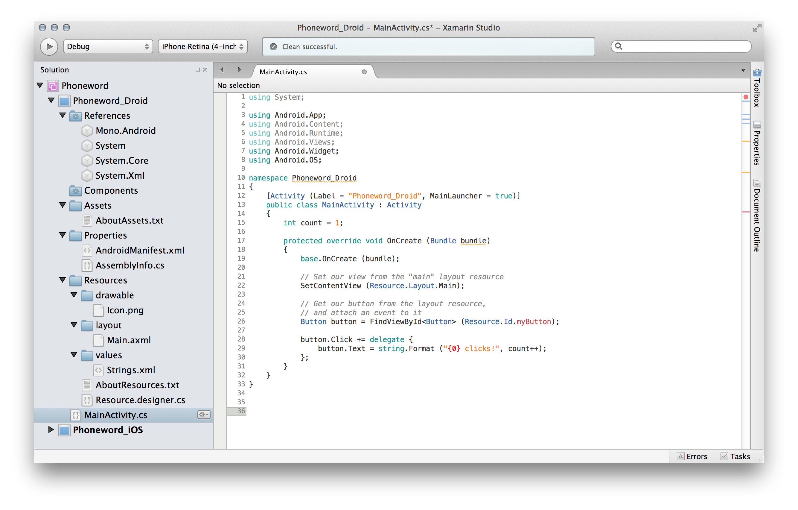
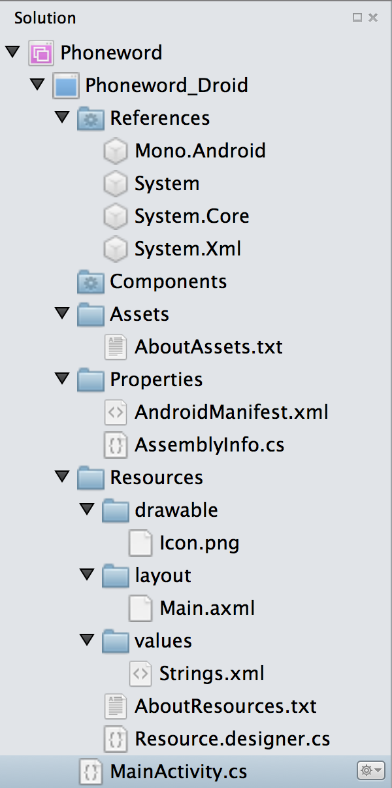
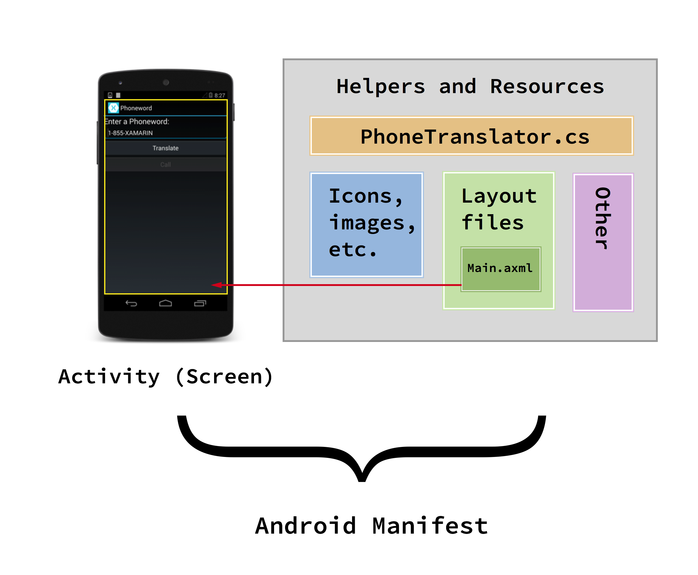
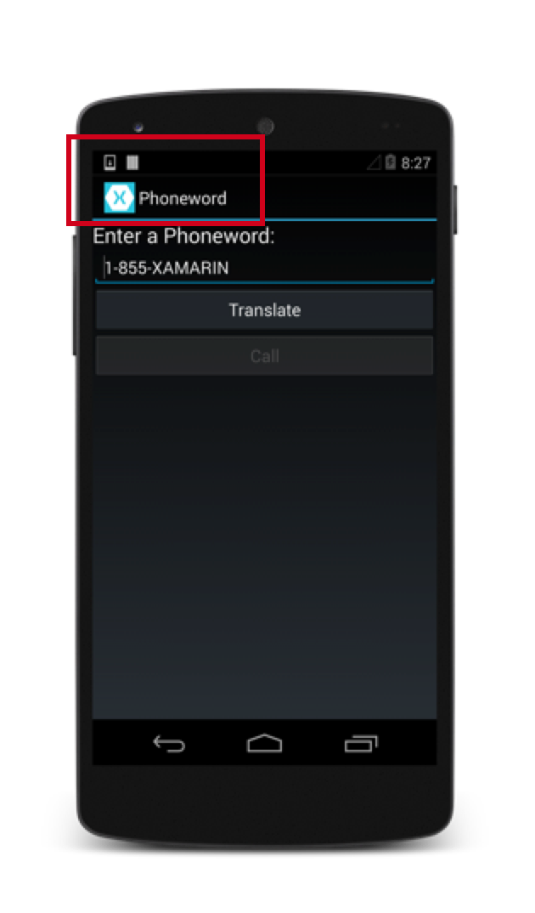
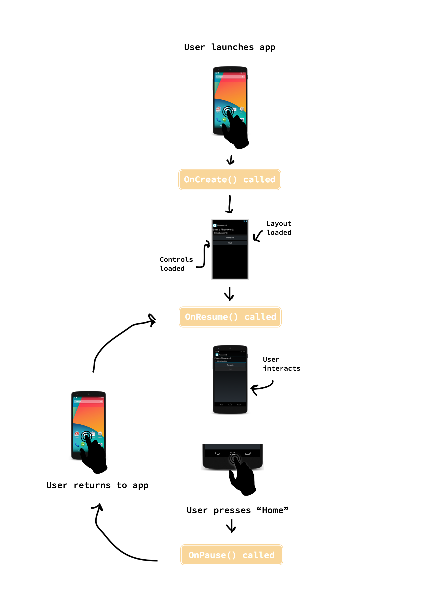
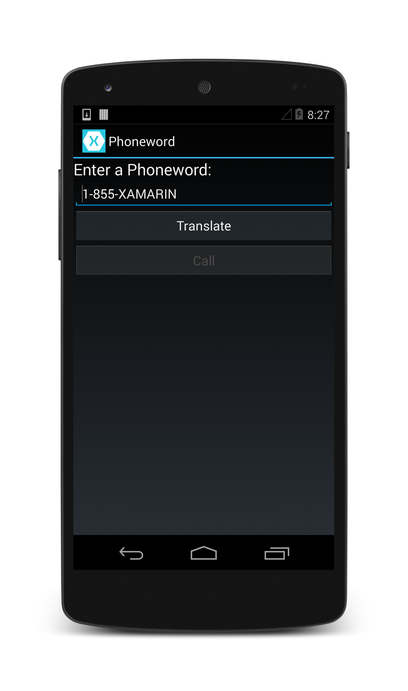
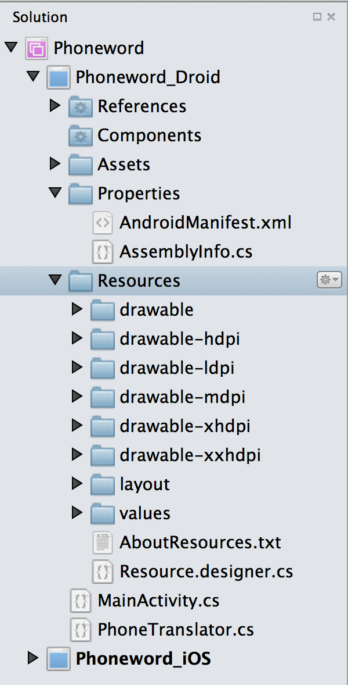

# Hello, Android Deep Dive

In the [Hello, Android Quickstart](http://developer.xamarin.com/guides/android/getting_started/hello,android_multiscreen/hello,android_multiscreen_quickstart/), we built and ran our first Xamarin.Android application. Now it’s time to develop a deeper understanding of how Android applications work so we can build more sophisticated programs. In this guide we review the steps that we took in the Hello, Android walkthrough so that we can understand what we did, and begin to develop a fundamental understanding of Android application development.

We will touch upon the following topics:

<ul>
    <ide name="xs"><li><strong>Introduction to Xamarin Studio</strong> – Introduction to Xamarin Studio and creating a new application.</li></ide>
    <li><strong>Anatomy of a Xamarin.Android Application</strong> - Tour of the essential parts of a Xamarin.Android application.</li>
    <li><strong>App Fundamentals and Architecture Basics</strong> – Introduction to Activities, the Android Manifest, and the general flavor of Android development.</li>
    <li><strong>User Interface (UI)</strong> – Creating user interfaces with the Android Designer.</li>
    <li><strong>Activities and the Activity Lifecycle</strong> – An introduction to the Activity Lifecycle and wiring up the user interface in code.</li>
    <li><strong>Testing, Deployment, and Finishing Touches</strong> – Complete your application with advice on testing, deployment, generating artwork, and more.</li>
</ul>

This guide helps you develop the skills and knowledge required to build a single-screen Android application. After working through it, you should have an understanding of the different parts of a Xamarin.Android application and how they fit together.

<ide name="xs">
<a name="Introduction_to_Xamarin_Studio" class="injected"></a>
<h1>Introduction to Xamarin Studio</h1>
<p>Xamarin Studio is a free, open-source IDE similar to Visual Studio. It features a fully integrated visual designer, a text editor complete with refactoring tools, an assembly browser, source code integration, and more. In this guide we'll learn to use some basic Xamarin Studio features, but if you're new to Xamarin Studio you will want to check out a more in-depth <a href="http://developer.xamarin.com/guides/cross-platform/getting_started/introducing_xamarin_studio/">Introduction to Xamarin Studio</a>.</p>
<p>Xamarin Studio follows the Visual Studio practice of organizing code into <em>Solutions</em> and <em>Projects</em>. A Solution is a container that can hold one or more Projects. A Project can be an application (such as iOS or Android), a supporting library, a test application, and more. In our Phoneword app, we added a new Android Project using the <span class="uiitem">Android Application</span> template to the Phoneword Solution we created in the <a href="http://developer.xamarin.com/guides/android/getting_started/hello,android/hello,android_quickstart/">Hello, Android</a> guide. Our Solution looked like this:</p>
<a href="Images/image17_.png" class=" fancybox"></a>
</ide>


# Anatomy of a Xamarin.Android Application

<ide name="xs">
    <p>Let’s get oriented with our Solution’s contents. On the left is the Solution Pad, which contains the directory
        structure and all the files associated with our Solution:</p>
    <a href="Images/image37_.png" class=" fancybox"></a>
</ide>

We’ve created a Solution called <span class="uiitem">Phoneword</span> and placed our Android project – <span class="uiitem">Phoneword_Droid</span> – inside it. Let’s take a look at the items inside the Project:

<table>
    <thead>
        <tr><td><strong>Folder</strong></td><td><strong>Purpose</strong></td></tr>
    </thead>
    <tbody>
        <tr>
            <td><strong>References</strong></td>
            <td>Contains the assemblies required to build and run the application. If we expand the References directory, we'll see references to .NET assemblies such as <a href="http://msdn.microsoft.com/en-us/library/system%28v=vs.110%29.aspx">System</a>, System.Core, and <a href="http://msdn.microsoft.com/en-us/library/system.xml%28v=vs.110%29.aspx">System.Xml</a>, as well as a reference to Xamarin's Mono.Android assembly.</td>
        </tr>
        <tr>
            <td><strong>Components</strong></td>
            <td>The Components directory houses ready-made features from the <a href="http://components.xamarin.com/">Xamarin Components</a> store, a public marketplace for Xamarin code. For more information on Xamarin Components, refer to the <a href="http://docs.xamarin.com/guides/cross-platform/application_fundamentals/components_walkthrough/">Xamarin Components walkthrough</a>.</td>
        </tr>
        <tr>
            <td><strong>Assets</strong></td>
            <td>Contains the files the application needs to run including fonts, local data files, and text files. Files included here are accessible through the generated <code>Assets</code> class. For more information on Android Assets, see the Xamarin <a href="http://docs.xamarin.com/guides/android/application_fundamentals/resources_in_android/part_6_-_using_android_assets/">Using Android Assets</a> guide.</td>
        </tr>
        <tr>
            <td><strong>Properties</strong></td>
            <td>Contains the <a href="http://developer.xamarin.com/guides/android/advanced_topics/working_with_androidmanifest.xml/">AndroidManifest.xml</a> file that describes all the requirements for our Xamarin.Android application, including name, version number, and permissions. The
                <span class="uiitem">Properties</span> folder also houses <a href="http://msdn.microsoft.com/en-us/library/microsoft.visualbasic.applicationservices.assemblyinfo(v=vs.110).aspx">AssemblyInfo.cs</a>, a .NET assembly metadata file. It is good practice to fill this file with some basic information about your application.</td>
        </tr>
        <tr>
            <td><strong>Resources</strong></td>
            <td>Contains application resources such as strings, images, and layouts. We can access these resources in code through the generated <code>Resource</code> class. The <a href="http://docs.xamarin.com/guides/android/application_fundamentals/resources_in_android/">Android Resources</a> guide provides more details about the
                <span class="uiitem">Resources</span> directory. The application template also includes a concise guide to Resources in the <span class="uiitem">AboutResources.txt</span> file.</td>
        </tr>

    </tbody>
</table>

 <a name="Resources" class="injected"></a>


## Resources

The <span class="uiitem">Resources</span> directory contains three folders named <span class="uiitem">drawable</span>, <span class="uiitem">layout</span>, and <span class="uiitem">values</span>, as well as a file named *Resource.designer.cs*. The items are summarized in the table below:

<table>
    <thead>
        <tr>
            <td><strong>Item</strong></td>
            <td><strong>Purpose</strong></td>
        </tr>
    </thead>
    <tbody>
        <tr>
            <td><strong>drawable</strong></td>
            <td>The drawable directory houses <a href="http://developer.android.com/guide/topics/resources/drawable-resource.html">drawable resources</a> such as images and bitmaps. In the default template, the drawable directory houses the application icon file, <code>Icon.png</code>.</td>
        </tr>
        <tr>
            <td><strong>layout</strong></td>
            <td>The layout directory contains <em>Android designer files</em> (.axml) that define the user interface for each screen or Activity. The template creates a default layout called
                <span class="uiitem">Main.axml</span>.</td>
        </tr>
        <tr>
            <td><strong>values</strong></td>
            <td>This directory houses XML files that store simple values such as strings, integers, and colors. The template creates a file to store string values called <em>Strings.xml</em>.</td>
        </tr>
        <tr>
            <td><strong>Resource.designer.cs</strong></td>
            <td>Also known as the <code>Resource</code> class, this file is a partial class that holds the unique IDs assigned to each resource. It is automatically created by the Xamarin.Android tools and is regenerated as necessary. This file should not be manually edited, as Xamarin.Android will overwrite any manual changes.</td>
        </tr>
    </tbody>
</table>

 <a name="App_Fundamentals_and_Architecture_Basics" class="injected"></a>


# App Fundamentals and Architecture Basics

Android applications don’t have a single entry point - there’s no single line of code in the application that the operating system calls to start the application. Instead, an application starts when Android creates one of its classes, during which Android loads the entire application’s process into memory.

This unique feature of Android can be extremely useful when designing complicated applications or interacting with the Android operating system. However, these options also make Android complex when dealing with a basic scenario like our <span class="uiitem">Phoneword</span> application. For this reason, we’re going to split our exploration of Android architecture in two. In this guide, we’ll dissect an application that uses the most common entry point for an Android app - the first screen. In the [Hello, Android Multiscreen](http://developer.xamarin.com/guides/android/getting_started/hello,android_multiscreen) guide, we’ll dive into the full complexities of Android architecture as we discuss different ways to launch an application.

## Phoneword Scenario - Starting with an Activity

When we open our Phoneword application for the first time in an emulator or on a device, the operating system creates the first *Activity*. An Activity is a special Android class that corresponds to a single application screen, and is responsible for drawing and powering the user interface. When Android creates an application’s first Activity, it loads the entire application:

 [ ](Images/image40-1.png)

Since there is no linear progression through an Android application – we can launch the application from several points - Android has a unique way of keeping track of what classes and files make up an application. In our Phoneword example, all the parts that make up our application are registered with a special XML file called the <span class="uiitem">Android Manifest</span>. The role of the <span class="uiitem">Android Manifest</span> is to keep track of an application’s contents, properties, and permissions and disclose them to the Android operating system. We can think of our Phoneword application as a single Activity (screen) and a collection of resource and helper files tied together by the Android Manifest file, as illustrated by the diagram below:

 [ ](Images/image41.png)

In the next few sections, we’ll explore the relationships between the various parts of the Phoneword application to gain a better understanding of the diagram above.  We’ll begin with the user interface as we discuss the Android designer and layout files.

 <a name="" class="injected"></a>


# User Interface

 `Main.axml` is the user interface layout file for the first screen in our application. The .axml indicates that this is an Android designer file (AXML stands for *Android XML*). The name *Main* is arbitrary from Android’s point of view - we could have easily named the layout file something else. When we open <span class="uiitem">Main.axml</span> in our IDE, it brings up the visual editor for Android layout files called the *Android designer*:

 [ ](Images/image028_.png)

In our <span class="uiitem">Phoneword</span> app, we set the <span class="uiitem">TranslateButton</span>’s ID to `@+id/TranslateButton`:

<ide name="xs">
    <a href="Images/image12.png" class=" fancybox"></a>
</ide>


When we set the ID property of the <span class="uiitem">TranslateButton</span>, the Android designer maps the <span class="uiitem">TranslateButton</span> control to the `Resource` class and assigns it a *resource ID* of `TranslateButton`. This mapping of visual control to class makes it possible for us to locate and use the <span class="uiitem">TranslateButton</span> and other controls in our code. We’ll cover this in more detail when we break apart the code that powers our controls. All you need to know for now is that the code representation of a control is linked to the visual representation of the control in the designer via the Id property.

 <a name="Source_View" class="injected"></a>


## Source View

Everything we define on the design surface gets translated into XML for Xamarin.Android to use. The Android designer provides a source view that contains the XML it generated from the visual designer. We can view the XML by switching to the <span class="uiitem">Source</span> panel in the lower left of the designer view, as illustrated by the screenshot below:

<ide name="xs">
    <a href="Images/image39.png" class=" fancybox"></a>
</ide>


The XML source code should contain our <span class="uiitem">Text (Large)</span>, <span class="uiitem">Plain Text</span>, and two <span class="uiitem">Button</span> elements.

For a more in-depth tour of the Android designer, refer to the Xamarin Android [Designer Overview](http://developer.xamarin.com/guides/android/user_interface/designer_overview/) guide.

We’ve covered the tools and concepts behind the visual part of our user interface. Next, let’s jump into the code that powers our user interface as we explore Activities and the Activity Lifecycle.

 <a name="Activites and the Activity Lifecycle" class="injected"></a>


# Activities and the Activity Lifecycle

The Activity class contains the code that powers the user interface. The Activity is responsible for responding to user interaction and creating a dynamic user experience.

In this section we introduce the Activity class, discuss the Activity Lifecycle, and dissect the code that powers the user interface in our Phoneword application.

 <a name="Activity Class" class="injected"></a>


## Activity Class

Our Phoneword application has only one screen (Activity). The class that powers the screen is called `MainActivity` and lives in the <span class="uiitem">MainActivity.cs</span> file. The name `MainActivity` has no special significance in Android - although it’s convention to name the first Activity in an application " `MainActivity`", Android wouldn’t care if we named it something else.

If we open the <span class="uiitem">MainActivity.cs</span> file, we see that our `MainActivity` class is a *subclass* of the `Activity` class, and that the Activity is adorned with the [ActivityAttribute](http://androidapi.xamarin.com/index.aspx?link=T%3aAndroid.App.ActivityAttribute):

```
[Activity(Label = "Phoneword", MainLauncher = true, Icon = "@drawable/icon")]
public class MainActivity : Activity
{
...
}
```

The Activity Attribute registers the Activity with the Android Manifest, letting Android know that this class is part of the Phoneword application managed by this Manifest. The `Label` property sets the text to display at the top of the screen, and the `Icon` sets the image to display next to the text, as illustrated by the screenshot below:

 [ ](Images/image44.png)

The `MainLauncher` property tells Android to display this Activity when the application starts up. This property becomes important as we add more Activities (screens) to our application in the [Hello, Android Multiscreen](http://developer.xamarin.com/guides/android/getting_started/hello,android_multiscreen) guide.

Now that we understand the basics of the `MainActivity`, let’s dive deeper into the Activity code by introducing the Activity lifecycle.

 <a name="Activity Lifecycle" class="injected"></a>


## Activity Lifecycle

In Android, Activities go through different stages of a *lifecycle* depending on their interactions with the user. Activities can be created, started and paused, resumed and destroyed, and so on. The Activity class contains methods that the system calls at certain points in the screen's lifecycle. The following diagram illustrates a typical life of an Activity, and some of the corresponding lifecycle methods:

 [ ](Images/image45.png)

By overriding Activity lifecycle methods, we can control how the Activity loads, how it reacts to the user, and even what happens after it disappears from the device screen. For example, we can override the lifecycle methods in the diagram above to perform some important tasks:

-  **OnCreate** – Create views, initialize variables, and do other prep work before the user sees the Activity. This method is called only once when the Activity is loaded into memory.
-  **OnResume** – Perform any tasks that need to happen every time the Activity returns to the device screen. 
-  **OnPause** – Perform any tasks that need to happen every time the Activity leaves the device screen.


When we add custom code to a lifecycle method in the Activity, we *override* that lifecycle method’s *base implementation*. We tap into the existing lifecycle method, which has some code already attached to it, and we extend it with our own code. We call the base implementation from inside our method to make sure the original code runs before our new code. We’ll see an example of this in the next section.

The Activity Lifecycle is an important and complex part of Android, and we’re not going to dive into the details just yet.  If you’d like to learn more about Activities after you finish the Getting Started series, we recommend reading the [Activity Lifecycle](http://developer.xamarin.com/guides/android/application_fundamentals/activity_lifecycle/) guide. For now, let’s focus on the first stage of the Activity Lifecycle, `OnCreate`.

 <a name="OnCreate" class="injected"></a>


## OnCreate

Android calls the Activity’s `OnCreate` method when it creates the Activity, before the screen is presented to the user. We can override the `OnCreate` lifecycle method to create views and prepare our Activity to meet the user:

```
protected override void OnCreate (Bundle bundle)
{
    base.OnCreate (bundle);

    // Set our view from the "main" layout resource
    SetContentView (Resource.Layout.Main);
       // Additional setup code will go here

   }
```

In our Phoneword app, the first thing we do in `OnCreate` is load the user interface we created in the Android designer. To load the UI, we call `SetContentView` and pass it the *resource layout name* for the layout file - our `Main.axml`. Our layout is located at `Resource.Layout.Main`:

```
SetContentView (Resource.Layout.Main);
```

When the `MainActivity` starts up, it will create a view based on the contents of the `Main.axml` file. Note that we’ve matched our layout name with our Activity name - *Main*.axml is the layout for *Main*Activity. This isn’t required from Android’s point of view, but as we begin to add more screens to the application, we’ll find this naming convention makes it easy for us to match the code file to the layout file.

Once the layout file is set, we can start looking up our controls. To look up a control, we call `FindViewById` and pass in the resource ID of the control:

```
EditText phoneNumberText = FindViewById<EditText>(Resource.Id.PhoneNumberText);
Button translateButton = FindViewById<Button>(Resource.Id.TranslateButton);
Button callButton = FindViewById<Button>(Resource.Id.CallButton);
```

Now that we have a reference to the controls in the layout file, we can start programming them to respond to user interaction.

 <a name="Responding to User Interaction" class="injected"></a>


## Responding to User Interaction

In Android, the `Click` event listens for the user’s touch. In our app, we handled the `Click` event with a lambda, but we could have also used a delegate or a named event handler. Our final <span class="uiitem">TranslateButton</span> code resembled the following:

```
translateButton.Click += (object sender, EventArgs e) =>
{
    // Translate user’s alphanumeric phone number to numeric
    translatedNumber = Core.PhonewordTranslator.ToNumber(phoneNumberText.Text);
    if (String.IsNullOrWhiteSpace(translatedNumber))
    {
        callButton.Text = "Call";
        callButton.Enabled = false;
    }
    else
    {
        callButton.Text = "Call " + translatedNumber;
        callButton.Enabled = true;
    }
};
```

 <a name="Additional Concepts Introduced in Phoneword" class="injected"></a>


# Additional Concepts Introduced in Phoneword

The Phoneword application introduced several concepts not covered in this guide. These concepts include:

<ul>
    <li><p><strong>Change Button Text</strong> – We learned to change the text of a <span class="uiitem">Button</span> by editing that
        <span class="uiitem">Button’s Text</span> property. For example, the following code changes the <code>callButton</code>’s text to "<code>Call</code>":</p>
        <pre><code class=" syntax brush-C#">callButton.Text = "Call";</code></pre>
    </li>
    <li><p><strong>Enable and Disable Buttons</strong> – <span class="uiitem">Buttons</span> can be in an <code>Enabled</code> or <code>Disabled</code> state. A disabled
        <span class="uiitem">Button</span> won’t respond to user input. For example, the following code disables the <code>callButton</code>:</p>

        <pre><code class=" syntax brush-C#">callButton.Enabled = false;</code></pre>
        <p>For more information on buttons, refer to the <a href="http://developer.xamarin.com/guides/android/user_interface/form_elements/custom_button">Android Buttons guide</a>.</p>
    </li>
    <li><p><strong>Display an Alert Dialog</strong> – When the user presses the Call <span class="uiitem">Button</span>, our app shows an <em>Alert Dialog</em> with the option to place or cancel a call. To create an Alert Dialog, we used an Alert Dialog <em>Builder</em>. Our dialog consists of a <code>Neutral</code> button to place a call and a <code>Negative</code> button to cancels the call, as illustrated by the code below:</p>

    <pre><code class=" syntax brush-C#">var callDialog = new AlertDialog.Builder(this);
callDialog.SetMessage("Call " + translatedNumber + "?");
callDialog.SetNeutralButton("Call",
       delegate
       {
           // Create intent to dial phone
       });
callDialog.SetNegativeButton("Cancel", delegate {});

// Show the alert dialog to the user and wait for response.
callDialog.Show();</code></pre>
</li>
    <li><p><strong>Launch Phone App with Intent</strong> – When we wired up the <code>CallButton</code>, we sent an <em>Intent</em> to launch the system phone app, passing in the telephone number we wanted to call, as illustrated by the code sample below:</p>

    <pre><code class=" syntax brush-C#">var callIntent = new Intent(Intent.ActionCall);
callIntent.SetData(Android.Net.Uri.Parse("tel:" + translatedNumber));
StartActivity(callIntent);</code></pre>
<p>Intents are covered in more depth in the <a href="http://developer.xamarin.com/guides/android/getting_started/hello,android_multiscreen">Hello, Android Multiscreen</a> guide. In that guide, we’ll learn to use Intents to launch other Activities (screens) and even other applications.</p>
</li>
</ul>

 <a name="Testing, Deployment, and Finishing Touches" class="injected"></a>


# Testing, Deployment, and Finishing Touches

Both Xamarin Studio and Visual Studio provide many options for testing and deploying an application. This section covers debugging options, demonstrates testing applications on device, and introduces tools for creating custom app icons for different screen densities.

 <a name="Debugging Tools" class="injected"></a>


## Debugging Tools

Sometimes issues in application code are difficult to diagnose. To help diagnose complex code issues, we could [Set a Breakpoint](http://developer.xamarin.com/recipes/cross-platform/ide/debugging/set_a_breakpoint/), [Step Through Code](http://developer.xamarin.com/recipes/cross-platform/ide/debugging/step_through_code/), or [Output Information to the Log Window](http://developer.xamarin.com/recipes/cross-platform/ide/debugging/output_information_to_log_window/).

 <a name="Deploy to a Device" class="injected"></a>


## Deploy to a Device

The emulator is a good start for deploying and testing an application, but users will not consume the final app in the emulator. We should test applications on a real device early and often.

Before an Android device can be used for testing applications, it needs to be configured for development. The [Set Up Device for Development](http://developer.xamarin.com/guides/android/getting_started/installation/set_up_device_for_development) guide provides thorough instructions on getting a device ready for development.

<ide name="xs">
<p>Once the device is configured, we can deploy to it by plugging it in, pressing <span class="uiitem">Start (Play)</span>, selecting it from the <span class="uiitem">Select Device</span> dialog, and pressing
    <span class="uiitem">OK</span>:</p>
    <a href="Images/image40.png" class=" fancybox"></a>
</ide>


This will launch the application on the device:

 [ ](Images/00a.png)

 <a name="Set Icons for Different Screen Densities" class="injected"></a>


## Set Icons for Different Screen Densities

Android devices come in different screen sizes and resolutions, and not all images look good on all screens. For example, here is a screenshot of a low-density icon on a high-density Nexus 5. Notice how blurry it is compared to the surrounding icons:

 [ ](Images/image47.png)

 <a name="Summary" class="injected"></a>


To account for this, it is good practice to add icons of different resolutions to the Resources folder. Android provides different versions of the drawable folder to handle images of different densities, including an *ldpi* version for low density, *mdpi* for medium, *hdpi* for high, and *xhdpi* and *xxhdpi* for very high density screens. Icons of varying sizes are stored in the appropriate <span class="uiitem">drawable-*</span> folders:

<ide name="xs">
    <a href="Images/image30.png" class=" fancybox"></a>
</ide>

Android will pick the icon with the appropriate density:

 [ ](Images/image49.png)

 <a name="Generate Custom Icons" class="injected"></a>


## Generate Custom Icons

Not everyone has a designer available to create the custom icons and launch images an app needs to stand out. Here are several alternate approaches to generating custom app artwork:

<ul>
    <li><a href="http://android-ui-utils.googlecode.com/hg/asset-studio/dist/index.html">Android Asset Studio</a> – A web-based, in-browser generator for all types of Android icons, with links to other useful community tools. It works best in Google Chrome.</li>
    <ide name="xs">
    <li><a href="https://itunes.apple.com/us/app/sketch/id852320343?mt=12">Sketch 3</a> – Sketch is a Mac app for designing user interfaces, icons, and more. This is the app we used to design the Xamarin App Icons and Launch Images set. Sketch 3 is available on the App Store and costs about $80. You can try out the free <a href="http://bohemiancoding.com/sketch/tool/">Sketch Tool</a> as well.</li>
    <li><a href="http://www.pixelmator.com/">Pixelmator</a> – A versatile image editing app for Mac that costs about $30.</li></ide>
    <li><a href="http://www.glyphish.com/">Glyphish</a> – High-quality prebuilt icon sets for free download and purchase.</li>
    <li><a href="http://www.fiverr.com/">Fivrr</a> – Choose from a variety of designers to create an icon set for you, starting at $5.  Can be hit or miss but a good resource if you need icons designed on the fly.</li>
</ul>

For more information about icon sizes and requirements, refer to the [Android Resources](http://developer.xamarin.com/guides/android/application_fundamentals/resources_in_android/) guide.

# Summary

Congratulations! You now have a solid understanding of the components of a Xamarin.Android application as well as the tools required to create it.

In the next tutorial in the Getting Started series, we'll extend our application to handle multiple screens as we explore more advanced Android architecture and concepts.
