# Hello, Android Quickstart

In this walkthrough, we create an application that translates an
alphanumeric phone number entered by the user into a numeric phone
number, and then calls that number. The final application looks like
this:

[ 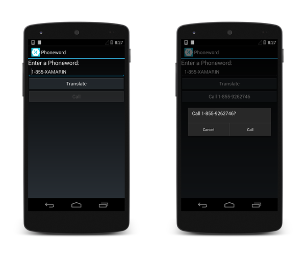](Images/intro-app-examples.png)

Let's get started!

# Requirements

Xamarin.Android works with any of the following setups:

-  Latest version of Xamarin Studio on OS X Mountain Lion and above.
-  Latest version of Xamarin Studio on Windows 7 and above.
-  Windows 7 and above with Visual Studio 2010 Professional or higher.

This walkthrough assumes that the latest version of Xamarin.Android is 
installed and running on your platform of choice. For a guide to 
installing Xamarin.Android, refer to the 
[Xamarin.Android Installation](http://developer.xamarin.com/guides/android/getting_started/installation/) guides. 
Before we get started, please download and unzip the 
[Xamarin App Icons & Launch Screens](http://developer.xamarin.com/guides/android/getting_started/hello,android/Resources/XamarinAppIconsAndLaunchImages.zip) 
set. 

# Configuring Emulators

Android has several options for emulators. The standard Android 
emulator is the simplest to set up but runs slowly. Xamarin recommends 
that you use the high-performance 
[Xamarin Android Player](http://developer.xamarin.com/guides/android/getting_started/installation/android-player). 
If you are not using the Xamarin Android Player, you should configure 
your emulator to use hardware acceleration. Instructions for 
configuring hardware acceleration are available in the 
[Accelerating Android Emulators](/guides/android/getting_started/installation/accelerating_android_emulators) 
guide. 

# Walkthrough

<ol>
<ide name="xs">

    <li>
      

        Let's launch Xamarin Studio from the Applications
        folder or from Spotlight. This opens the start
        page:
      

      

        <a href="Images/xs/01-launch.png" class=" fancybox">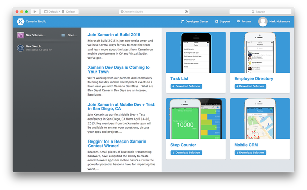</a>
      

    </li>
    <li>
      

        Click New Solution... to create a new project:
      

      

        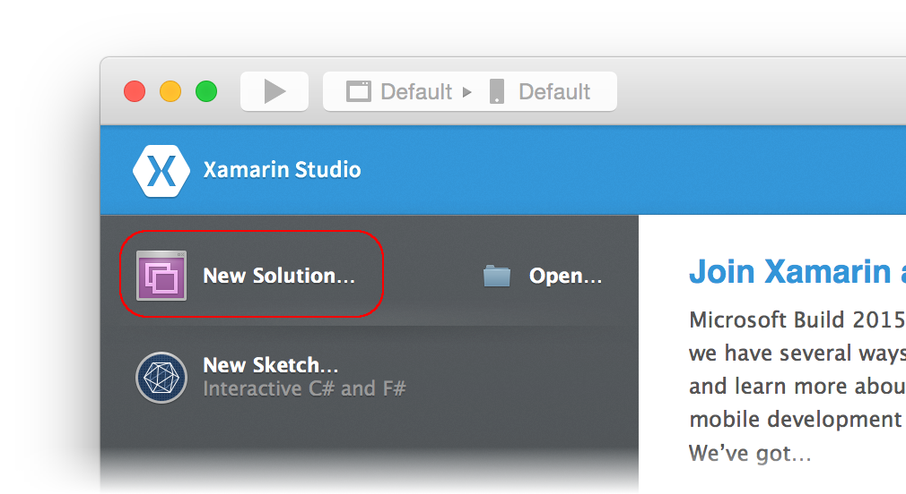
      

    </li>
    <li>
      

        In the Choose a template for your new project dialog, 
        let's click Android &gt; App and select the 
        Android App template. Click Next.
      

      

        <a href="Images/xs/03-choose-template.png" class=" fancybox">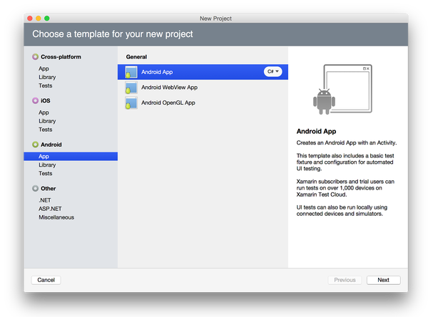</a>
      

    </li>
    <li>
      

        In the Configure your Android app dialog, 
        we'll name the new app <code>Phoneword</code> and click Next:
      

      

        <a href="Images/xs/04-configure-app.png" class=" fancybox">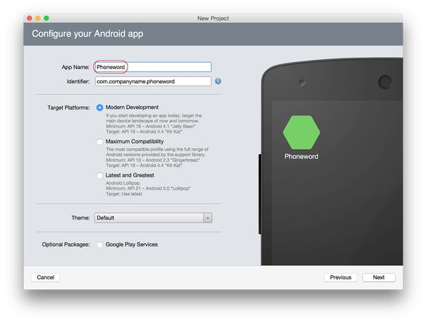</a>
      

    </li>

    <li>
      

        In the Configure your new project dialog, 
        we'll leave the Solution and Project names set to <code>Phoneword</code>
        and click Create to create the project:
      

      

        <a href="Images/xs/05-configure-project.png" class=" fancybox">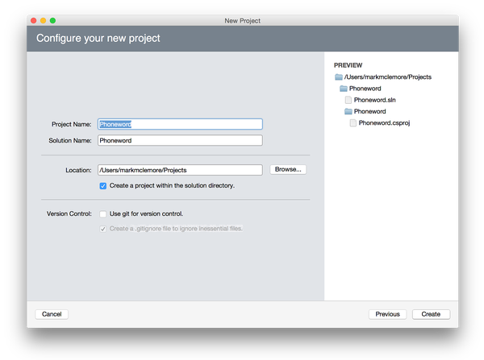</a>
      

    </li>
</ide>
<ide name="vs">

    <li>
      

        Let's start Visual Studio:
      

      

        <a href="Images/vs/01-launch.png" class=" fancybox">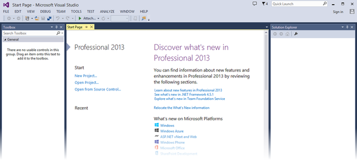</a>
      

    </li>
    <li>
      

        Click Start &gt; New Project to create a new project:
      

      

        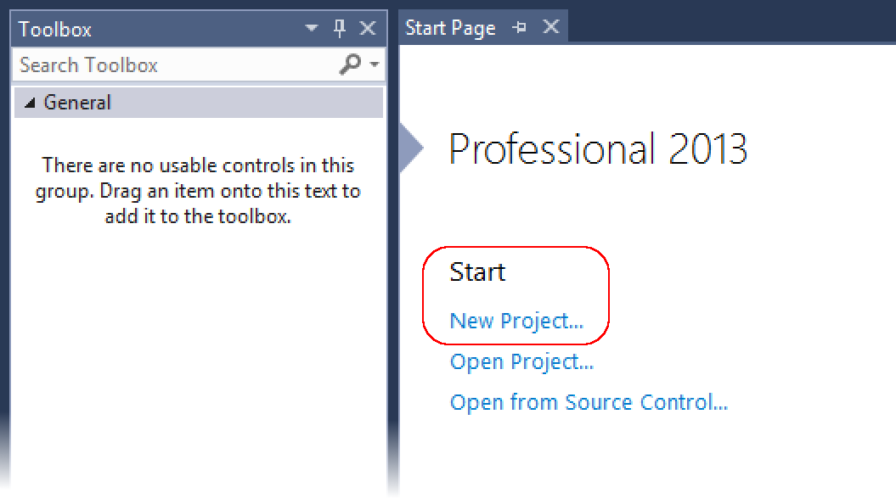
      

    </li>
    <li>
      

        In the New Project dialog, click Visual C# &gt; Android and select the Blank App
        (Android) template. We'll name the new project <code>Phoneword</code>.
        Click OK to create the new project:
      

      

        <a href="Images/vs/03-new-project-name.png" class=" fancybox">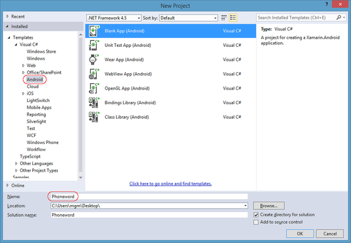</a>
      

    </li>

</ide>

<ide name="xs">

    <li>
      

        After the new project is created, let&lsquo;s expand the Resources folder and then the layout
        folder in the Solution pad. Double-click
        <b>Main.axml</b> to open it in the Android Designer. This is the layout file for
        our screen:
      

      

        <a href="Images/xs/06-open-layout.png" class=" fancybox">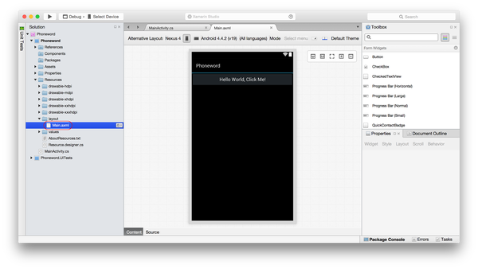</a>
      

    </li>
</ide>
<ide name="vs">

    <li>
      

        After the new project is created, let&lsquo;s expand the Resources folder and then the layout
        folder in the Solution Explorer. Double-click
        <b>Main.axml</b> to open it in the Android Designer. This is the layout file for
        our screen:
      

      

        <a href="Images/vs/04-open-layout.png" class=" fancybox">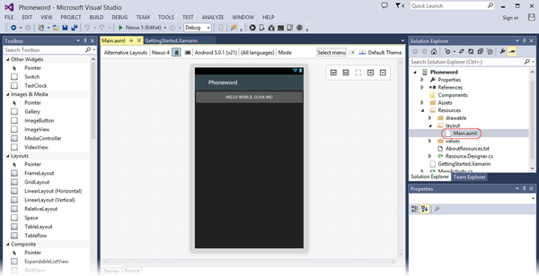</a>
      

    </li>
   
</ide>

<ide name="xs">

    <li>
      

        Let&lsquo;s select the <b>Hello World, Click Me!</b> Button on the design surface and press the <kbd>Delete</kbd> key to
        remove it. From the Toolbox (the area on the right),
        enter <code>text</code> into the search field and drag a Text
        (Large) widget onto the design surface (the area in the center):
      

      

        <a href="Images/xs/07-large-text.png" class=" fancybox">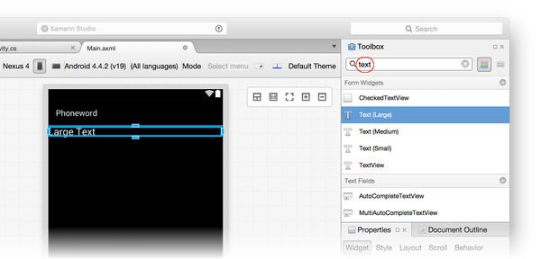</a>
      

    </li>

</ide>
<ide name="vs">

    <li>
      

        Let&lsquo;s select the <b>Hello World, Click Me!</b> Button on the design surface and press the <kbd>Delete</kbd> key to
        remove it. From the Toolbox (the area on the left),
        enter <code>text</code> into the search field and drag a Text
        (Large) control onto the design surface (the area in the center):
      

      

        <a href="Images/vs/05-large-text.png" class=" fancybox">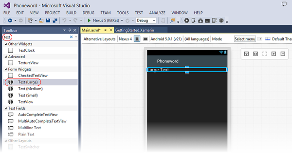</a>
      

    </li>
   
</ide>
    
<ide name="xs">

    <li>
      

        With the Text (Large) widget selected on the design
        surface, we can use the Properties pad to change the
        <code>Text</code> property of the Text
        (Large) widget to <code>Enter a Phoneword:</code> as seen below:
      

      

        <a href="Images/xs/08-enter-a-phoneword.png" class=" fancybox">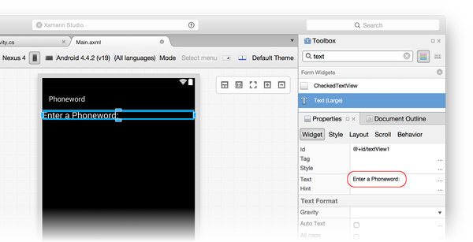</a>
      

      

        

          <strong>Note</strong>: You can bring up the 
          Properties pad or 
          Toolbox at any time by navigating to
          View &gt; Pads.
        

      

    </li>
</ide>
<ide name="vs">

    <li>
      

        With the Text (Large) control selected on the design
        surface, we can use the Properties pane to change the
        <code>text</code> property of the Text
        (Large) control to <code>Enter a Phoneword:</code> as seen here:
      

      

        <a href="Images/vs/06-enter-a-phoneword.png" class=" fancybox">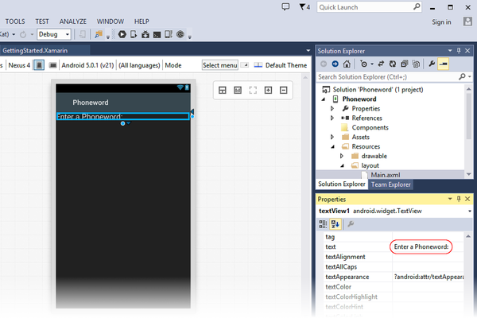</a>
      

    </li>
</ide>

<li>

  

    Next, let&lsquo;s drag a Plain Text widget from the
    Toolbox to the design surface and place it underneath the
    Text (Large) widget. Notice that we can use the search
    field to help locate widgets by name:
  

<ide name="xs">

  

    <a href="Images/xs/09-plain-text.png" class="fancybox">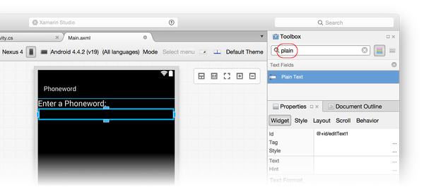</a>
  

</ide>
<ide name="vs">

  

    <a href="Images/vs/07-plain-text.png" class="fancybox">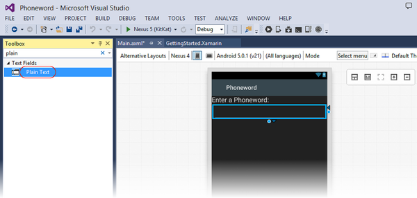</a>
  

</ide>
</li>

<ide name="xs">

    <li>
      

        With the Plain Text widget selected on the design
        surface, we can use the Properties pad to change the
        <code>Id</code> property of the Plain
        Text widget to <code>@+id/PhoneNumberText</code> and change the 
        <code>Text</code> property to <code>1-855-XAMARIN</code>:
      

      

        <a href="Images/xs/10-add-properties.png" class=" fancybox">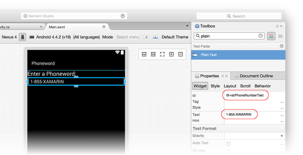</a>
      

    </li>
</ide>
<ide name="vs">

    <li>
      

        With the Plain Text control selected on the design
        surface, we can use the Properties pane to change the
        <code>id</code> property of the Plain
        Text control to <code>@+id/PhoneNumberText</code> and change the
        <code>text</code> property to <code>1-855-XAMARIN</code>:
      

      

        <a href="Images/vs/08-add-properties.png" class=" fancybox">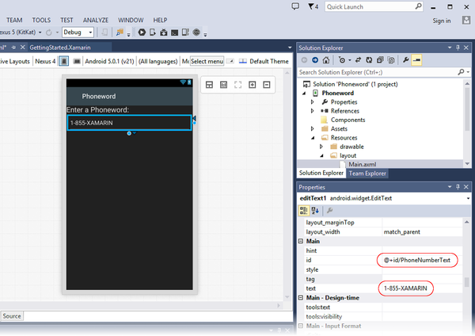</a>
      

    </li>
</ide>

<li>

  

    Let&lsquo;s drag a Button from the Toolbox to the design surface and place it underneath the Plain Text widget:
  

<ide name="xs">

  

    <a href="Images/xs/11-drag-button.png" class="fancybox">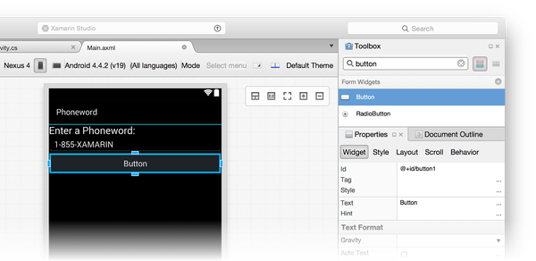</a>
  

</ide>
<ide name="vs">

  

    <a href="Images/vs/09-drag-button.png" class="fancybox">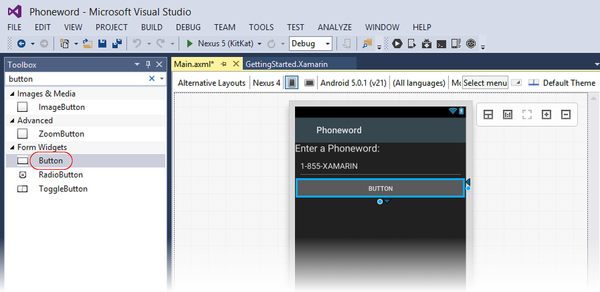</a>
  

</ide>
</li>

<ide name="xs">

    <li>
      

        With the Button selected on the design surface, we can
        use the Properties pad to change the 
        <code>Id</code> property of the Button to
        <code>@+id/TranslateButton</code> and change the 
        <code>Text</code> property to <code>Translate</code>:
      

      

        <a href="Images/xs/12-translate-button.png" class=" fancybox">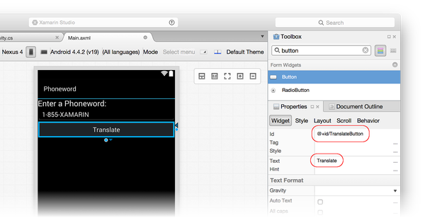</a>
      

    </li>
</ide>
<ide name="vs">

    <li>
      

        With the Button selected on the design surface, we can
        use the Properties pane to change the <code>id</code>
        property of the Button to
        <code>@+id/TranslateButton</code> and change the <code>text</code>
        property to <code>Translate</code>:
      

      

        <a href="Images/vs/10-translate-button.png" class=" fancybox">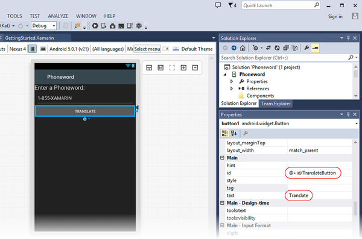</a>
      

    </li>
</ide>

<li>

  

    Next, let&lsquo;s drag a second Button from the
    Toolbox to the design surface and place it underneath the
    Translate button:
  

<ide name="xs">

  

    <a href="Images/xs/13-drag-call-button.png" class="fancybox">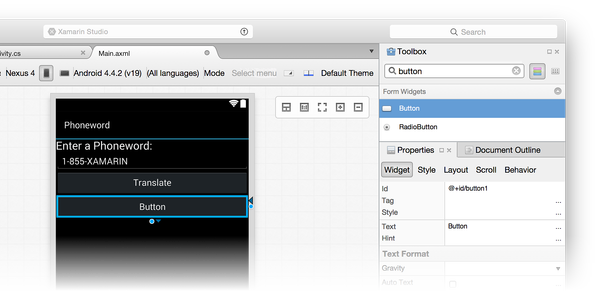</a>
  

</ide>
<ide name="vs">

  

    <a href="Images/vs/11-drag-call-button.png" class="fancybox">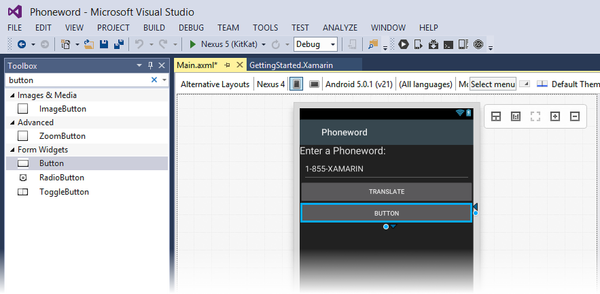</a>
  

</ide>
</li>

<ide name="xs">

    <li>
      

        With the Button selected on the design surface, we can
        use the Properties pad to change the 
        <code>Id</code> property of the Button to
        <code>@+id/CallButton</code> and change the <code>Text</code>
        property to <code>Call</code>:
      

      

        <a href="Images/xs/14-call-properties.png" class=" fancybox">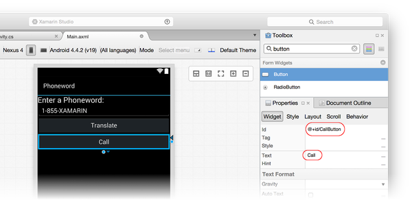</a>
      

      

        Let's save our work by pressing <kbd>&#8984; + S</kbd>.
      

    </li>
    <li>
      

        Now, let&lsquo;s add some code to translate phone numbers from alphanumeric to
        numeric. We&lsquo;ll add a new file to the project by clicking on the gear
        icon next to the Phoneword project in the Solution pad and choosing Add &gt; New
        File...:
      

      

        <a href="Images/xs/15-add-new-file.png" class=" fancybox">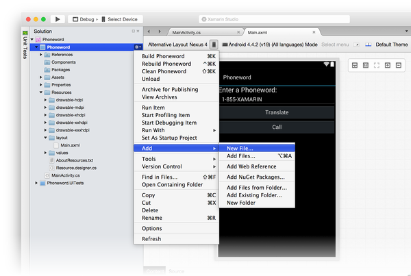</a>
      

    </li>
</ide>
<ide name="vs">

    <li>
      

        With the new Button control selected on the design surface,
        we can use the Properties pane to change the
        <code>id</code> property of the Button
        to <code>@+id/CallButton</code> and change the <code>text</code>
        property to <code>Call</code>:
      

      

        <a href="Images/vs/12-call-properties.png" class=" fancybox">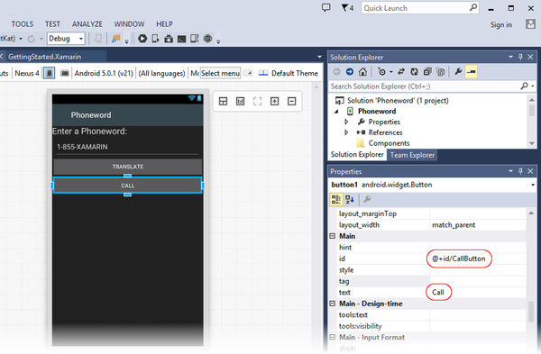</a>
      

      

        Let's save our work by pressing <kbd>CTRL+S</kbd>.
      

    </li>
    <li>
      

        Now, let&lsquo;s add some code to translate phone numbers from alphanumeric to
        numeric. We&lsquo;ll add a new file to the project by right-clicking the
        Phoneword project in the Solution
        Explorer pane and choosing Add &gt; New Item...:
      

      

        <a href="Images/vs/13-add-new-item.png" class=" fancybox">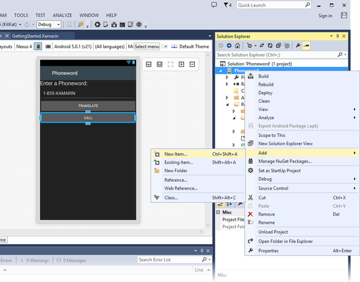</a>
      

    </li>
   
</ide>

<ide name="xs">

    <li>
      

        In the New File dialog, let&lsquo;s select General &gt; Empty Class, name the new file
        <b>PhoneTranslator</b>, and click New:
      

      

        <a href="Images/xs/16-add-class.png" class=" fancybox">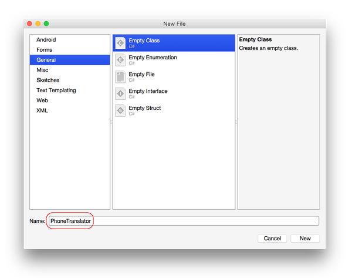</a>
      

    </li>
</ide>
<ide name="vs">

    <li>
      

        In the Add New Item dialog, let&lsquo;s select
        Visual C# &gt; Code and name the new code file
        <b>PhoneTranslator.cs</b>:
      

      

        <a href="Images/vs/14-add-class.png" class=" fancybox">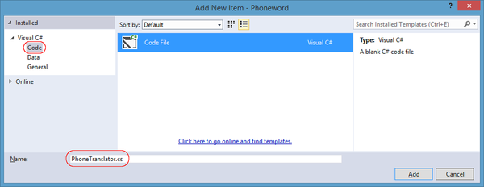</a>
      

    </li>
</ide>

<li>

  

    This creates a new empty C# class for us. Let&lsquo;s remove all of the template 
    code and replace it with the following code:
  

<pre>
<code class=" syntax brush-C#">using System.Text;
using System;

namespace Core
{
    public static class PhonewordTranslator
    {
        public static string ToNumber(string raw)
        {
            if (string.IsNullOrWhiteSpace(raw))
                return "";
            else
                raw = raw.ToUpperInvariant();

            var newNumber = new StringBuilder();
            foreach (var c in raw)
            {
                if (" -0123456789".Contains(c))
                    newNumber.Append(c);
                else {
                    var result = TranslateToNumber(c);
                    if (result != null)
                        newNumber.Append(result);
                }
                // otherwise we've skipped a non-numeric char
            }
            return newNumber.ToString();
        }
        static bool Contains (this string keyString, char c)
        {
            return keyString.IndexOf(c) &gt;= 0;
        }
        static int? TranslateToNumber(char c)
        {
            if ("ABC".Contains(c))
                return 2;
            else if ("DEF".Contains(c))
                return 3;
            else if ("GHI".Contains(c))
                return 4;
            else if ("JKL".Contains(c))
                return 5;
            else if ("MNO".Contains(c))
                return 6;
            else if ("PQRS".Contains(c))
                return 7;
            else if ("TUV".Contains(c))
                return 8;
            else if ("WXYZ".Contains(c))
                return 9;
            return null;
        }
    }
}</code></pre>

<ide name="xs">

  

    Let's save the changes to the <b>PhoneTranslator.cs</b> file by choosing 
    File &gt; Save (or by pressing <kbd>&#8984; + S</kbd>),
    then close the file.
  

   
</ide>
<ide name="vs">

  

    Let's save the changes to the <b>PhoneTranslator.cs</b> file by clicking File &gt; Save (or by pressing <kbd>CTRL+S</kbd>), then close the
    file.
  

</ide>
</li>

<ide name="xs">

    <li>
      

        Next we&lsquo;re going to add code to wire up the user interface. Let&lsquo;s add
        the backing code into the <code>MainActivity</code> class. Double-click
        <b>MainActivity.cs</b> in the Solution Pad to open it:
      

      

        <a href="Images/xs/18-mainactivity.png" class=" fancybox">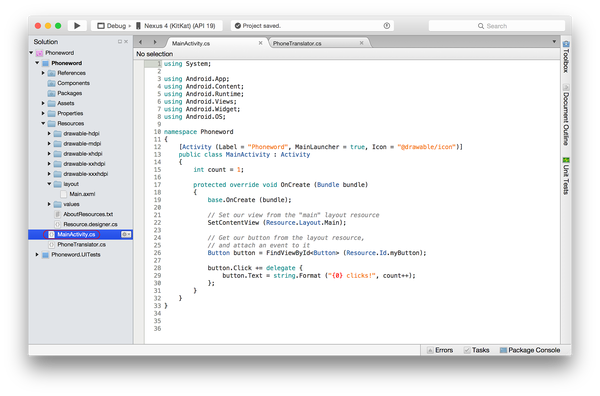</a>
      

    </li>
</ide>
<ide name="vs">

    <li>
      

        Next we&lsquo;re going to add code to wire up the user interface. Let&lsquo;s add
        the backing code into the <code>MainActivity</code> class. Double-click
        <b>MainActivity.cs</b> in the Solution Explorer to open
        it:
      

      

        <a href="Images/vs/16-mainactivity.png" class=" fancybox">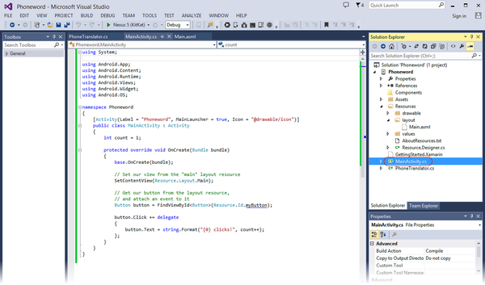</a>
      

    </li>
   
</ide>

<li>

  

    We begin by wiring up the Translate button. In the
    <code>MainActivity</code> class, find the <code>OnCreate</code> method. We'll add our
    button code inside <code>OnCreate</code>, below the <code>base.OnCreate(bundle)</code>
    and <code>SetContentView (Resource.Layout.Main)</code> calls. Remove the template code
    so that the <code>OnCreate</code> method resembles the following code:
  

   

<pre>
<code class=" syntax brush-C#">using System;
using Android.App;
using Android.Content;
using Android.Runtime;
using Android.Views;
using Android.Widget;
using Android.OS;

namespace Phoneword
{
    [Activity (Label = "Phoneword", MainLauncher = true)]
    public class MainActivity : Activity
    {
        protected override void OnCreate (Bundle bundle)
        {
            base.OnCreate (bundle);

            // Set our view from the "main" layout resource
            SetContentView (Resource.Layout.Main);

            // Our code will go here
        }
    }
}</code></pre>
</li>

<li>

  

    Next, we need to get a reference to the controls that we created in the layout file
    with the Android Designer. Let's add the following code inside the
    <code>OnCreate</code> method:
  

<pre>
<code class=" syntax brush-c#">// Get our UI controls from the loaded layout:
EditText phoneNumberText = FindViewById&lt;EditText&gt;(Resource.Id.PhoneNumberText);
Button translateButton = FindViewById&lt;Button&gt;(Resource.Id.TranslateButton);
Button callButton = FindViewById&lt;Button&gt;(Resource.Id.CallButton);</code></pre>
</li>

<li>

  

    Now let's add code that responds to user presses of the Translate button. Add the following code below the control definitions
    inside the <code>OnCreate</code> method:
  

<pre>
<code class=" syntax brush-C#">// Disable the "Call" button
callButton.Enabled = false;

// Add code to translate number
string translatedNumber = string.Empty;

translateButton.Click += (object sender, EventArgs e) =&gt;
{
    // Translate user’s alphanumeric phone number to numeric
    translatedNumber = Core.PhonewordTranslator.ToNumber(phoneNumberText.Text);
    if (String.IsNullOrWhiteSpace(translatedNumber))
    {
        callButton.Text = "Call";
        callButton.Enabled = false;
    }
    else
    {
        callButton.Text = "Call " + translatedNumber;
        callButton.Enabled = true;
    }
};</code></pre>
</li>

<li>

  

    Next let&lsquo;s add code that responds to user presses of the Call button. We&lsquo;ll place the following code below the code for
    the Translate button:
  

<pre>
<code class=" syntax brush-C#">callButton.Click += (object sender, EventArgs e) =&gt;
{
    // On "Call" button click, try to dial phone number.
    var callDialog = new AlertDialog.Builder(this);
    callDialog.SetMessage("Call " + translatedNumber + "?");
    callDialog.SetNeutralButton("Call", delegate {
           // Create intent to dial phone
           var callIntent = new Intent(Intent.ActionCall);
           callIntent.SetData(Android.Net.Uri.Parse("tel:" + translatedNumber));
           StartActivity(callIntent);
       });
    callDialog.SetNegativeButton("Cancel", delegate { });

    // Show the alert dialog to the user and wait for response.
    callDialog.Show();
};</code></pre>
</li>

<ide name="xs">

    <li>
      

        Finally, let&lsquo;s give our application permission to place a phone call. Open
        the project options by right-clicking Phoneword in the
        Solution pad and selecting Options:
      

      

        <a href="Images/xs/23a-project-options.png" class=" fancybox">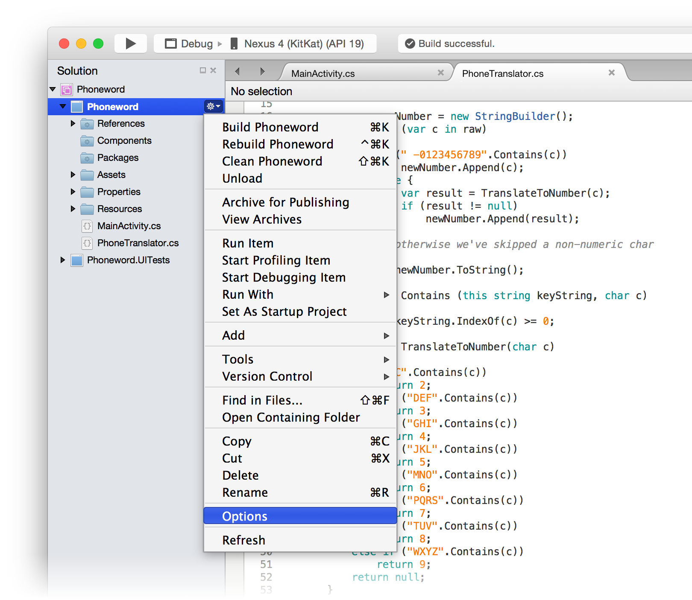</a>
      

      

        In the Project Options dialog, 
        select Build &gt; Android 
        Application. In the Required 
        Permissions section, enable the 
        CallPhone permission: 
      

      

        <a href="Images/xs/23b-call-phone.png" class=" fancybox">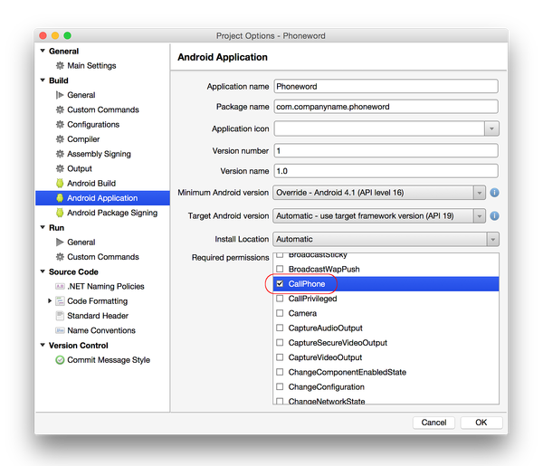</a>
      

    </li>
   
</ide>
<ide name="vs">

    <li>
      

        Finally, let&lsquo;s give our application permission to place a phone call. We can
        edit app permissions in the Android Manifest. Open the Android Manifest by
        double-clicking Properties under Phoneword in the Solution Explorer,
        then select the Android Manifest page:
      

      

        <a href="Images/vs/21a-android-manifest.png" class=" fancybox">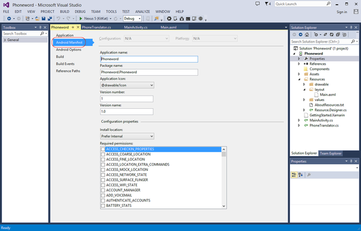</a>
      

      

        Under Required Permissions, enable the CALL_PHONE permission:
      

      

        <a href="Images/vs/21b-call-phone.png" class=" fancybox">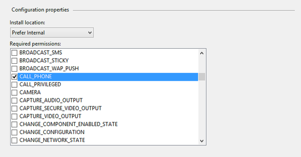</a>
      

    </li>
   
</ide>

<ide name="xs">

    <li>
      

        Let's save our work and build the application by selecting Build &gt; Build All (or by pressing <kbd>&#8984; + B</kbd>). If
        our application compiles, we will get a success message at the top of 
        Xamarin Studio:
      

      

        
      

      

        If there are errors, we can go through the previous steps and correct any mistakes
        until the application builds successfully.
      

    </li>
</ide>

<ide name="vs">

    <li>
      

        Let's save our work by selecting File &gt; Save All (or
        by pressing <kbd>CTRL-SHIFT-S</kbd>) and build the application by selecting
        Build &gt; Rebuild Solution (or by pressing
        <kbd>CTRL-SHIFT-B</kbd>). If our application compiles, we will get a success
        message in the bottom left corner of Visual Studio:
      

      

        
      

      

        If there are errors, we can go through the previous steps and correct any mistakes
        until the application builds successfully.
      

    </li>
</ide>

<li>

  

    We now have a working application &ndash; it&lsquo;s time to add the finishing touches!
    Let&lsquo;s start by editing the <code>Label</code> for our <code>MainActivity</code>.
    The <code>Label</code> is what Android displays at the top of the screen to let users
    know where they are in the application. At the top of the <code>MainActivity</code>
    class, change the <code>Label</code> to <code>Phone Word</code> as seen here:
  

<pre>
<code class=" syntax brush-C#">namespace Phoneword
{
    [Activity (Label = "Phone Word", MainLauncher = true)]
    public class MainActivity : Activity
    {
        ...
    }
}</code></pre>
</li>

<ide name="xs">

    <li>
      

        Next, let's set the application icon. First, let's open the downloaded and unzipped <a href=
        "/guides/android/getting_started/hello,android/Resources/XamarinAppIconsAndLaunchImages.zip">
        Xamarin App Icons set</a>. Next, let's expand the drawable-hdpi folder under Resources
        and remove the existing <b>Icon.png</b> by right-clicking it and selecting
        Remove:
      

      

        <a href="Images/xs/25a-remove-icon.png" class=" fancybox">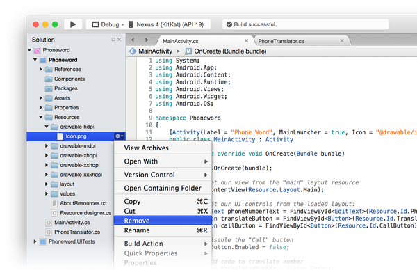</a>
      

      

        When the following dialog box is displayed, select Delete:
      

      

        

      

    </li>
    <li>
      

        Next, let's right-click the drawable-hdpi folder
        and select Add &gt; Add Files:
      

      

        <a href="Images/xs/26-add-files.png" class=" fancybox">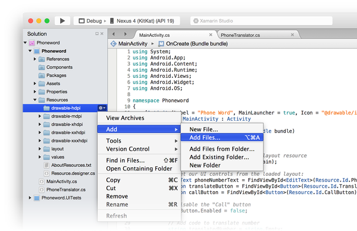</a>
      

    </li>
    <li>
      

        From the selection dialog, let's navigate to the unzipped Xamarin App Icons
        directory and open the drawable-hdpi folder. Select 
        <b>Icon.png</b>:
      

      

        <a href="Images/xs/27-xamarin-icons.png" class=" fancybox">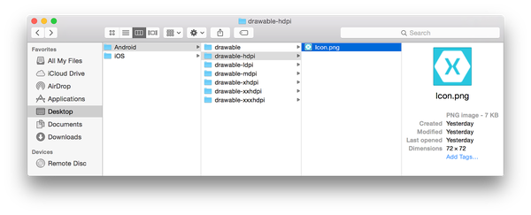</a>
      

    </li>
    <li>
      

        In the Add File to Folder dialog box, select 
        Copy the file into the
        directory and click OK:
      

      

        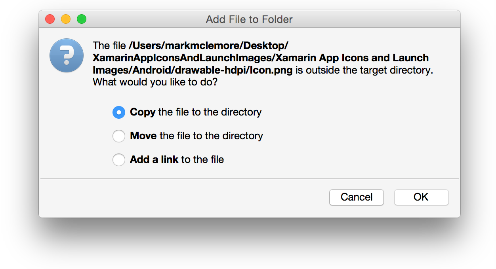
      

    </li>
    <li>
      

        Repeat these steps for each of the drawable-* folders
        until the contents of the drawable-* Xamarin App Icons 
        folders are copied to their counterpart drawable-* folders 
        in the <b>Phoneword</b> project:
      

      

        <a href="Images/xs/29-resource-folders.png" class=" fancybox">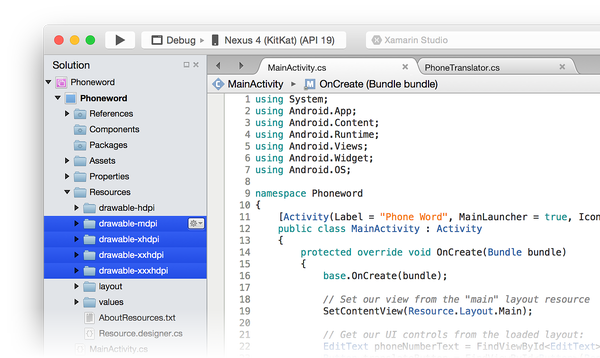</a>
      

      

        These folders provide different resolutions of the icon so that it renders correctly 
        on different devices with different screen densities.
      

    </li>
   
</ide>
<ide name="vs">

    <li>
      

        Next, let's set the application icon. First, download and unzip the <a href=
        "/guides/android/getting_started/hello,android/Resources/XamarinAppIconsAndLaunchImages.zip">
        Xamarin App Icons set</a>. Next, expand the drawable
        folder under Resources and remove the existing
        <b>Icon.png</b> by right-clicking it and selecting Delete:
      

      

        <a href="Images/vs/24a-delete-icon.png" class=" fancybox">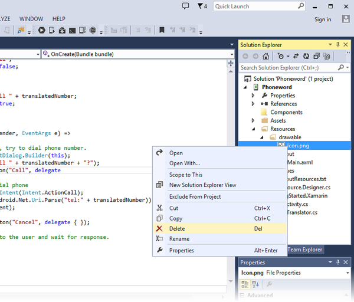</a>
      

      

        When the following dialog box is displayed, click OK:
      

      

        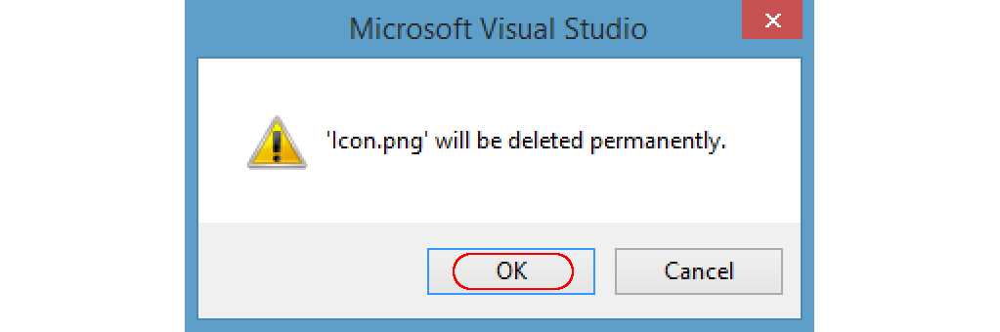
      

    </li>
    <li>
      

        Next, let&lsquo;s right-click the drawable folder and
        select Add &gt; Existing Item...:
      

      

        <a href="Images/vs/25-add-existing-item.png" class=" fancybox">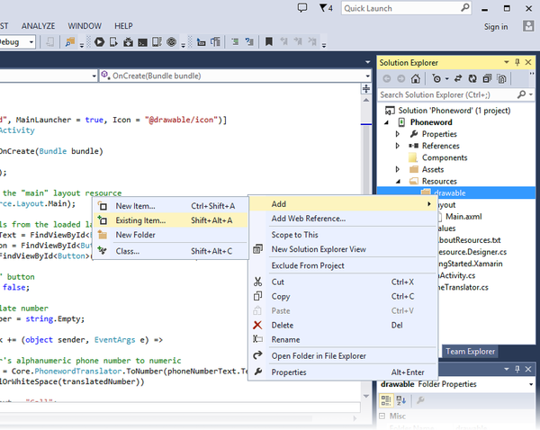</a>
      

    </li>
    <li>
      

        From the selection dialog, let's navigate to the unzipped Xamarin App Icons
        directory and open the drawable folder. Select 
        <b>Icon.png</b> and click Add:
      

      

        <a href="Images/vs/26-select-icon.png" class=" fancybox">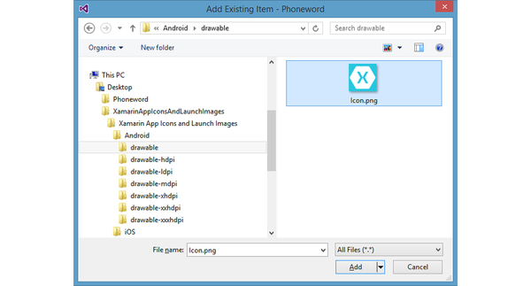</a>
      

    </li>
    <li>
      

        Next, let&lsquo;s add the rest of the Xamarin App Icons drawable-* folders to the project. These folders provide different
        resolutions of the icon so that it renders correctly on different devices with
        different screen densities. In a File Explorer window, navigate to the unzipped
        Xamarin App Icons directory and select the drawable-*
        folders:
      

      

        <a href="Images/vs/27a-source-icons.png" class=" fancybox">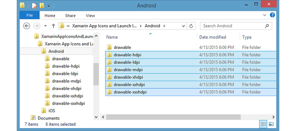</a>
      

      

        Drag these folders onto the Resources folder in the
        Visual Studio Solution Explorer pane.
        These folders are now part of your project as shown in Solution Explorer on the right:
      

      

        <a href="Images/vs/27b-drag-icon-folders.png" class=" fancybox">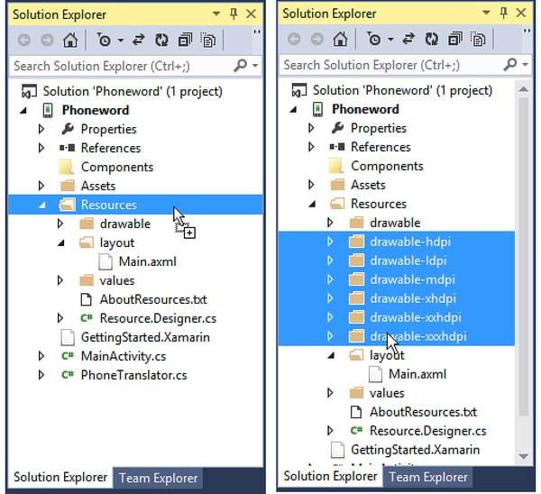</a>
      

    </li>
    <li>
      

        Next, let&lsquo;s specify the icon in the Android Manifest by choosing
        <code>@drawable/Icon</code> from the Application Icon
        drop-down menu:
      

      

        <a href="Images/vs/28-specify-icon.png" class=" fancybox">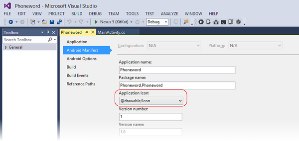</a>
      

    </li>
   
</ide>

<ide name="xs">

    <li>
      

        Finally, we can test our application by deploying it to an Android emulator. If you
        have not yet configured your emulator, please see <a href=
        "http://developer.xamarin.com/guides/android/getting_started/installation/android-player/">
        Xamarin Android Player</a> for setup instructions. 
        In this example, we have installed the Nexus 4 (KitKat) 
        (Android 4.4.2, API Level 19) virtual device and we have started it from the 
        Xamarin Android Player Device Manager console:
      

      

         <a href="Images/xs/32a-start-xap-virtual-device.png" class=" fancybox">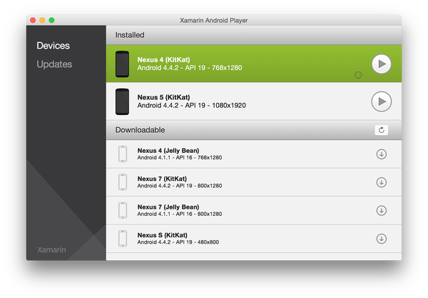</a>
      

      

        In Xamarin Studio, select this virtual device (under 
        Virtual Devices) and click the play button
        in the upper left corner:
      

      

        <a href="Images/xs/32b-select-virtual-device.png" class=" fancybox">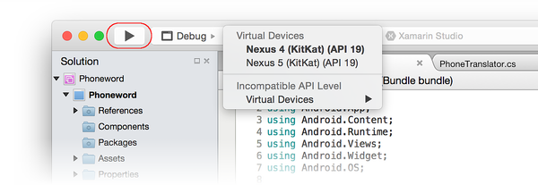</a>
      

      

        As shown in this screenshot, we have selected the Nexus 4
        (KitKat) (API 19) virtual device that is running in the Xamarin Android
        Player.
      

    </li>
   
</ide>
<ide name="vs">

    <li>
      

        Finally, we can test our application by deploying it to an emulator. If you have
        not yet configured your emulator, please see <a href=
        "http://developer.xamarin.com/guides/android/getting_started/installation/android-player/">
        Xamarin Android Player</a> for setup instructions. If you are using a Google
        Android emulator, please see <a href=
        "http://developer.xamarin.com/guides/android/getting_started/installation/accelerating_android_emulators/">
        Accelerating Android Emulators</a> for tips on improving emulation performance.
        Let's open the Xamarin Android Player Device Manager by 
        clicking the Manage virtual devices (XAP) icon in the toolbar: 
      

      

        <a href="Images/vs/29a-manage-virtual-devices.png" class=" fancybox">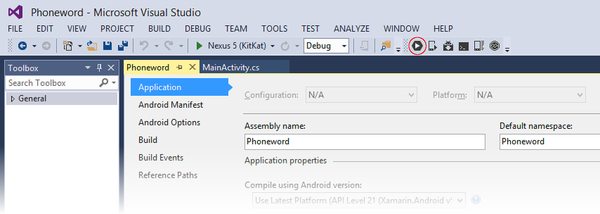</a>
      

      

        In the Xamarin Android Player Device Manager,
        let's download, install, and start the Nexus 5 (KitKat)
        (Android 4.4.2, API Level 19) virtual device:
      

      

        <a href="Images/vs/29b-start-xap-virtual-device.png" class=" fancybox">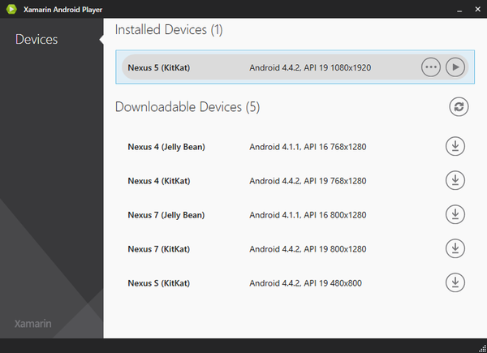</a>
      

      

        Before we send our app to this emulator, let's configure the app's minimum Android version
        so that it will run on our chosen virtual device. In Visual Studio, open the 
        Application page of Properties. 
        Under Minimum Android to
        target:, select API Level 19 (for more information about Android API levels,
        see <a href=
        "http://developer.xamarin.com/guides/android/application_fundamentals/understanding_android_api_levels/">
        Understanding Android API Levels</a>). 
      

      

        <a href="Images/vs/29c-set-api-level.png" class=" fancybox">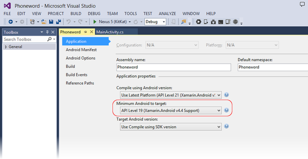</a>
      

      

        Next, let's deploy our app to the Nexus 5 (KitKat) device 
        from the drop-down menu on the toolbar as shown here:
      

      

        <a href="Images/vs/29d-select-virtual-device.png" class=" fancybox">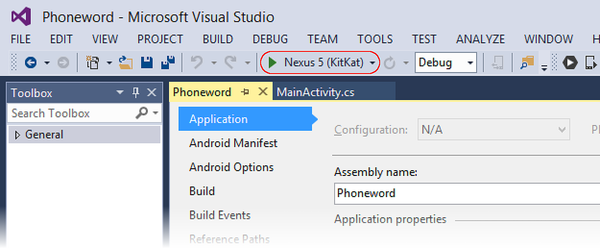</a>
      

      

        Visual Studio will copy files to this emulator before installing and launching
        our app.
      

    </li>
   
   
</ide>

<ide name="xs">

    <li>
      

        After Xamarin Studio loads the application into the virtual device, the <b>Phoneword</b> 
        app is automatically started. The screenshots below
        illustrate the <b>Phoneword</b> application running in the Xamarin Android Player.
        The icons that we installed are displayed next to the Phone Word 
        label that we configured in <code>MainActivity</code>. 
        Clicking the Translate button
        updates the text of the Call button, and clicking the
        Call button causes the call dialog to appear as shown
        on the right:
      

      

        <a href="Images/xs/31-phoneword-result.png" class="fancybox">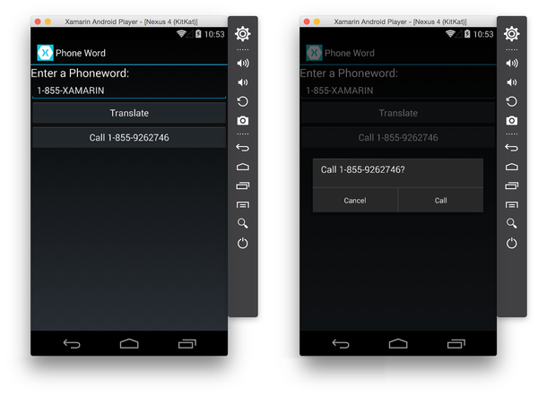</a>
      

    </li>
   
</ide>
<ide name="vs">

    <li>
      

        The screenshots below illustrate the <b>Phoneword</b> application running in 
        Xamarin Android Player. The icons that we installed are displayed
        next to the Phone Word label that we configured in 
        <code>MainActivity</code>. 
        Clicking the Translate button 
        updates the text of the Call button, and clicking the
        Call button causes the call dialog to appear as shown
        on the right:
      

      

        <a href="Images/vs/30-phoneword-result.png" class=" fancybox">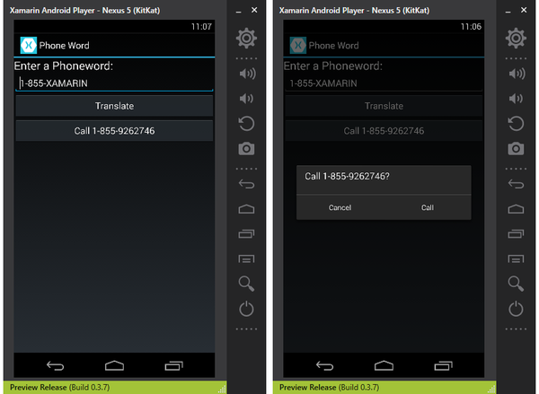</a>
      

    </li>
</ide>

</ol>

Congratulations on completing your first Xamarin.Android application! Now it's time to 
dissect the tools and skills we just learned in the 
[Hello, Android Deep Dive](/guides/android/getting_started/hello,android/hello,android_deepdive/).
