# Hello, Android Multiscreen Quickstart

In the walkthrough part of this guide we’ll add a second screen to our 
[Phoneword](https://github.com/xamarin/monodroid-samples/tree/master/Phoneword)
application to keep track of
the history of numbers called using our app. The 
[final application](https://github.com/xamarin/monodroid-samples/tree/master/PhonewordMultiscreen)
will have a second screen that displays the call history, as illustrated by
the following screenshots:

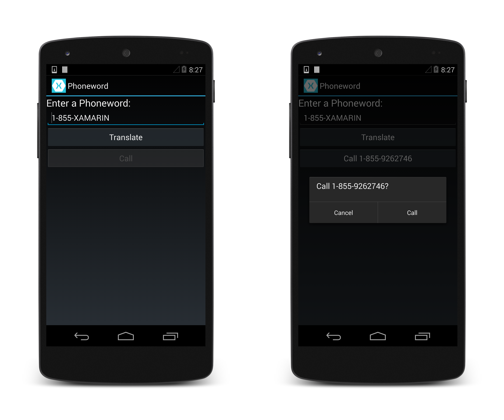

In the accompanying
[Deep Dive](http://developer.xamarin.com/guides/android/getting_started/hello,android_multiscreen/hello,android_multiscreen_deepdive/),
we’ll review what we’ve built and discuss architecture, navigation,
and other new Android concepts that we encounter along the way. 

Let’s get started!

# Requirements

Because this guide picks up where [Hello, Android](http://developer.xamarin.com/guides/android/getting_started/hello,android/)
leaves off, it requires completion of the
[Hello, Android Quickstart](http://developer.xamarin.com/guides/android/getting_started/hello,android/hello,android_quickstart/).
If you would like to jump directly into the walkthrough below, you can download the completed version of 
[Phoneword](https://github.com/xamarin/monodroid-samples/tree/master/Phoneword)
(from the Hello, Android Quickstart) and use it to start the walkthrough.

<h2>Walkthrough</h2>

In this walkthrough we’ll add a <b>Call History</b> screen to our Phoneword application.

<ide name="vs">
    <ol>
        <li>
            

                Let’s open the Phoneword application in Visual Studio:
            

            
<a href="Images/vs/01-phoneword.png" class=" fancybox">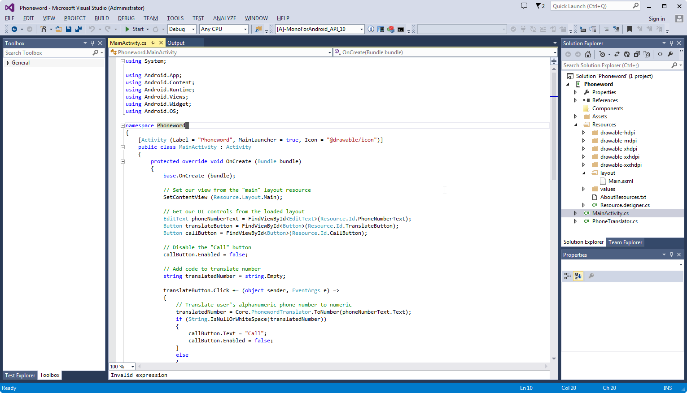</a>

        </li>
        <li>
            

                Let’s start by editing the user interface. Open the <b>Main.axml</b> file from
                the Solution Explorer:
            

            
<a href="Images/vs/02-main-axml.png" class=" fancybox">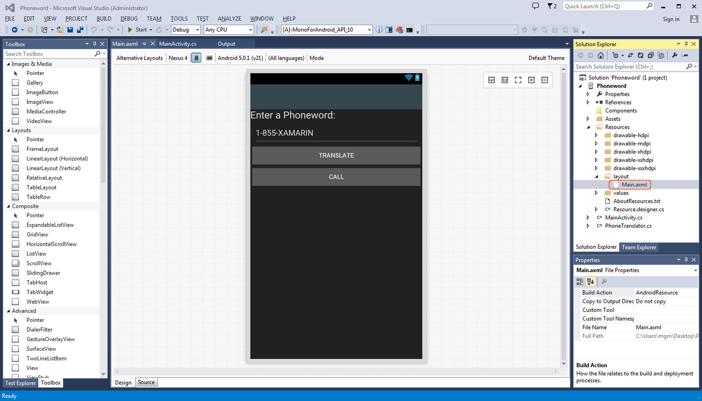</a>

        </li>
        <li>
            

                From the Toolbox, drag a Button onto the
                design surface and place it below the Call button:
            

            
<a href="Images/vs/03-new-button.png" class=" fancybox">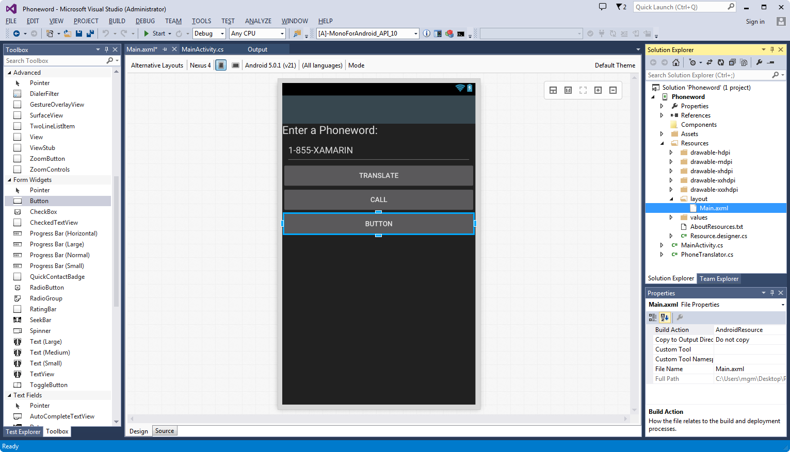</a>

        </li>
        <li>
            

                In the Properties pane, change the button Id
                to <code>@+id/CallHistoryButton</code>:
            

            
<a href="Images/vs/04-call-history-button.png" class=" fancybox">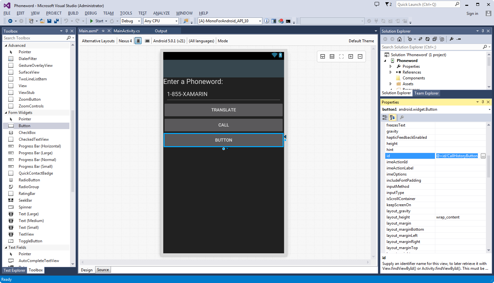</a>

        </li>
        <li>
            

                Let’s set the Text property of the button
                to <code>@string/callHistory</code>. The Android Designer will
                interpret this literally, but we’re going to make a few changes so that the button’s text shows up correctly:
            

            
<a href="Images/vs/05-call-history-string.png" class=" fancybox">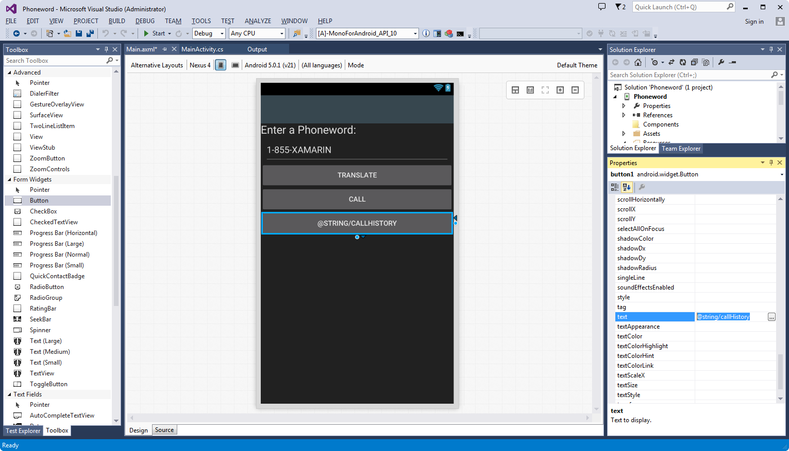</a>

        </li>
        <li>
            

                Expand the values node under the Resources folder in the Solution Explorer and double-click the string resources file,
                <b>Strings.xml</b>:
            

            
<a href="Images/vs/06-strings-resources-file.png" class=" fancybox">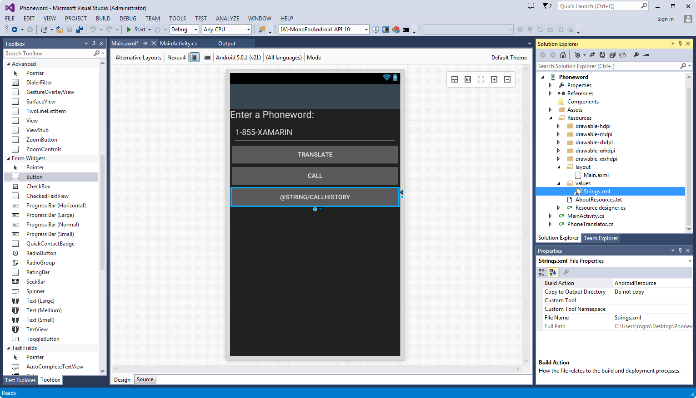</a>

        </li>
        <li>
            
Add the <code>callHistory</code> string name and value to the <b>Strings.xml</b> file and save it:

            <pre><code class=" syntax brush-C#">&lt;?xml version="1.0" encoding="utf-8"?&gt;
&lt;resources&gt;
    &lt;string name="callHistory"&gt;Call History&lt;/string&gt;
&lt;/resources&gt;</code></pre>
            
The Call History button text should update to reflect the new string value:

            
<a href="Images/vs/07-new-string-value.png" class=" fancybox">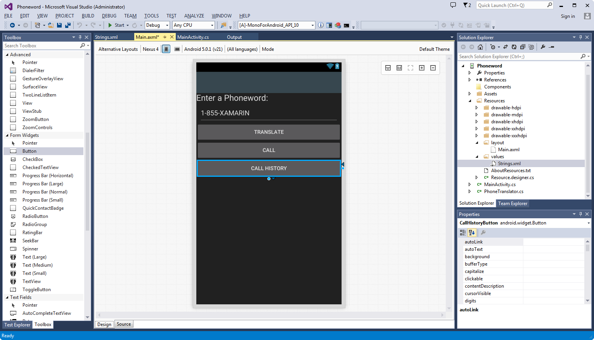</a>

        </li>
        <li>
            

                With the Call History button selected on the design surface, find the
                <code>enabled</code> setting in the Properties pane and set its value to 
                <code>false</code> to disable the button.
                This will cause the button to become darker on the design surface:
            

            
<a href="Images/vs/08-enabled-false.png" class=" fancybox">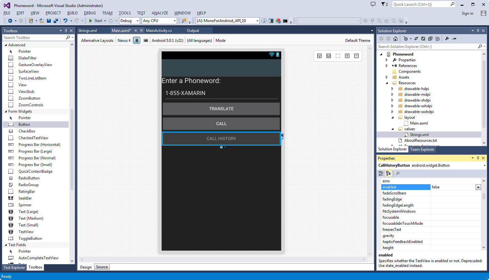</a>

        </li>
        <li>
            

                Let’s create a second Activity to power the second screen. In the Solution Explorer, 
                right-click the <b>Phoneword</b> project and 
                choose Add &gt; New Item...:
            

            
<a href="Images/vs/09-add-new-file.png" class=" fancybox">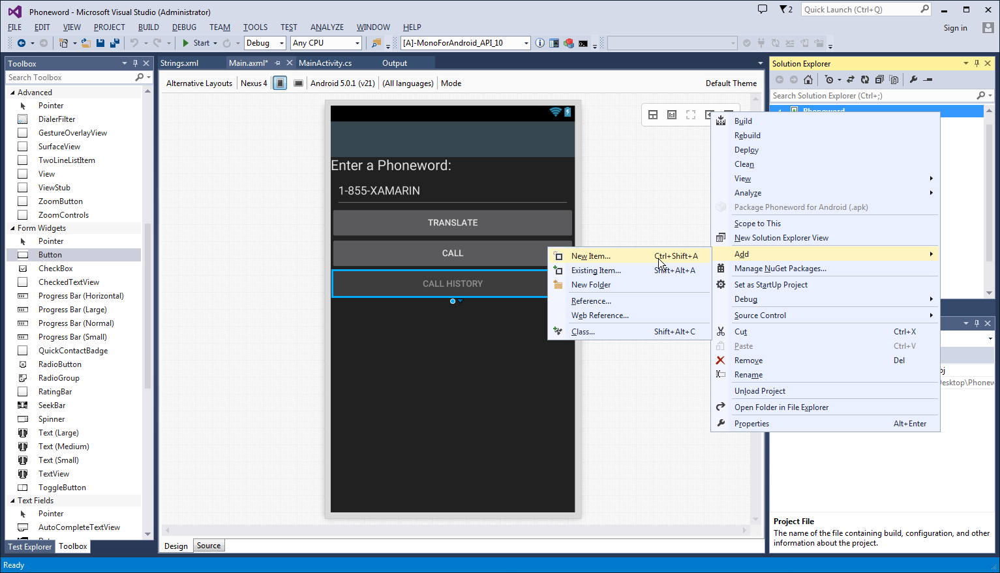</a>

        </li>
        <li>
            
In the Add New Item dialog, choose Visual C# > Activity and name the Activity file <b>CallHistoryActivity.cs</b>:

            
<a href="Images/vs/10-call-history-activity.png" class=" fancybox">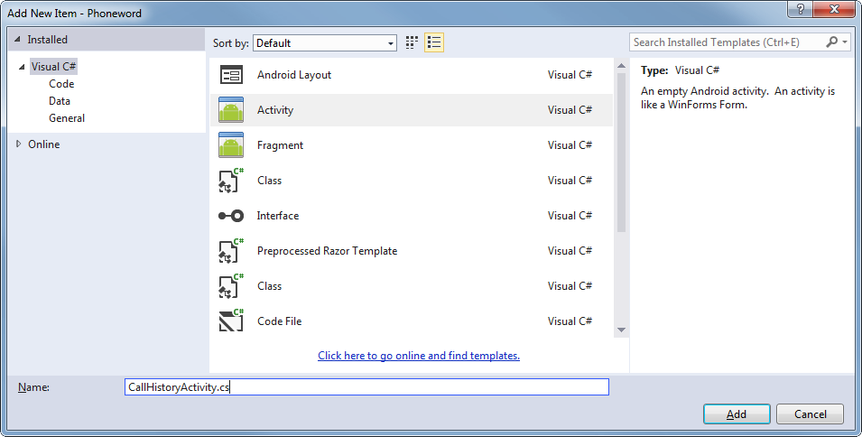</a>

        </li>
        <li>
            
Replace the template code in <b>CallHistoryActivity.cs</b> with the following:

            <pre><code class=" syntax brush-C#">using System;
using System.Collections.Generic;
using Android.App;
using Android.OS;
using Android.Widget;
namespace Phoneword
{
    [Activity(Label = "@string/callHistory")]            
    public class CallHistoryActivity : ListActivity
    {
        protected override void OnCreate(Bundle bundle)
        {
            base.OnCreate(bundle);
            // Create your application here
            var phoneNumbers = Intent.Extras.GetStringArrayList("phone_numbers") ?? new string[0];
            this.ListAdapter = new ArrayAdapter&lt;string&gt;(this, Android.Resource.Layout.SimpleListItem1, phoneNumbers);
        }
    }
}</code></pre>
            

                In this class, we're creating a <code>ListActivity</code> and populating it programmatically, so we don’t need to create a new layout file for this Activity.
                We’ll discuss this in more detail in the <a href="http://developer.xamarin.com/guides/android/getting_started/hello,android/hello,android_deepdive/">Hello, Android Multiscreen Deep Dive</a>.
            

        </li>
        <li>
            
In our app, we’re going to collect phone numbers that the user has dialed on the first screen and then pass them to the second screen. We’re going to store the phone numbers as a list of strings. To support lists, add the following <code>using</code> directive to the top of the <code>MainActivity</code> class:

            <pre><code class=" syntax brush-C#">using System.Collections.Generic;</code></pre>
            
Next, let’s create an empty list that we can fill with phone numbers. Our <code>MainActivity</code> class will look like this:

            <pre><code class=" syntax brush-C#">[Activity(Label = "Phoneword", MainLauncher = true, Icon = "@drawable/icon")]
public class MainActivity : Activity
{
    static readonly List&lt;string&gt; phoneNumbers = new List&lt;string&gt;();
    ...// OnCreate, etc.
}</code></pre>
        </li>
        <li>
            
Let’s wire up the Call History button. In the <code>MainActivity</code> class, add the 
            following code to register and wire up the button:

            <pre><code class=" syntax brush-C#">Button callHistoryButton = FindViewById&lt;Button&gt; (Resource.Id.CallHistoryButton);
callHistoryButton.Click += (sender, e) =&gt;
{
    var intent = new Intent(this, typeof(CallHistoryActivity));
    intent.PutStringArrayListExtra("phone_numbers", _phoneNumbers);
    StartActivity(intent);
};</code></pre>
        </li>
        <li>
            

                We want to extend the Call button's functionality to add a phone number to the list of numbers and enable the
                Call History button whenever the user dials a new number. Let’s change the code of the <em>Neutral Button</em> in our Alert Dialog to reflect that:
            

            <pre><code class=" syntax brush-C#">callDialog.SetNeutralButton("Call", delegate
{
    // add dialed number to list of called numbers.
    phoneNumbers.Add(translatedNumber);
    // enable the Call History button
    callHistoryButton.Enabled = true;
    // Create intent to dial phone
    var callIntent = new Intent(Intent.ActionCall);
    callIntent.SetData(Android.Net.Uri.Parse("tel:" + translatedNumber));
    StartActivity(callIntent);
});</code></pre>
            
Save and build the application to make sure there are no errors.

        </li>
        <li>
            
Deploy the application to an emulator or device. The following screenshots illustrate the Phoneword application running in the Xamarin Android Player:

            
<a href="Images/vs/phoneword-xap.png" class=" fancybox">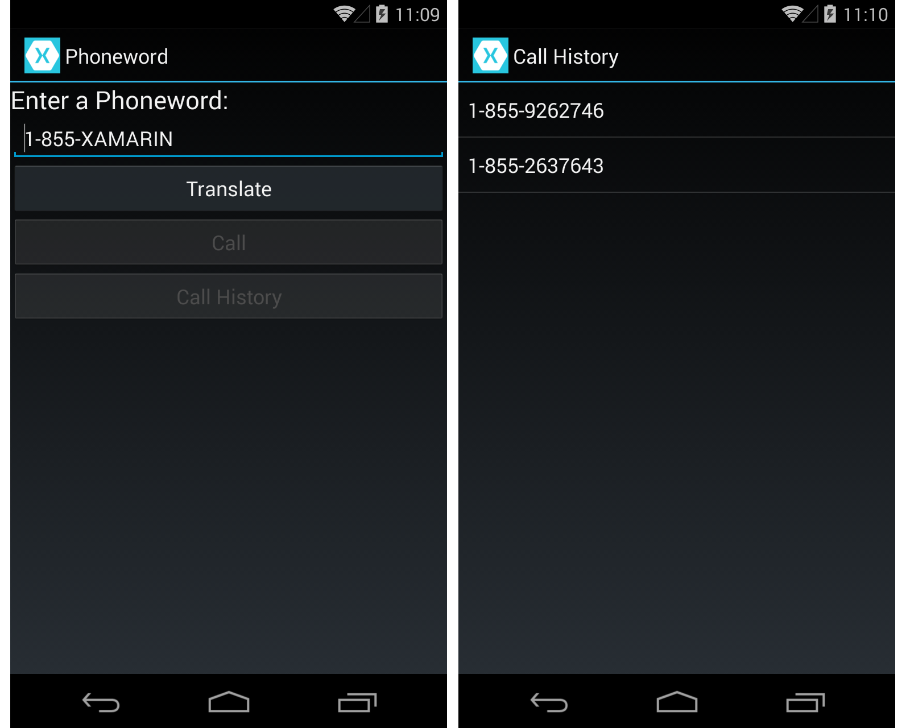</a>

        </li>
    </ol>
</ide>
Congratulations on completing your first multi-screen Xamarin.Android application! Now it’s time to dissect the
tools and skills we just learned in the
[Hello, Android Multiscreen Deep Dive](http://developer.xamarin.com/guides/android/getting_started/hello,android_multiscreen/hello,android_multiscreen_deepdive/).
