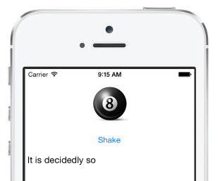

# Xamarin.Forms

## The Challenge

In this challenge you'll build the Magic Ball app shown in the **Your First Xamarin.Forms App** session. Will you succeed??




The app should run on iOS, Android or Windows Phone. You only need to demonstrate one platform to qualify for the prize - but show the code is all Xamarin.Forms :)

Xamarin's Developer Center has [Intro to Xamarin.Forms](http://developer.xamarin.com/guides/cross-platform/xamarin-forms/introduction-to-xamarin-forms/) and [XAML](http://developer.xamarin.com/guides/cross-platform/xamarin-forms/xaml-for-xamarin-forms/) docs that will help.

### Bonus Challenge #1

Use the [DependencyService](http://developer.xamarin.com/guides/cross-platform/xamarin-forms/dependency-service/) to read the result using text-to-speech. Sample code for this can be found in the [Todo app](https://github.com/xamarin/xamarin-forms-samples/tree/master/Todo/PCL) (see the [`ITextToSpeech`](https://github.com/xamarin/xamarin-forms-samples/blob/master/Todo/PCL/Todo/ITextToSpeech.cs) interface and its implementations for [iOS](https://github.com/xamarin/xamarin-forms-samples/blob/master/Todo/PCL/Todo.iOS/TextToSpeech_iOS.cs) and [Android](https://github.com/xamarin/xamarin-forms-samples/blob/master/Todo/PCL/Todo.Android/TextToSpeech_Android.cs)).

### Bonus Challenge #2

Use a [CustomRenderer](http://developer.xamarin.com/guides/cross-platform/xamarin-forms/custom-renderer/) to add another button to tweet the result, similar to the `TweetButton` in [this sample](https://github.com/conceptdev/xamarin-forms-samples/blob/master/Evolve13/Evolve13/Controls/TweetButton.cs). It could say something like *"Is my #Xamarin.Forms Dev Days Labs amazing?""* then append the result.

Don't forget to implement the platform-specific renderers for [iOS](https://github.com/conceptdev/xamarin-forms-samples/blob/master/Evolve13/Evolve13.iOS/TweetButtonRenderer.cs) and [Android](https://github.com/conceptdev/xamarin-forms-samples/blob/master/Evolve13/Evolve13.Android/TweetButtonRenderer.cs).

## Challenge Walkthrough

* Create a new **Xamarin.Forms (PCL)** solution (don't forget to update the NuGet package version to use the latest Xamarin.Forms release)

* Add a new `XAML Content Page` to the common-code project:

  - Add a `StackLayout` element to contain the following controls

  - Add a `Button` to press (set the `Text` property)
 
  - Add a `Label` to display the result (give it an `x:Name`)

  - Add a `Clicked` handler (you'll implement this fully in the next step)

  - Add other elements to make your app pretty :)

* Copy over the following code into your page's code-behind file:

```CSharp
// http://en.wikipedia.org/wiki/Magic_8-Ball
string[] options = {" It is certain"
	, " It is decidedly so"
	, " Without a doubt"
	, " Yes definitely"
	, " You may rely on it"
	, " As I see it, yes"
	, " Most likely"
	, " Outlook good"
	, " Yes"
	, " Signs point to yes"

	, " Reply hazy try again"
	, " Ask again later"
	, " Better not tell you now"
	, " Cannot predict now"
	, " Concentrate and ask again"

	, " Don't count on it"
	, " My reply is no"
	, " My sources say no"
	, " Outlook not so good"
	, " Very doubtful "
};
```
* Use `System.Random` to implement the `Clicked` handler so that it choose a random element from the `options` array and displays it in the `Label`. You can refer to the label in code using the `x:Name` you chose.

* Don't forget to edit `App.cs` to replace the default `ContentPage` with your new XAML page.

* Run the app!

