# Hello, iOS Deep Dive

In the Quickstart walkthrough, we built and ran our first Xamarin.iOS application. Now it’s time to develop a deeper understanding of how iOS applications work so we can build more sophisticated programs. In this guide we review the steps that we took in the Hello, iOS walkthrough so that we can understand what we did, and begin to develop a fundamental understanding of iOS application development.

We will explore the following topics:

<ul>
<ide name="vs"><li><strong>Introduction to Visual Studio</strong> – Introduction to Visual Studio and creating a new application.</li></ide>
<li><strong>Anatomy of a Xamarin.iOS Application</strong> - Tour of the essential parts of a Xamarin.iOS application.</li>
<li><strong>Architecture and App Fundamentals</strong> – A review of the parts of an iOS application and the relationship between them.</li>
<li><strong>User Interface (UI)</strong> – Creating user interfaces with the iOS Designer.</li>
<li><strong>View Controllers and the View Lifecycle</strong> – An introduction to the View Lifecycle and managing Content View Hierarchies with the View Controller.</li>
<li><strong>Testing, Deployment, and Finishing Touches</strong> - Complete your application with advice on testing, deployment, generating artwork, and more.</li>
</ul>

This guide helps you develop the skills and knowledge required to build a single-screen iOS application. After working through it, you should have an understanding of the different parts of a Xamarin.iOS application and how they fit together.


<ide name="vs">
<h1>Introduction to Visual Studio</h1>

<p>Visual Studio is a powerful IDE from Microsoft. It features a fully integrated visual designer, a text editor complete with refactoring tools, an assembly browser, source code integration, and more. In this guide we'll learn to use some basic Visual Studio features with the Xamarin plug-in.</p>

<p>Visual Studio organizes code into <em>Solutions</em> and <em>Projects</em>. A Solution is a container that can hold one or more Projects. A Project can be an application (such as iOS or Android), a supporting library, a test application, and more. In our Phoneword app, we created an empty Solution and added a new iPhone Project using the <span class="uiitem">Single View Application</span> template. Our initial Solution looked like this:</p>

<p><a href="Images/VS_image30.png" class=" fancybox">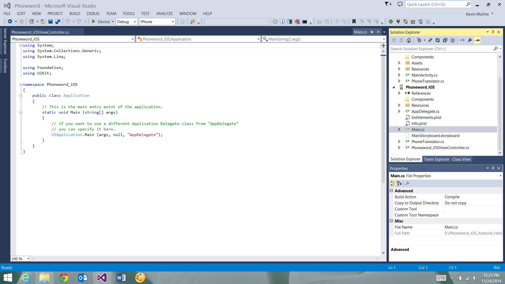</a></p>
</ide>

# Anatomy of a Xamarin.iOS Application

<ide name="vs">
<p>Let’s get familiar with the contents of our Solution. On the right is the <em>Solution Pane</em>, which contains the directory structure and all the files associated with our Solution:</p>

<p><a href="Images/VS_image31.png" class=" fancybox">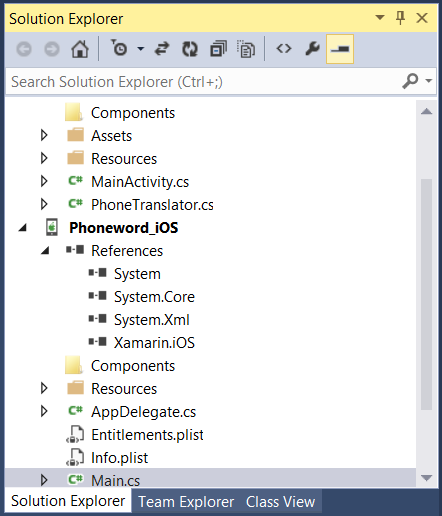</a></p>
</ide>

We've created a Solution called <span class="uiitem">Phoneword</span> and placed our iOS Project - <span class="uiitem">Phoneword_iOS</span> - inside it. Let’s take a look at the items inside the Project:

-  **References** - Contains the assemblies required to build and run the application. If we expand the directory, we'll see references to .NET assemblies such as  [System](http://msdn.microsoft.com/en-us/library/system%28v=vs.110%29.aspx) , System.Core, and  [System.Xml](http://msdn.microsoft.com/en-us/library/system.xml%28v=vs.110%29.aspx) , as well as a reference to Xamarin's Xamarin.iOS assembly.
-  **Components** - The Components directory houses ready-made features from the  [Xamarin Components store](http://components.xamarin.com/) , a public marketplace for Xamarin code. This is similar to the NuGet Gallery for those familiar with Visual Studio. For more information on Xamarin Components, refer to the  [Xamarin Components walkthrough](http://developer.xamarin.com/guides/cross-platform/application_fundamentals/components_walkthrough/) .
-  **Resources** - The Resources folder stores icons, launch images, and other media. Xamarin has a separate guide for  [Working with Resources](http://developer.xamarin.com/guides/ios/application_fundamentals/working_with_resources/) that explores the role of this directory further.
-  **Main.cs** – This contains the main entry point of the application. To start the application, we pass in the name of the main application class, the  `AppDelegate` .
-  **AppDelegate.cs** – This file contains the main application class and is responsible for creating the Window, building the user interface, and listening to events from the operating system.
-  **Main.storyboard** - The Storyboard contains the visual design of the application’s user interface. Storyboard files open in a graphical editor called the iOS Designer.
-  **ViewController.cs** – The View Controller powers the screen (View) that a user sees and touches. The View Controller is responsible for handling interactions between the user and the View.
-  **ViewController.designer.cs** – The `designer.cs` is an auto-generated file that serves as the glue between controls in the View and their code representations in the View Controller. Because this is an internal plumbing file, the IDE will overwrite any manual changes and most of the time we can ignore this file. For more information on the relationship between the visual Designer and the backing code, refer to the  [Introduction to the iOS Designer](http://developer.xamarin.com/guides/ios/user_interface/designer/introduction/) guide.
-  **Info.plist** – `Info.plist` is where we set application properties such as the application name, icons, launch images, and more. This is a powerful file and a thorough introduction to it is available in the  [Working with Property Lists](http://developer.xamarin.com/guides/ios/application_fundamentals/working_with_property_lists/) guide.
-  **Entitlements.plist** - The entitlements property list lets us specify application  *capabilities* (also called App Store Technologies) such as iCloud, PassKit, and more. More information on the  `Entitlements.plist` can be found in the  [Working with Property Lists](http://developer.xamarin.com/guides/ios/application_fundamentals/working_with_property_lists/) guide. For a general introduction to entitlements, refer to the  [Device Provisioning](http://developer.xamarin.com/guides/ios/getting_started/device_provisioning/) guide.


Now that we’ve developed a basic understanding of the components of a Xamarin.iOS application, let’s explore how the different parts work together to make the application run.

# Architecture and App Fundamentals

Before an iOS application can load a user interface, two things need to be in place. First, the application needs to define an *entry point* – the first code that runs when the application’s process is loaded into memory. Second, it needs to define a class to handle application-wide events and interact with the operating system.

In this section we’ll break down the relationships illustrated in the following diagram:

 [ 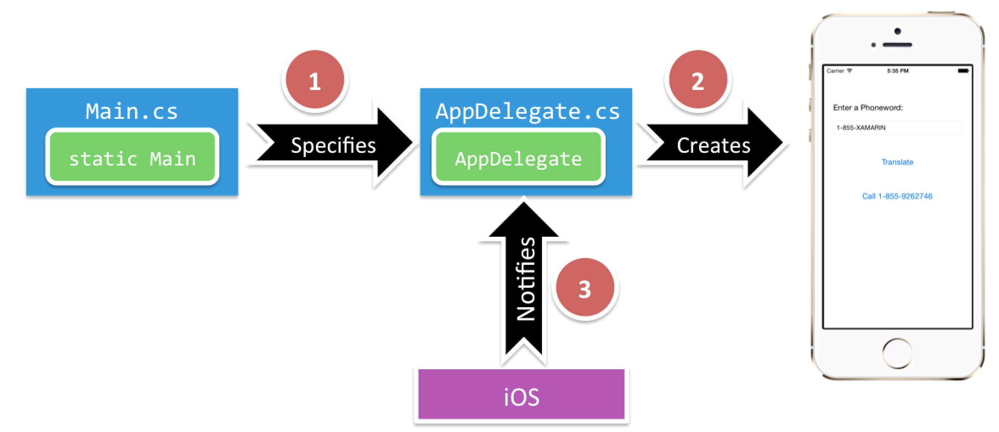](Images/image32.png)

Let's start at the beginning and learn what happens at application startup.

## Main

The main entry point of an iOS application is the `Main.cs` file. `Main.cs` contains a static Main method that creates a new Xamarin.iOS application instance and passes the name of the *Application Delegate* class that will handle OS events. The template code for the static `Main` method appears below:

```
using System;
using UIKit;

namespace Phoneword_iOS
{
    public class Application
    {
        static void Main (string[] args)
        {            
            UIApplication.Main (args, null, "AppDelegate");
        }
    }
}
```

## Application Delegate

In iOS, the *Application Delegate* class handles system events; this class lives inside `AppDelegate.cs`. The `AppDelegate` class manages the application *Window*. The Window is a single instance of the `UIWindow` class that serves as a container for the user interface. By default, an application gets only one Window onto which to load its content, and the Window is attached to a *Screen* (single `UIScreen` instance) that provides the bounding rectangle matching the dimensions of the physical device screen.

The *AppDelegate* is also responsible for subscribing to system updates about important application events such as when the app finishes launching or when memory is low.

The template code for the AppDelegate is presented below:

```
using System;
using Foundation;
using UIKit;

namespace Phoneword_iOS
{
    
    [Register ("AppDelegate")]
    public partial class AppDelegate : UIApplicationDelegate
    {
        public override UIWindow Window {
            get;
            set;
        }
    
        ...
    }
}
```

Once the application has defined its Window, it can begin loading the user interface. The next section explores UI creation.

# User Interface

The user interface of an iOS app is like a storefront - the application typically gets one Window, but it can fill the Window up with as many objects at it needs, and the objects and arrangements can be changed depending on what the app wants to display. The objects in this scenario - the things that the user sees - are called Views. To build a single screen in an application, Views are stacked on top of each other in a *Content View Hierarchy*, and the hierarchy is managed by a single View Controller. Applications with multiple screens have multiple Content View Hierarchies, each with its own View Controller, and the application places Views in the Window to create a different Content View Hierarchy based on the screen that the user is on.

In this section we dive into the user interface as we learn about Views, Content View Hierarchies, and the iOS Designer.

## iOS Designer and Storyboards

The iOS Designer is a visual tool for building user interfaces in Xamarin. We can launch the Designer by double-clicking on any Storyboard (.storyboard) file, which will open to a view that resembles the following screenshot:


<ide name="vs">
<p><a href="Images/VS_image33.png" class=" fancybox"></a></p>
</ide>

<ide name="vs">
<p>A <em>Storyboard</em> is a file that contains the visual designs of our application’s screens as well as the transitions and relationships between the screens. The representation of an application’s screen in a Storyboard is called a <em>Scene</em>. Each Scene represents a View Controller and the stack of Views that it manages (Content View Hierarchy). When we create a new <span class="uiitem">Single View Application</span> Project from a template, Visual Studio automatically generates a Storyboard file called <code>Main.storyboard</code> and populates it with a single Scene, as illustrated by the screenshot below:</p>
</ide>


<ide name="vs">
<p><a href="Images/VS_image34.png" class=" fancybox"></a></p>
</ide>

<ide name="vs">
<p>We can select the black bar at the bottom of the Storyboard screen to select the View Controller for the Scene. The View Controller is an instance of the <code>UIViewController</code> class that contains the backing code for the Content View Hierarchy. We can view and set properties on this View Controller inside the <span class="uiitem">Properties Pane</span>, as illustrated by the screenshot below:</p>
</ide>

<ide name="vs">
<p><a href="Images/VS_image35.png" class=" fancybox"></a></p>
</ide>

If we click inside the white part of the Scene, we can select the *View*. The View is an instance of the `UIView` class that defines an area of the screen and provides interfaces for working with the content in that area. Our current View is a single *Root View* that fills the whole device screen:


<ide name="vs">
<p><a href="Images/VS_image36.png" class=" fancybox">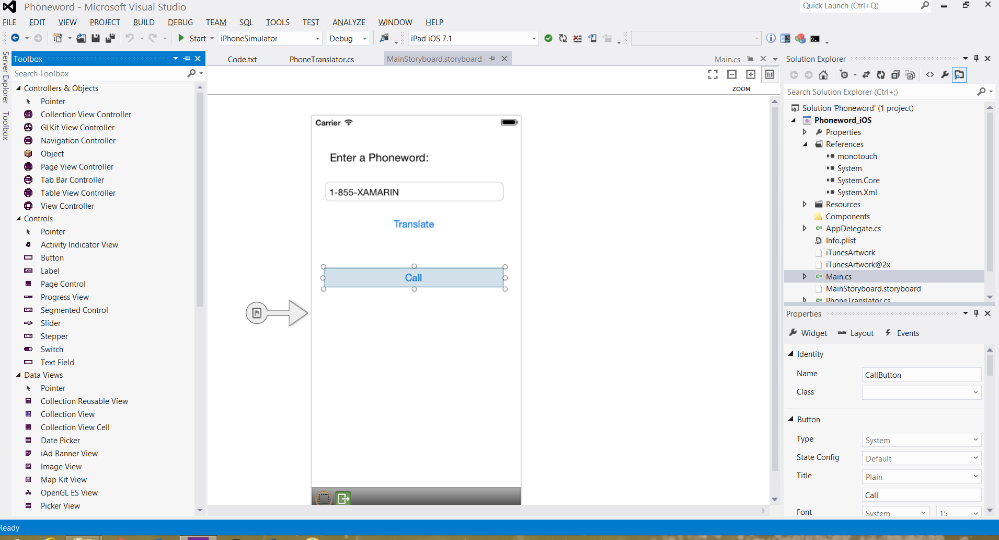</a></p>
</ide>

To the left of the Scene is a gray arrow with a flag icon, as illustrated by the screenshot below:

 [ 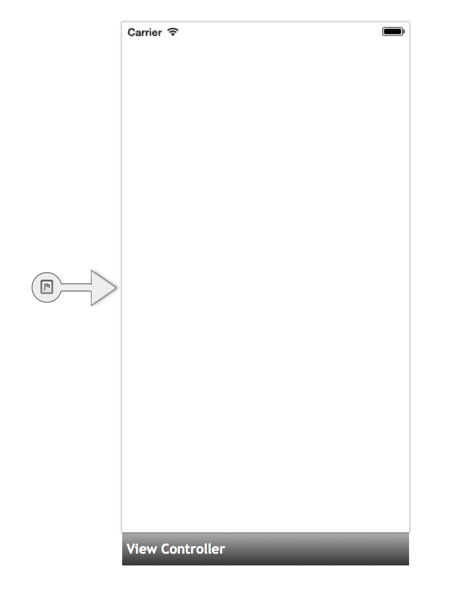](Images/image37.png)

The gray arrow represents a Storyboard transition called a *Segue* (pronounced “seg-way”). Since this Segue has no origin, it is called a *Sourceless Segue*. A Sourceless Segue points to the first Scene whose Views gets loaded into our application's Window at application startup. The Scene and the Views inside it will be the first thing that the user sees when the app loads.

When we build a user interface, we drag additional Views from the <span class="uiitem">Toolbox</span> onto the main View on the design surface, as illustrated by the screenshot below:

<ide name="vs">
<p><a href="Images/VS_image38.png" class=" fancybox">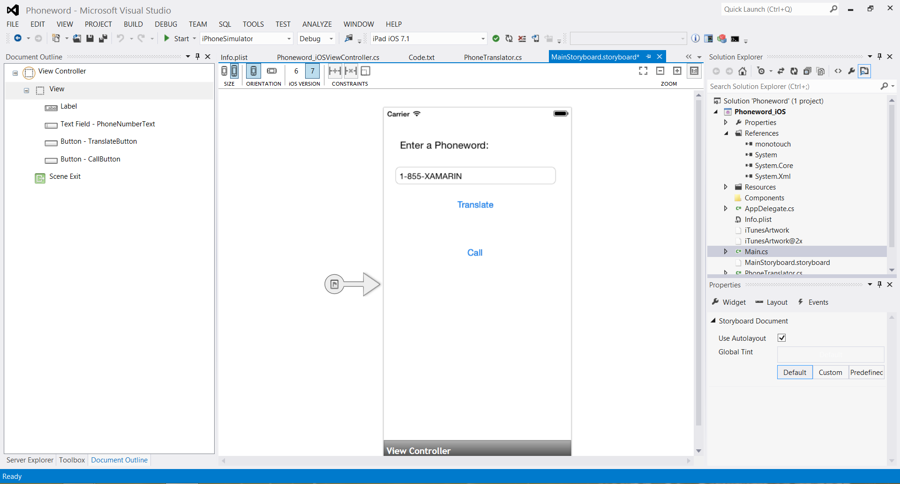</a></p>
</ide>

These additional Views are called *Subviews*. Together, the root View and Subviews are part of a *Content View Hierarchy* that is managed by our `ViewController`. We can see the outline of all the elements in the Scene by examining it in the <span class="uiitem">Document Outline</span> pad:

<ide name="vs">
<p><a href="Images/VS_image39.png" class=" fancybox">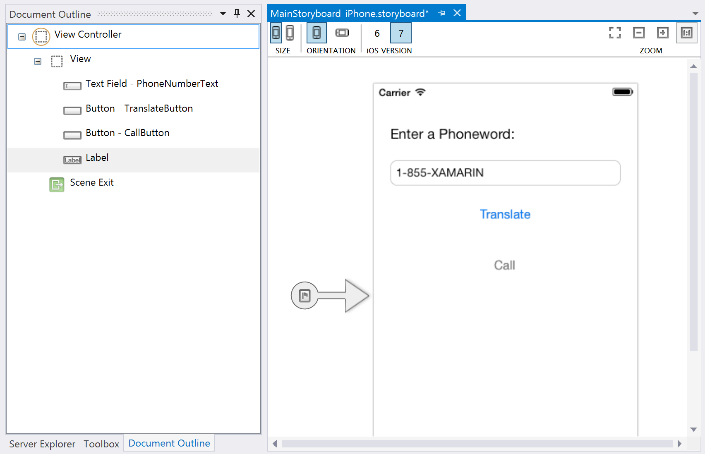</a></p>
</ide>

The Subviews are highlighted in the diagram below:

<ide name="vs">
<p><a href="Images/VS_image40.png" class=" fancybox">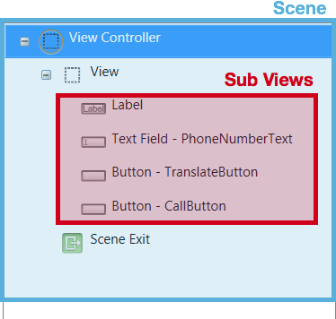</a></p>
</ide>

Let’s break down the Content View Hierarchy represented by this Scene in the next section.

## Content View Hierarchy

A *Content View Hierarchy* is a stack of Views and Subviews managed by a single View Controller, as illustrated by the diagram below:

 [ 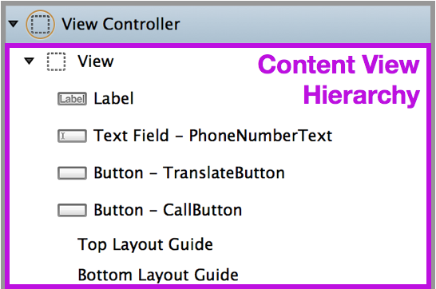](Images/image41.png)

We can make the Content View Hierarchy of our `ViewController` easier to see by temporarily changing the background color of the root View to yellow in the View section of the <span class="uiitem">Properties Pad</span>, as illustrated by the screenshot below:

<ide name="vs">
<p><a href="Images/VS_image42.png" class=" fancybox">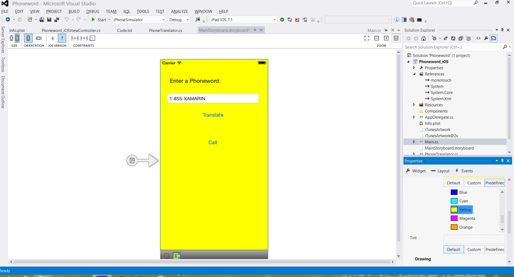</a></p>
</ide>

The diagram below illustrates the relationships between the Window, Views, Subviews, and View Controller that bring the user interface to the device screen:

 [ 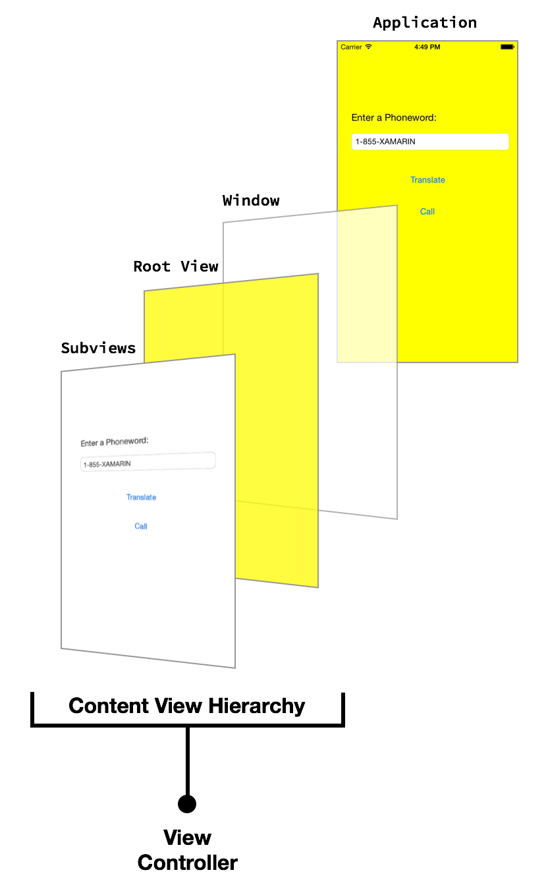](Images/image43.png)

In the next section, we will discuss how to work with Views in code and learn to program for user interaction using View Controllers and the View Lifecycle.

# View Controllers and the View Lifecycle

Every Content View Hierarchy has a corresponding View Controller to power user interaction. The role of the View Controller is to manage the Views in the Content View Hierarchy. The View Controller is not part of the Content View Hierarchy, and it's not an element in the interface. Rather, it provides the code that powers the user's interactions with the objects on the screen.

## View Controllers and Storyboards

<ide name="vs">
<p>The View Controller is represented in a Storyboard as a black bar at the bottom of the Scene. Selecting the View Controller brings up its properties in the <span class="uiitem">Properties Pane</span>:</p></ide>

<ide name="vs">
<p><a href="Images/VS_image44.png" class=" fancybox">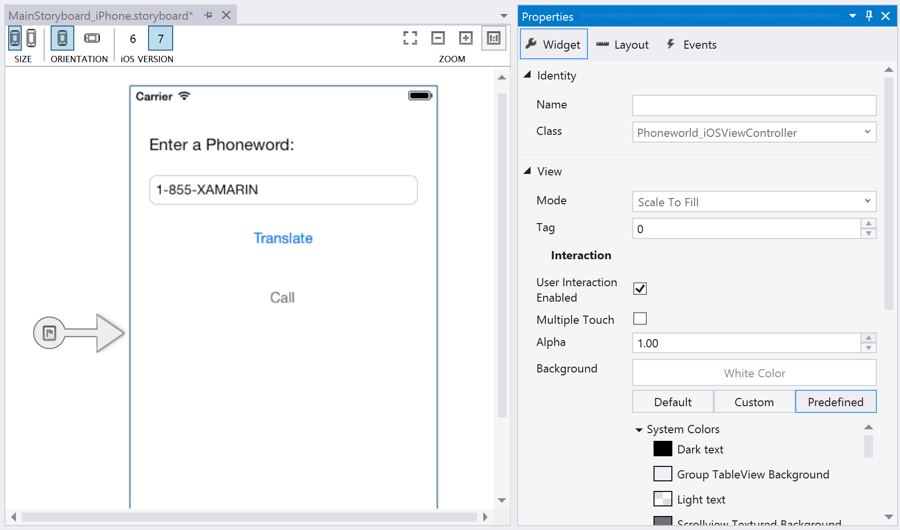</a></p>
</ide>

<ide name="vs">
<p>We can specify a custom View Controller class for the Content View Hierarchy represented by this Scene by editing the <span class="uiitem">Class</span> property in the <span class="uiitem">Identity</span> section of the <span class="uiitem">Properties Pane</span>. For example, our <span class="uiitem">Phoneword</span> application sets the <code>ViewController</code> as the View Controller for our first screen, as illustrated by the screenshot below:</p>
</ide>

<ide name="vs">
<p><a href="Images/VS_image45.png" class=" fancybox"></a></p>
</ide>

This links the Storyboard representation of the View Controller to the `ViewController` C# class. If we open the `ViewController.cs` file, we see that our View Controller is a *subclass* of `UIViewController`, as illustrated by the code below:

```
public partial class ViewController : UIViewController 
{ 
    public ViewController (IntPtr handle) : base (handle)   
    { 

    } 
}
```

The `ViewController` now drives the interactions of the Content View Hierarchy associated with this View Controller in the Storyboard. Next we’ll learn about the View Controller's role in managing the Views by introducing a process called the View lifecycle.

<div class="note"><strong>Note</strong>: For visual-only screens that don’t require user interaction, we can leave the <span class="uiitem">Class</span> property blank in the <span class="uiitem">Properties Pad</span>. This sets the View Controller's backing class as the default implementation of a <code>UIViewController</code>, which is appropriate if we don’t plan on adding custom code.</div>

## View Lifecycle

The View Controller is in charge of loading and unloading Content View Hierarchies from the Window. When something of importance happens to a View in the Content View Hierarchy, the operating system notifies the View Controller through events in the View lifecycle. By overriding methods in the View lifecycle, we can interact with the objects on the screen and create a dynamic, responsive user interface.

These are the basic lifecycle methods and their function:

-  **ViewDidLoad** - Called  *once* the first time the View Controller loads its Content View Hierarchy into memory. This is a good place to do initial setup because it is when Subviews first become available in code.
-  **ViewWillAppear** - Called every time a View Controller's View is about to be added to a Content View Hierarchy and appear on the screen.
-  **ViewWillDisappear** - Called every time a View Controller's View is about to be removed from a Content View Hierarchy and disappear from the screen. This lifecycle event is used for cleanup and saving state.
-  **ViewDidAppear** and  **ViewDidDisappear** - Called when a View gets added or removed from the Content View Hierarchy, respectively.


When we add custom code to any stage of the Lifecycle, we *override* that Lifecycle method’s *base implementation*. We tap into the existing Lifecycle method, which has some code already attached to it, and we extend it with our own code. We call the base implementation from inside our method to make sure the original code runs before our new code. We’ll see an example of this in the next section.

For more information on working with View Controllers, refer to Apple's [View Controller Programming Guide for iOS](https://developer.apple.com/library/ios/featuredarticles/ViewControllerPGforiPhoneOS/ViewLoadingandUnloading/ViewLoadingandUnloading.html) and the [UIViewController reference](https://developer.apple.com/library/ios/documentation/uikit/reference/UIViewController_Class/Reference/Reference.html).

## Responding to User Interaction

The most important role of the View Controller is responding to user interaction, such as button presses, navigation, and more. The simplest way to handle user interaction is to wire up a control to listen to user input and attach an event handler to respond to the input. For example, we could wire up a button to respond to a touch event, like we did in our Phoneword app.

Now that we have a deeper understanding of Views and View Controllers, let's explore how this works.
In our `Phoneword_iOS` Project, we added a button called `TranslateButton` to our Content View Hierarchy:

 [ 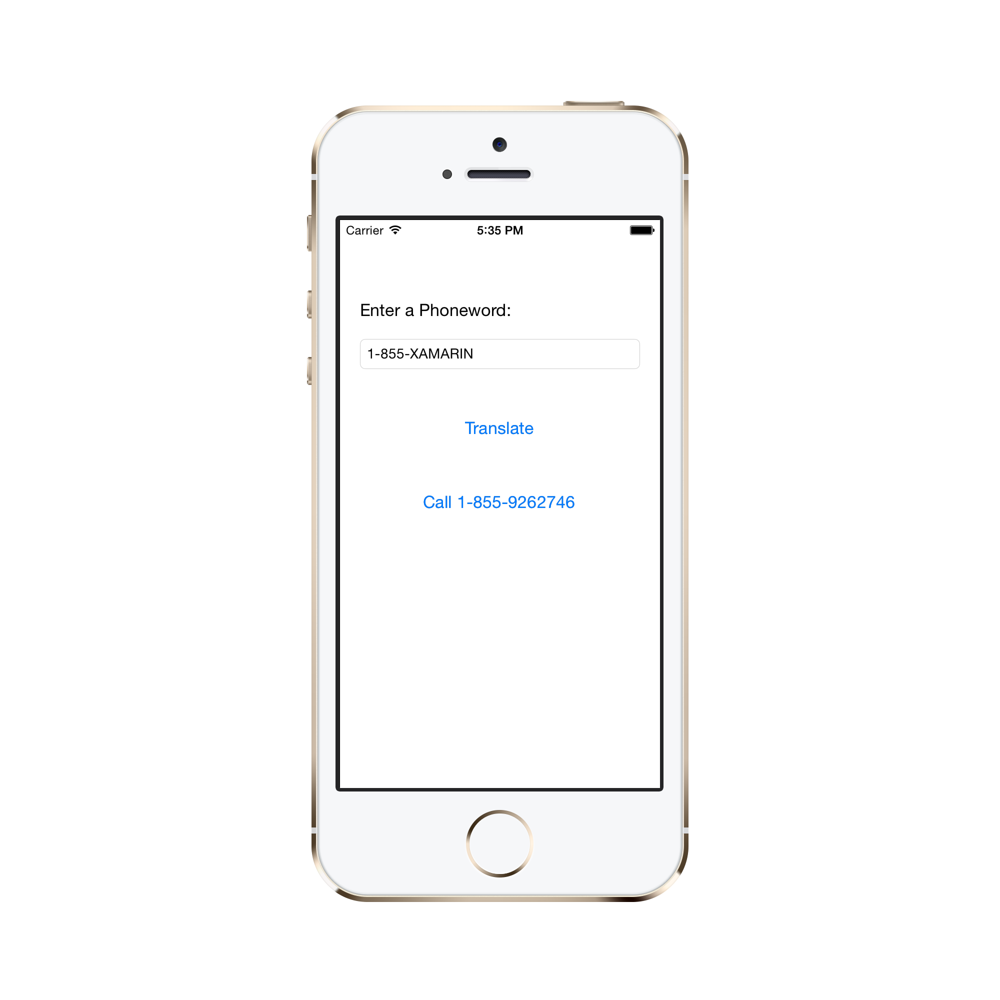](Images/image1.png)

When we assigned a <span class="uiitem">Name</span> to the <span class="uiitem">Button</span> control in the <span class="uiitem">Properties Pad</span>, the iOS designer automatically mapped it to a control in the <span class="uiitem">ViewController.designer.cs</span>, making the `TranslateButton` available to us inside the `ViewController` class. We know that controls first become available in the `ViewDidLoad` stage of the View Lifecycle, so we prepared to respond to the user's touch inside the lifecycle method:

```
public override void ViewDidLoad ()
{
    base.ViewDidLoad ();

    // wire up TranslateButton here
}
```

In our Phoneword app, we used a touch event called `TouchUpInside` to listen to the user's touch. `TouchUpInside` listens for a touch up event (finger lifting off the screen) that follows a touch down (finger touching the screen) inside the bounds of the control. The opposite of `TouchUpInside` is the `TouchDown` event, which fires when the user presses down on a control. The `TouchDown` event captures a lot of noise and gives the user no option to cancel the touch by sliding their finger off the control. `TouchUpInside` is the most common way to respond to a <span class="uiitem">Button</span> touch and creates the experience the user expects when pressing a button. More information on this is available in Apple’s [iOS Human Interface Guidelines](https://developer.apple.com/library/ios/documentation/userexperience/conceptual/MobileHIG/index.html).

In our app we handled the `TouchUpInside` event with a lambda, but we could have also used a delegate or a named event handler. Our final Button code resembled the following:

```
public override void ViewDidLoad ()
{
    base.ViewDidLoad ();
    string translatedNumber = "";

    TranslateButton.TouchUpInside += (object sender, EventArgs e) => {
      translatedNumber = Core.PhonewordTranslator.ToNumber(PhoneNumberText.Text);
      PhoneNumberText.ResignFirstResponder ();

      if (translatedNumber == "") {
        CallButton.SetTitle ("Call", UIControlState.Normal);
        CallButton.Enabled = false;
      } else {
        CallButton.SetTitle ("Call " + translatedNumber, UIControlState.Normal);
        CallButton.Enabled = true;
      }
  };
}
```

# Additional Concepts Introduced in Phoneword

The Phoneword application introduced several concepts not covered in this guide. These concepts include:

<ul>
  <li><strong>Change Button Text</strong> – We learned to change the text of a <span class="uiitem">Button</span> by calling <code>SetTitle</code> on the <span class="uiitem">Button</span> and passing in the new text and the <span class="uiitem">Button</span>’s <em>Control State</em>. For example, the following code changes the CallButton’s text to “Call”:
  <pre><code class=" syntax brush-C#">CallButton.SetTitle ("Call", UIControlState.Normal);</code></pre>
</li>
  <li><strong>Enable and Disable Buttons</strong> – <span class="uiitem">Buttons</span> can be in an <code>Enabled</code> or <code>Disabled</code> state. A disabled <span class="uiitem">Button</span> won’t respond to user input. For example, the following code disables the <code>CallButton</code>:
  <pre><code class=" syntax brush-C#">CallButton.Enabled = false;</code></pre>
  For more information on buttons, refer to the <a href="http://developer.xamarin.com/guides/ios/user_interface/controls/part_4_-_buttons/">Buttons guide</a>.
</li>
  <li><strong>Dismiss the Keyboard</strong> – When the user taps the Text Field, iOS displays the keyboard to let the user enter input. Unfortunately, there is no built-in functionality to dismiss the keyboard. We added the following code to the <code>TranslateButton</code> to dismiss the keyboard when the user presses the <code>TranslateButton</code>:
  <pre><code class=" syntax brush-C#">PhoneNumberText.ResignFirstResponder ();</code></pre>
  For another example of dismissing the keyboard, refer to the <a href="http://developer.xamarin.com/recipes/ios/input/keyboards/dismiss_the_keyboard/">Dismiss the Keyboard recipe</a>.
</li>
  <li><strong>Place Phone Call with URL</strong> – In the Phoneword app, we use an Apple URL scheme to launch the system phone app. The custom URL scheme consists of a “tel:” prefix and the phone number we want to call, as illustrated by the code below:
  
  <pre><code class=" syntax brush-C#">var url = new NSUrl ("tel:" + translatedNumber);
  if (!UIApplication.SharedApplication.OpenUrl (url)) 
  {
      // show alert Controller
  }</code></pre>
</li>
  <li><strong>Show an Alert</strong> – When a user tries to place a phone call on a device that doesn’t support calls – for example the Simulator or an iPod Touch – we display an alert dialog to let the user know the phone call can’t be placed. The code below creates and populates an alert controller:
  
  <pre><code class=" syntax brush-C#">if (!UIApplication.SharedApplication.OpenUrl (url)) {
					var alert = UIAlertController.Create ("Not supported", "Scheme 'tel:' is not supported on this device", UIAlertControllerStyle.Alert);
					alert.AddAction (UIAlertAction.Create ("Ok", UIAlertActionStyle.Default, null));
					PresentViewController (alert, true, null);
				}</code></pre>
</li>
</ul>

For more information on iOS alert views, refer to the [Alert Controller recipe](http://developer.xamarin.com/recipes/ios/standard_controls/alertcontroller/).

# Testing, Deployment, and Finishing Touches

Both Xamarin Studio and Visual Studio provide many options for testing and deploying an application. This section covers debugging options, demonstrates testing applications on device, and introduces tools for creating custom app icons and launch images.

## Debugging Tools

Sometimes issues in application code are difficult to diagnose. To help diagnose complex code issues, we could [Set a Breakpoint](http://developer.xamarin.com/recipes/cross-platform/ide/debugging/set_a_breakpoint/), [Step Through Code](http://developer.xamarin.com/recipes/cross-platform/ide/debugging/step_through_code/), or [Output Information to the Log Window](http://developer.xamarin.com/recipes/cross-platform/ide/debugging/output_information_to_log_window/).

## Deploy to a Device

The iOS Simulator is a quick way to test an application. The Simulator has a number of useful optimizations for testing, including mock location, [simulating movement](http://developer.xamarin.com/recipes/ios/multitasking/test_location_changes_in_simulator/), and more. However, users will not consume the final app in a Simulator. We should test applications on real devices early and often.

A device takes time to provision and requires an Apple Developer Account. The [Device Provisioning](http://developer.xamarin.com/guides/ios/getting_started/device_provisioning/) guide gives thorough instructions on getting a device ready for development.

Once the device is provisioned, we can deploy to it by plugging it in, changing the target in the build toolbar to iOS Device, and pressing <span class="uiitem">Start</span> ( <span class="uiitem">Play</span>) as illustrated by the following screenshot:

<ide name="vs">
<p><a href="Images/VS_image46.png" class=" fancybox">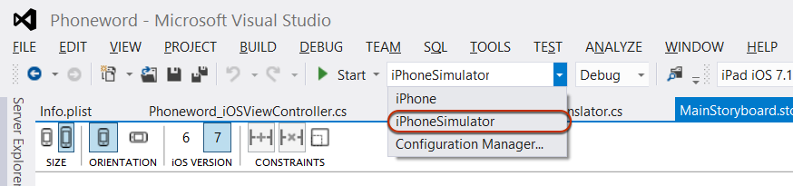</a></p>
</ide>

The app will deploy to our iOS device:

 [ ](Images/image1.png)

## Generate Custom Icons and Launch Images

Not everyone has a designer available to create the custom icons and launch images an app needs to stand out. Here are several alternate approaches to generating custom app artwork:

<ul>
  <ide name="vs"><li>Visual Studio – You can use this to create a simple icon set for your app directly in the IDE.</li></ide>
  <li><strong><a href="http://www.glyphish.com/">Glyphish</a></strong> – High-quality prebuilt icon sets for free download and purchase.</li>
  <li><strong><a href="http://www.fiverr.com/">Fivrr</a></strong> – Choose from a variety of designers to create an icon set for you, starting at $5.  Can be hit or miss but a good resource if you need icons designed on the fly.</li>
</ul>

For more information about icon and launch image sizes and requirements, refer to the [Working with Images guide](http://developer.xamarin.com/guides/ios/application_fundamentals/working_with_images).

# Summary

Congratulations! You now have a solid understanding of the components of a Xamarin.iOS application as well as the tools used to create them.
In the [next tutorial in the Getting Started series](http://developer.xamarin.com/guides/ios/getting_started/hello,_iOS_multiscreen/), we’ll extend our application to handle multiple screens. Along the way we’ll implement a Navigation Controller, learn about Storyboard Segues, and introduce the Model, View, Controller (MVC) pattern as we extend our application to handle multiple screens.