# Hello.iOS Quickstart

In this walkthrough we’ll create an application that translates an alphanumeric phone number entered by the user into a numeric phone number, and then calls that number. The final application looks like this:

 [ 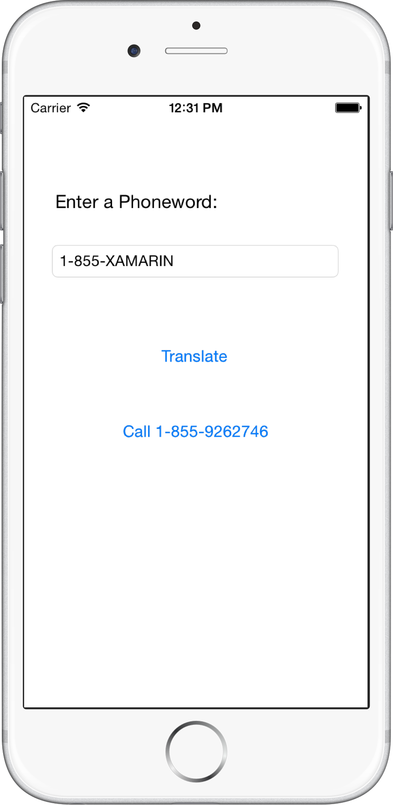](Images/image1.png)

Let’s get started!

# Requirements

iOS development with Xamarin requires:

-  A Mac running OS X Mountain Lion or above.
-  Latest version of XCode and iOS SDK installed from the  [App Store](https://itunes.apple.com/us/app/xcode/id497799835?mt=12) .

Xamarin.iOS works with any of the following setups:

-  Latest version of Xamarin Studio on a Mac that fits the above specifications.
-  Latest version of Visual Studio Professional or higher on Windows 7 or above, paired with a Mac build host that fits the above specifications.  *This setup requires a Xamarin Business License or  [trial](http://developer.xamarin.com/guides/cross-platform/getting_started/beginning_a_xamarin_trial/).*

The [Xamarin.iOS OSX Installation guide](http://developer.xamarin.com/guides/ios/getting_started/installation/mac/) is available for step-by-step installation instructions

Note: Xamarin.iOS is not available for Xamarin Studio on Windows.

Before we get started, please download the [Xamarin App Icons and Launch Screens set](Resources/Xamarin App Icons and Launch Images.zip).

<ide name="xs">
<h1>Xamarin Studio Walkthrough</h1>

In this walkthrough we’ll create an application called Phoneword that translates an alphanumeric phone number into a numeric phone number.

<ol>
<li>
Let’s launch Xamarin Studio from the Applications folder or Spotlight to bring up the Launch screen:

<a href="Images/image2New.png" class="fancybox">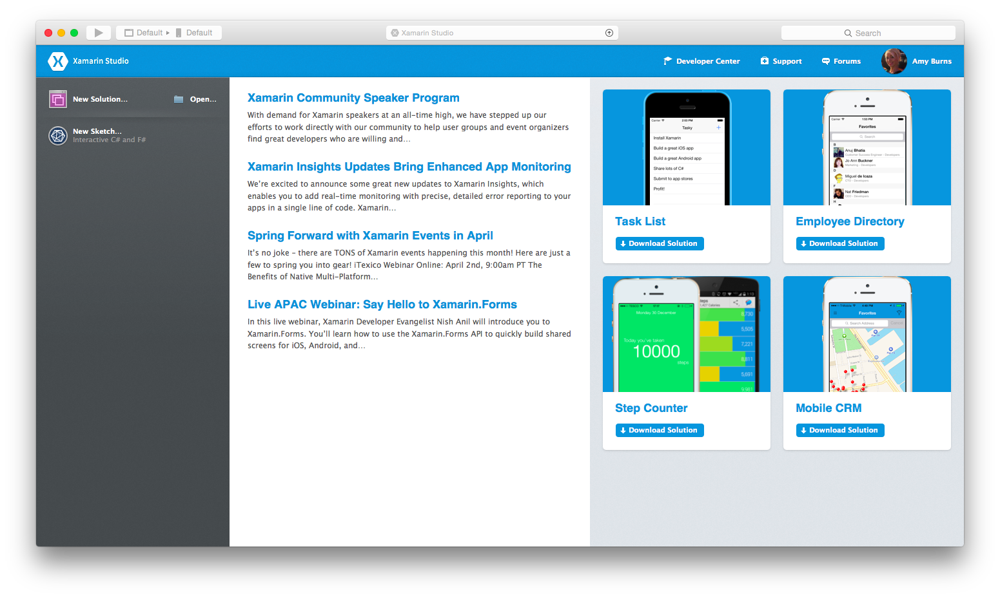</a>

 

In the top left, let’s click New Solution... to create a new Xamarin.iOS solution:

<a href="Images/image3New.png" class="fancybox">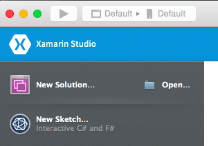</a>

</li>
 
<li>
From the New Solution dialog, we’ll choose the iOS > App > Single View Application template, ensuring that C# is selected. Click Next:

 .</li>

<li>Let's configure the app. Give it the Name <code>Phoneword_iOS</code>, and leave Identifiers, Devices, and Target as default. Click Next:

<a href="Images/image5New.png" class=" fancybox">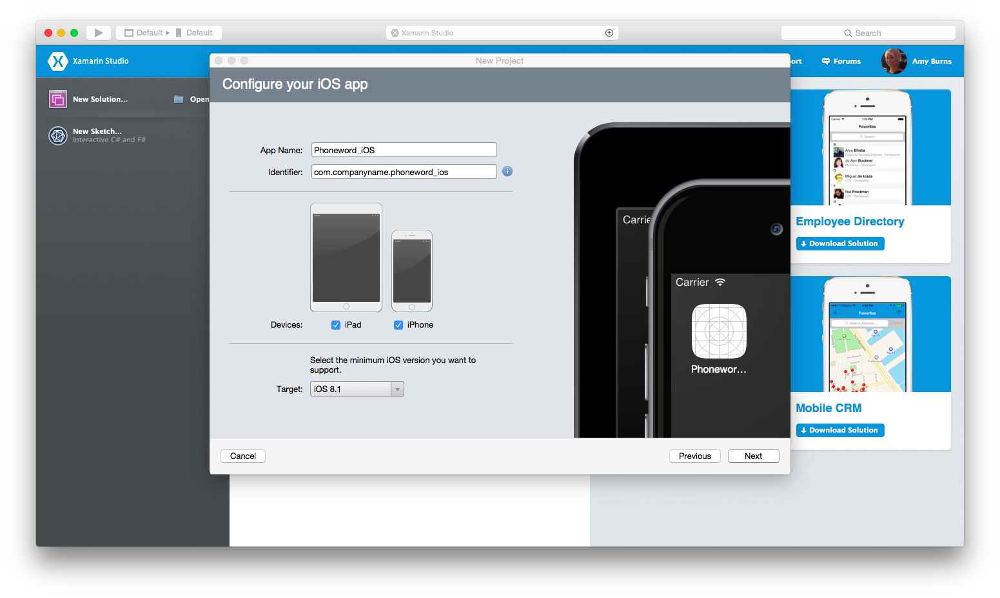</a> </li>

<li>Let's leave the Project and Solution Name as is. We can choose the location of our project here, or keep it as the default:

<a href="Images/image6New.png" class=" fancybox">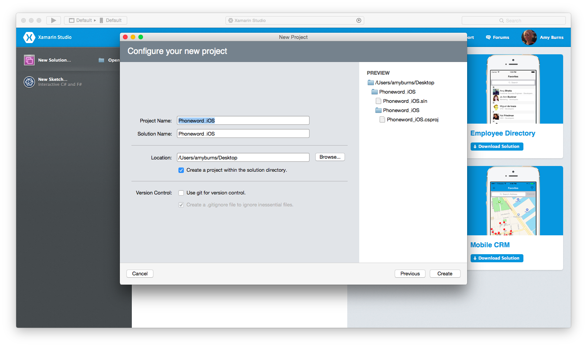</a> </li> 

<li>Click Create to make the Solution. 
Note that creating a Solution automatically creates a <a href="http://developer.xamarin.com/guides/testcloud/uitest/intro-to-uitest/">UITest</a> project. This is beyond the scope of this document, for more information on using UITest, you can read relevant documentation <a href="/guides/testcloud/uitest/intro-to-uitest/">here</a>.

 
<li>
Next, we’ll open the Main.storyboard file by double-clicking on it in the Solution Pad. This will allow us to create our UI:

<a href="Images/image7New.png" class=" fancybox">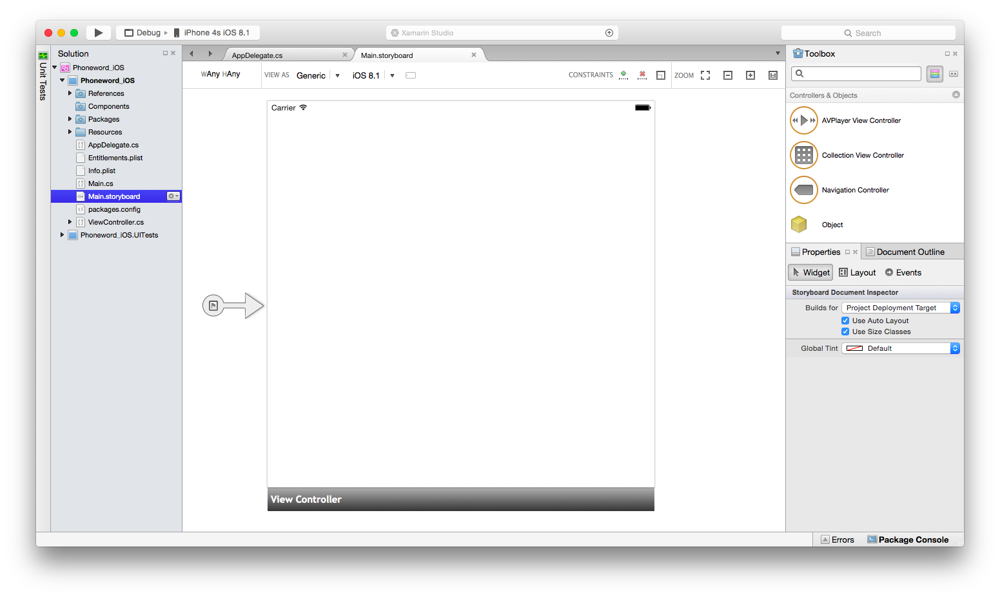</a>

Note that size classes are enabled by default. You can read more about them <a href="http://developer.xamarin.com/guides/ios/platform_features/introduction_to_Unified_Storyboards/#Unified_Storyboards">here.</a>

</li>
 
<li>
From the Toolbox (the area on the right), let’s type "label" into the search bar and drag a Label onto the design surface (the area in the center):

<a href="Images/image8New.png" class=" fancybox">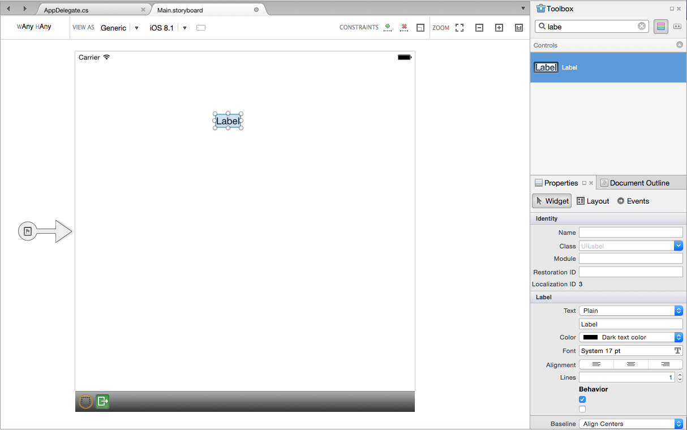</a>

</li>
 
<li>
Next, grab the handles of the <em>Dragging Controls</em> (the circles around the control) and make the label wider:

<a href="Images/image9.png" class=" fancybox">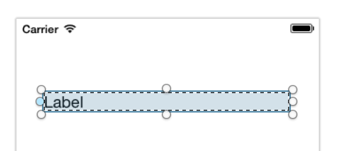</a>

</li>
 
<li>
With the Label selected on the design surface, use the Properties Pad to change the Title property of the Label to "Enter a Phoneword:"

<a href="Images/image10.png" class=" fancybox">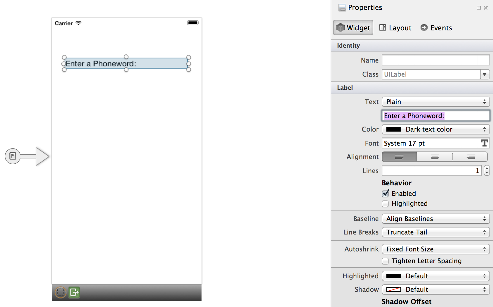</a>

 

<strong>Note</strong>: You can bring up the Properties Pad or Toolbox at any time by navigating to View > Pads.

</li>
 
<li>
Next, let’s search for “text field” inside the Toolbox and drag a Text Field from the Toolbox onto the design surface and place it under the Label. Adjust the width until the Text Field is the same width as the Label:

<a href="Images/image12New.png" class=" fancybox">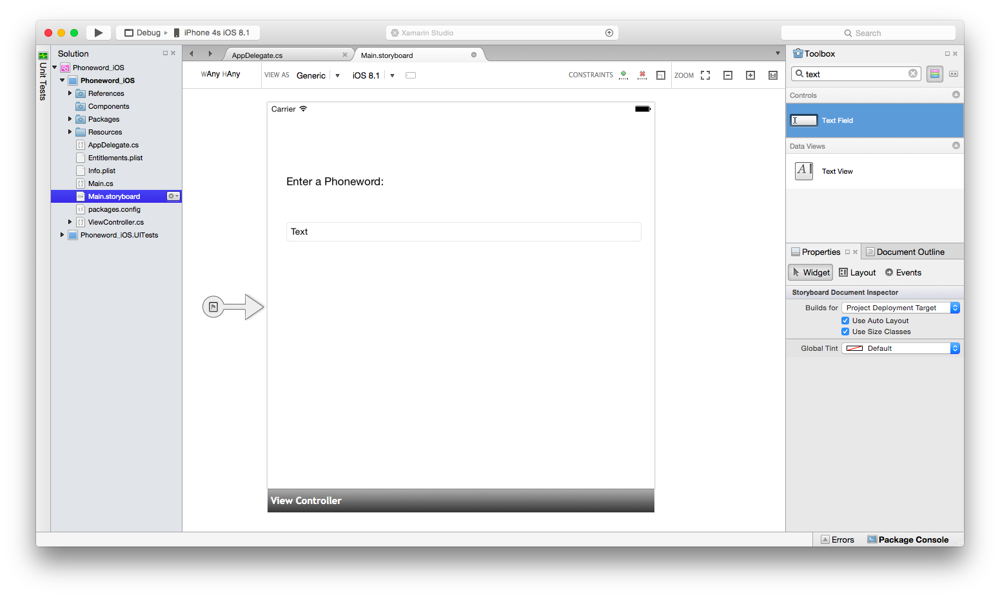</a>

</li>
 
<li>
With the Text Field selected on the design surface, change the Text Field’s Name property in the Identity section of the Properties Pad to <code>PhoneNumberText</code>, and change the Title property to "1-855-XAMARIN":

<a href="Images/image13New.png" class=" fancybox">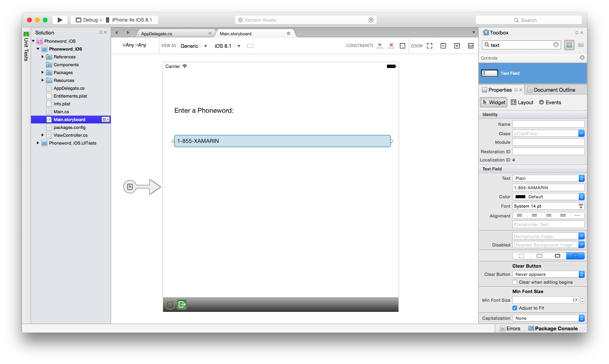</a>

</li>
 
<li>
Next, drag a Button from the Toolbox onto the design surface and place it under the Text Field. Adjust the width so the Button is as wide as the Text Field and Label:

<a href="Images/image14New.png" class=" fancybox">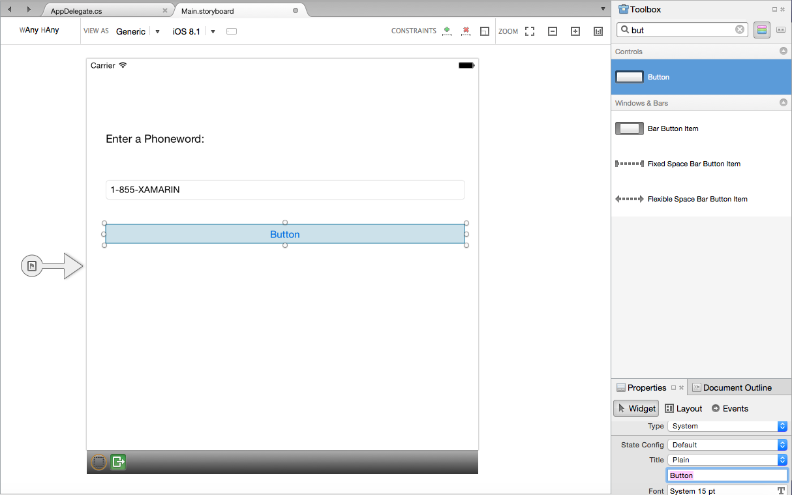</a>

</li>
 
<li>
With the Button selected on the design surface, change the Name property in the Identity section of the Properties Pad to <code>TranslateButton</code>. Change the Title property to "Translate":

<a href="Images/image15New.png" class=" fancybox">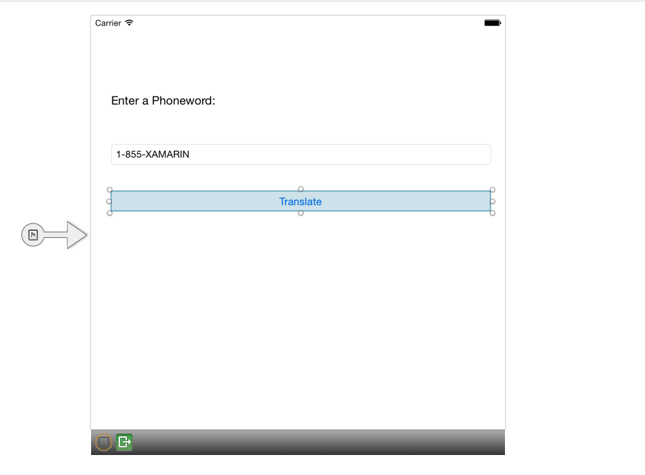</a>

</li>
 
<li>
Let’s repeat the two steps above and drag a Button from the Toolbox onto the design surface and place it under the first Button. Adjust the width so the Button is as wide as the first Button:

<a href="Images/image16New.png" class=" fancybox">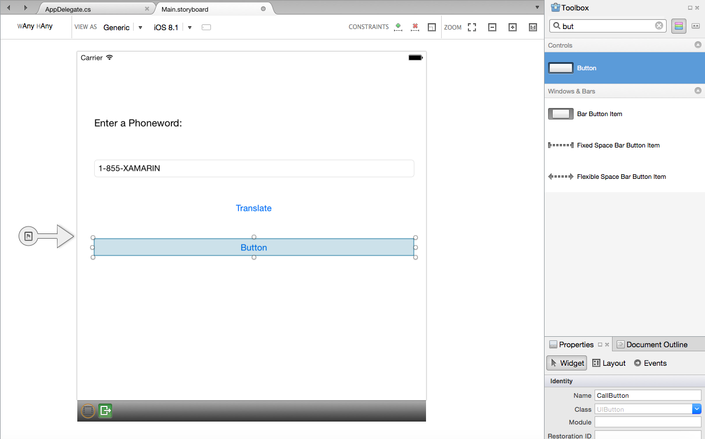</a>

</li>
 
<li>
With the second Button selected on the design surface, we’ll change the Name property in the Identity section of the Properties Pad to <code>CallButton</code>. We’ll change the Title property to "Call":

<a href="Images/image17New.png" class=" fancybox">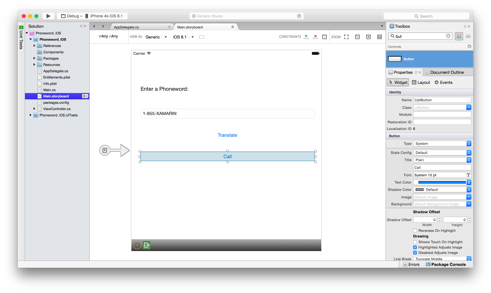</a>

 

Let’s save our work by navigating to File > Save or by pressing ⌘ + s.

</li>

<li>
Now, let’s add some code to translate phone numbers from alphanumeric to numeric. We’ll add a new file to the Project by clicking on the gray gear icon next to the Phoneword_iOS Project in the Solution Pad and choosing Add > New File... or pressing ⌘ + n:

<a href="Images/image18.png" class=" fancybox">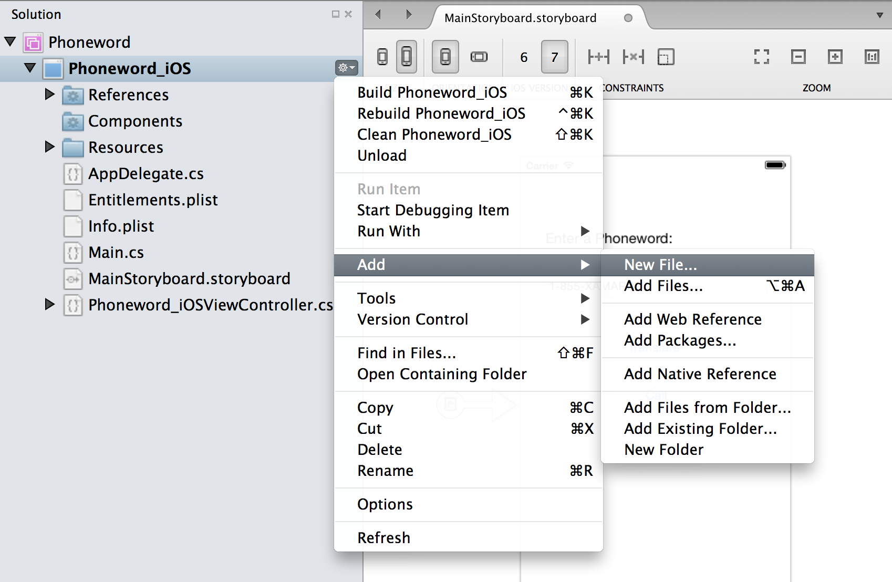</a>

</li>
 
<li>
In the New File dialog, select General > Empty Class and name the new file <code>PhoneTranslator</code>:

<a href="Images/image19.png" class=" fancybox">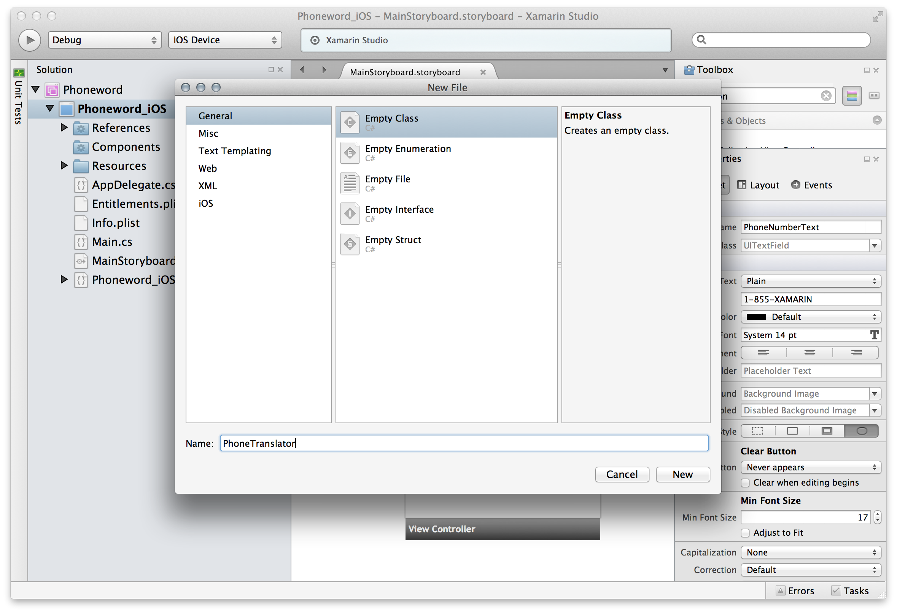</a>

</li>
 
<li>
This creates a new, empty C# class for us. Remove all the template code and replace it with the following code:

<pre><code class=" syntax brush-C#">
using System.Text;
using System;

namespace Phoneword_iOS
{
	public static class PhoneTranslator
	{
		public static string ToNumber(string raw)
		{
			if (string.IsNullOrWhiteSpace(raw))
				return "";
			else
				raw = raw.ToUpperInvariant();

			var newNumber = new StringBuilder();
			foreach (var c in raw)
			{
				if (" -0123456789".Contains(c))
					newNumber.Append(c);
				else {
					var result = TranslateToNumber(c);
					if (result != null)
						newNumber.Append(result);
				}    
				// otherwise we've skipped a non-numeric char
			}
			return newNumber.ToString();
		}

		static bool Contains (this string keyString, char c)
		{
			return keyString.IndexOf(c) >= 0;
		}

		static int? TranslateToNumber(char c)
		{
			if ("ABC".Contains(c))
				return 2;
			else if ("DEF".Contains(c))
				return 3;
			else if ("GHI".Contains(c))
				return 4;
			else if ("JKL".Contains(c))
				return 5;
			else if ("MNO".Contains(c))
				return 6;
			else if ("PQRS".Contains(c))
				return 7;
			else if ("TUV".Contains(c))
				return 8;
			else if ("WXYZ".Contains(c))
				return 9;
			return null;
		}
	}
}
</code></pre>

Save the PhoneTranslator.cs file and close it.
</li>

<li>
Next we’re going to add code to wire up the user interface. Let’s add the code to power the user interface into the <code>ViewController</code> class. Double-click on ViewController.cs in the Solution Pad to open it:

<a href="Images/image20New.png" class=" fancybox">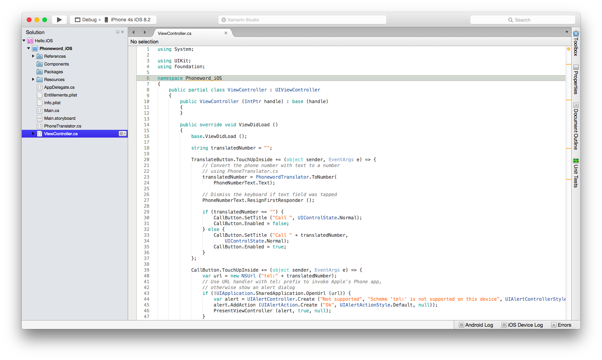</a>

</li>
 
<li>
Let’s begin by wiring up the <code>TranslateButton</code>. In the ViewController class, find the <code>ViewDidLoad</code> method. We will add our button code inside <code>ViewDidLoad</code>, below the <code>base.ViewDidLoad()</code> call:

<pre><code class=" syntax brush-C#">public override void ViewDidLoad ()
{
  base.ViewDidLoad ();
  // code goes here
}</code></pre>
</li>

<li>
Let’s add code to respond to the user pressing the first button, which we’ve named <code>TranslateButton</code>. Populate <code>ViewDidLoad</code> with the following code:

<pre><code class=" syntax brush-C#">string translatedNumber = "";

TranslateButton.TouchUpInside += (object sender, EventArgs e) => {
				// Convert the phone number with text to a number 
				// using PhoneTranslator.cs
				translatedNumber = PhoneTranslator.ToNumber(
					PhoneNumberText.Text); 
				
				// Dismiss the keyboard if text field was tapped
				PhoneNumberText.ResignFirstResponder ();

				if (translatedNumber == "") {
					CallButton.SetTitle ("Call ", UIControlState.Normal);
					CallButton.Enabled = false;
				} else {
					CallButton.SetTitle ("Call " + translatedNumber, 
						UIControlState.Normal);
					CallButton.Enabled = true;
				}
			};
</code></pre>
</li>

<li>
Next let’s add code to respond to the user pressing the second button, which we’ve named <code>CallButton</code>. Place the following code below the code for the <code>TranslateButton</code>:

<pre><code class=" syntax brush-C#">CallButton.TouchUpInside += (object sender, EventArgs e) => {
				// Use URL handler with tel: prefix to invoke Apple's Phone app...
				var url = new NSUrl ("tel:" + translatedNumber);
				
				
				// ...otherwise show an alert dialog                
				if (!UIApplication.SharedApplication.OpenUrl (url)) {
					var alert = UIAlertController.Create ("Not supported", "Scheme 'tel:' is not supported on this device", UIAlertControllerStyle.Alert);
					alert.AddAction (UIAlertAction.Create ("Ok", UIAlertActionStyle.Default, null));
					PresentViewController (alert, true, null);
				}
			};
</code></pre>
</li>

<li>
Let’s save our work, and then build the application by choosing Build > Build All or pressing ⌘ + B.  If our application compiles, we will get a success message at the top of the IDE:

 

If there are errors, we can go through the previous steps and correct any mistakes until the application builds successfully.
</li>

<li>
We now have a working application and it’s time to add the finishing touches! We can edit the application name and icons in the Info.plist file. Let’s open Info.plist by double-clicking on it in the Solution Pad:

<a href="Images/image22New.png" class=" fancybox">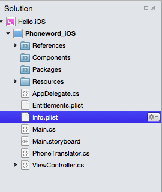</a>

</li>
 
<li>
In the iOS Application Target section, let’s change the Application Name to "Phoneword":

<a href="Images/image23.png" class=" fancybox">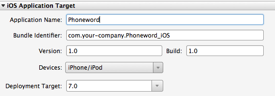</a>

</li>
 
<li>
Next, let’s set the launch images. We’ll assign Default.png to the standard resolution (320x480) placeholder, Default@2x.png to the Retina (3.5-inch) placeholder, and finally Default-568h@2x.png to the Retina (4-inch) placeholder:

<a href="Images/image26.png" class=" fancybox">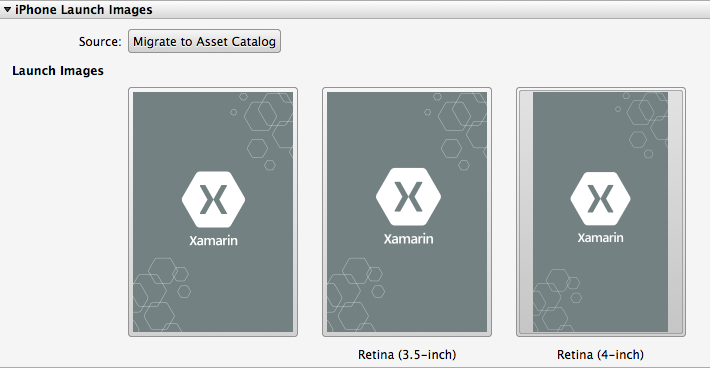</a>

<li>
To set application icons and launch images, first download the <a href="Resources/Xamarin App Icons and Launch Images.zip">Xamarin App Icons & Launch Screens set</a>. As we are using <a href="http://developer.xamarin.com/guides/ios/application_fundamentals/working_with_images/app-icons/#Managing_Icons_with_Asset_Catalogs">Asset Catalog</a> to manage our icons, navigate to Resources > Images.xcassets > AppIcons.appiconset in our Solution Pad, and the open <code>contents.json</code> file. In the iPhone Icons section, click directly on the (57x57) icon placeholder and select the matching icon from the Xamarin App Icons & Launch Images directory:

<a href="Images/image24New.png" class=" fancybox">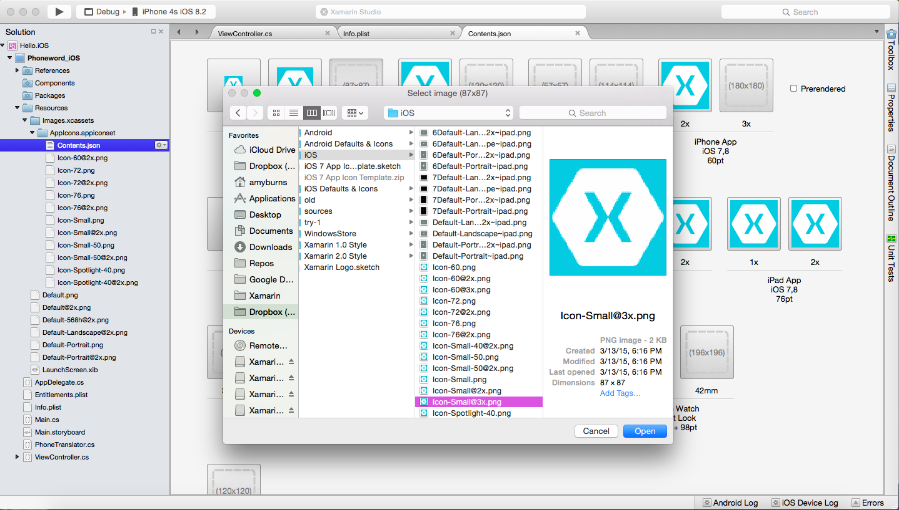</a>

 

Let’s continue filling in all icons. Xamarin Studio will replace the placeholders with our icons:

<a href="Images/image25New.png" class=" fancybox">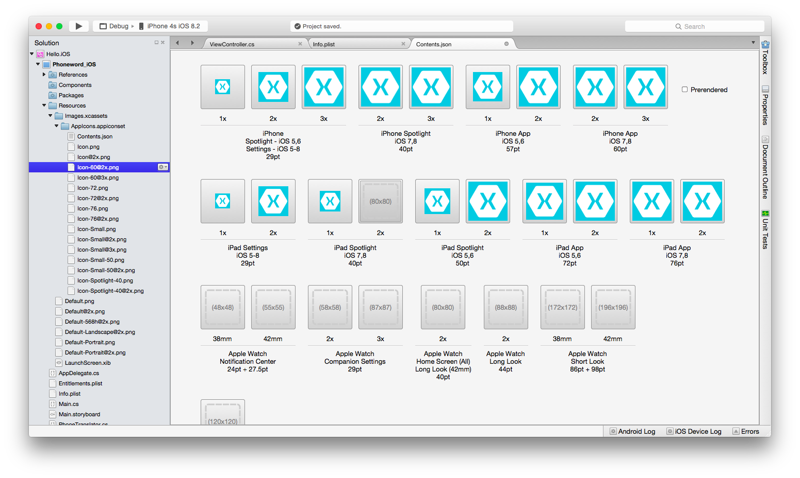</a>

</li>
 

The image names follow iOS naming conventions for images of different densities.
</li>

<li>
Finally, let’s test our application in the iOS Simulator. In the top left of the IDE, choose Debug from the first dropdown, and iPhone 6 iOS 8.x from the second dropdown, and press Start (the triangular button that resembles a Play button):

<a href="Images/image27New.png" class=" fancybox">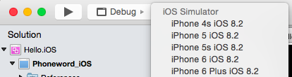</a>

</li>
 
<li>
This will launch our application inside the iOS Simulator:

<a href="Images/image28.png" class=" fancybox">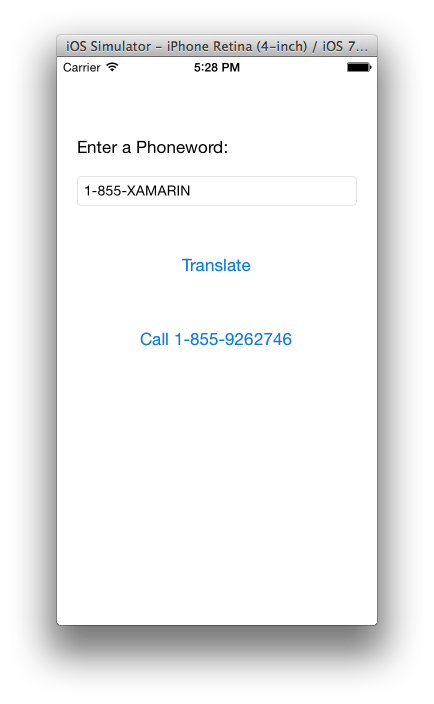</a>

 

Phone calls are not supported in the iOS Simulator; instead, we’ll see our alert dialog when we try to place a call:

<a href="Images/image29.png" class=" fancybox">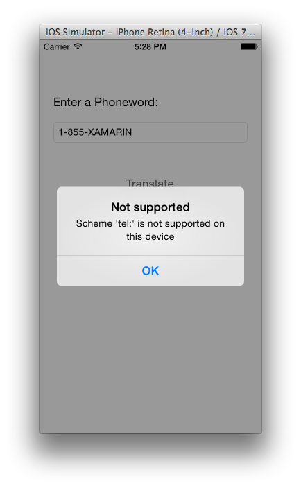</a>

</li>
</ol>
 

</ide>

Congratulations on completing your first Xamarin.iOS application! Now it’s time to dissect the tools and skills we just learned in the [Hello, iOS Deep Dive](http://developer.xamarin.com/guides/ios/getting_started/hello,_iOS/hello,_iOS_deepdive).
