id:{d72e6230-c9ee-4bee-90ec-877d256821aa}  
title:Hello, iOS Multiscreen  
subtitle:Handling Navigation with Xamarin.iOS  
brief:In this two-part guide, we expand the Phoneword application we created in the Hello, iOS guide to handle a second screen. Along the way we’ll introduce the Model-View-Controller design pattern, implement our first iOS navigation, and develop a deeper understanding of iOS application structure and functionality.  
samplecode:[Hello, iOS](/samples/monotouch/Hello_iOS/)  
sdk:[iOS Human Interface Guidelines](http://developer.apple.com/library/ios/#documentation/UserExperience/Conceptual/MobileHIG/Introduction/Introduction.html)  
sdk:[iOS Provisioning Portal](https://developer.apple.com/ios/manage/overview/index.action)  

# Hello.iOS Multiscreen Quickstart

In the walkthrough part of this guide we’ll add a second screen to our Phoneword application to keep track of the history of numbers called using our app. The final application will have a second screen that displays the call history, as illustrated by the following screenshot:

 [ 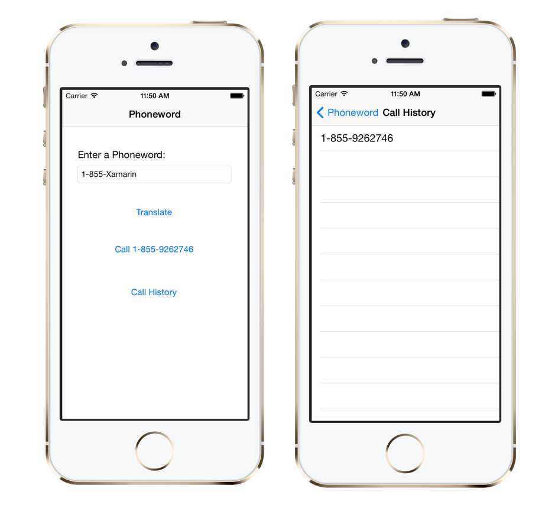](Images/00.png)

In the [accompanying Deep Dive](http://developer.xamarin.com/guides/ios/getting_started/hello,_iOS_multiscreen/hello,_iOS_multiscreen_deepdive/), we’ll review what we’ve built and discuss architecture, navigation, and other new iOS concepts that we encounter along the way. Let’s get started!

 

# Requirements

This guide resumes where the Hello, iOS document left off, and requires completion of the [Hello, iOS Quickstart](http://developer.xamarin.com/guides/ios/getting_started/hello,_iOS/). If you’d like to
jump directly into the Hello, iOS Multiscreen Quickstart, you can download the completed version of the Phoneword app from the [Hello, iOS sample](http://developer.xamarin.com/samples/monotouch/Hello_iOS/).

<ide name="vs">
<h1>Walkthrough – Navigation with Segues</h1>

In this walkthrough we’ll add a Call History screen to our <b>Phoneword</b> application.

<ol>

<li>
Let’s open the <b>Phoneword</b> application in Visual Studio. If you haven’t completed the <a href="http://developer.xamarin.com/guides/ios/getting_started/hello,_iOS/">Hello, iOS walkthrough</a>, you can
<a href="http://developer.xamarin.com/guides/ios/getting_started/hello,_iOS/hello,_iOS_multiscreen_quickstart/Resources/Phoneword_iOS_Android_Multiscreen.zip">download the completed Phoneword application here</a>:

<a href="Images/vs01.png" class=" fancybox">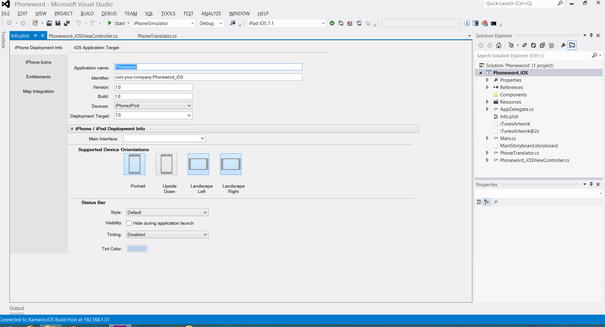</a>

</li>

<li>
Let’s start by editing the user interface. Open the MainStoryboard.storyboard file from the Solution Explorer:

</li>

<li>
Next, let’s drag a Navigation Controller from the Toolbox onto the design surface:

</li>

<li>
Drag the Sourceless Segue (that’s the gray arrow to the left of the Phoneword Scene) from the Phoneword Scene
to the Navigation Controller to change the starting point of the application:

<a href="Images/vs04.png" class=" fancybox">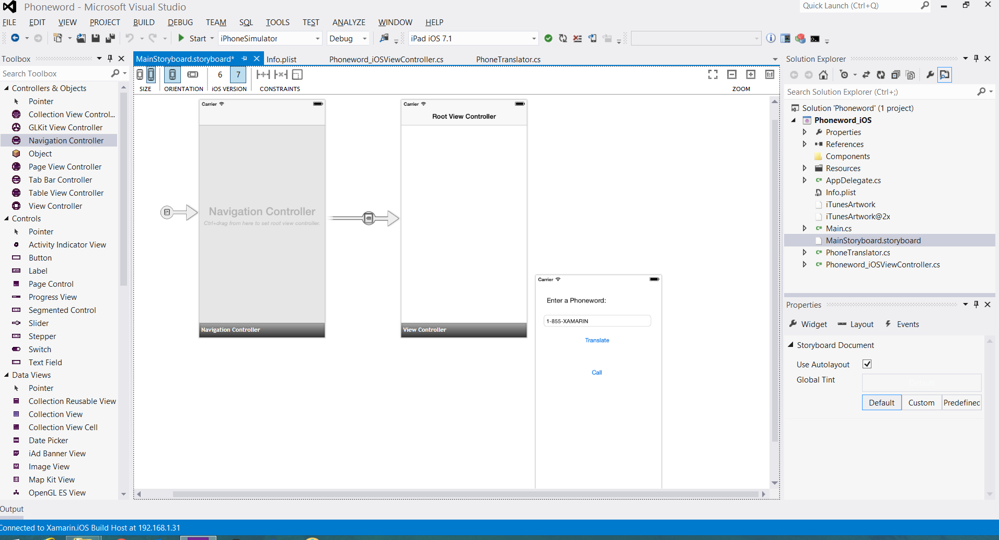</a>

</li>

<li>
Select the Root View Controller by clicking on the black bar, and press <code>Delete</code> to remove it from the design surface. 

Then, let’s move the Phoneword Scene next to the Navigation Controller:

<a href="Images/vs05.png" class=" fancybox">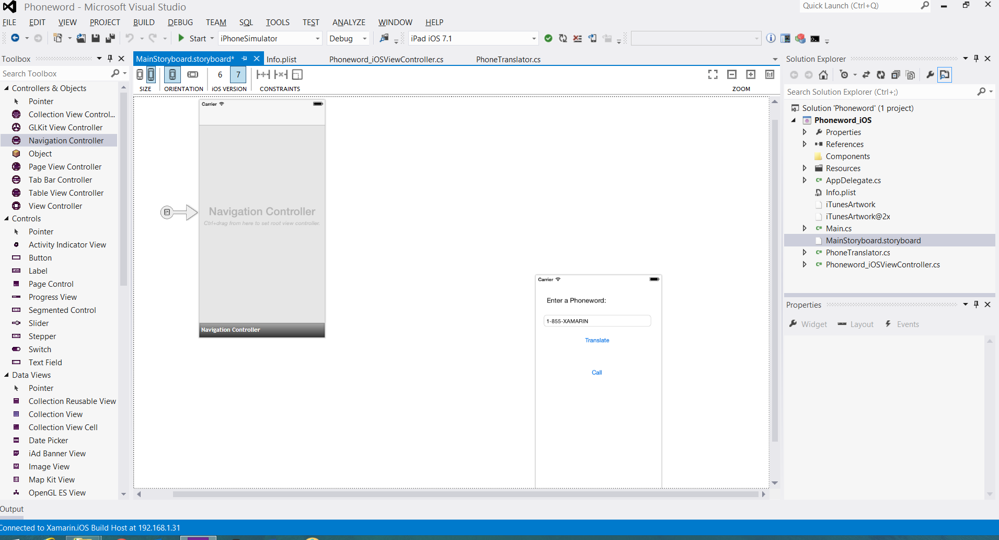</a>

</li>

<li>
Next, let’s set the ViewController as the Navigation Controller’s <code>Root View Controller</code>. Press down the
<code>Ctrl</code> key and click inside the Navigation Controller. A blue line should appear. Then, still holding down the <code>Ctrl</code>
 key, drag from the Navigation Controller to the Phoneword Scene and release. This is called <code>Ctrl-dragging</code>:

<a href="Images/vs06.png" class=" fancybox">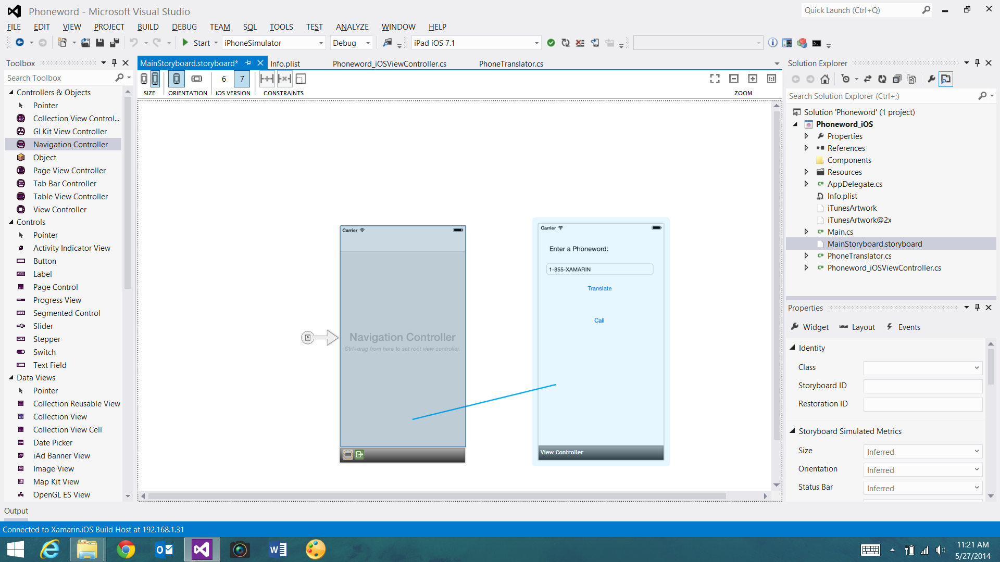</a>

</li>

<li>
From the popover, let’s set the relationship to Root:

The ViewController is now our Navigation Controller’s Root View Controller:

<a href="Images/vs08.png" class=" fancybox">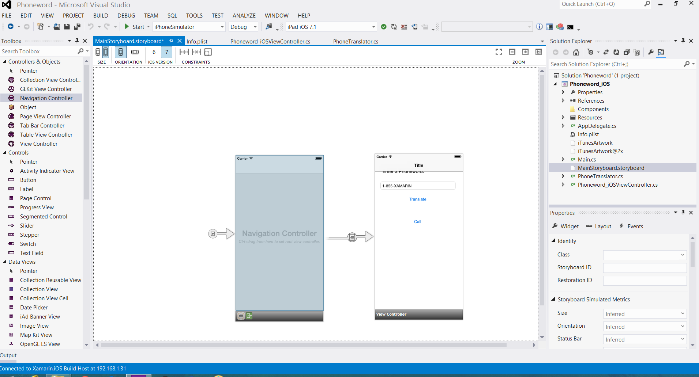</a>

</li>

<li>
Double-click on the Phoneword screen’s Title bar and change the Title to "<code>Phoneword</code>":

</li>

<li>
Let’s drag a Button from the Toolbox and place it under the Call Button. Drag the
handles to make the new Button the same width as the Call Button:

</li>

<li>
In the Properties Explorer, change the Name of the Button to <code>CallHistoryButton</code>
 and change the Title to "<code>Call History</code>":

</li>

<li>
Next, let’s create the Call History screen. From the Toolbox, drag a Table View Controller
 onto the design surface:

<a href="Images/vs12.png" class=" fancybox">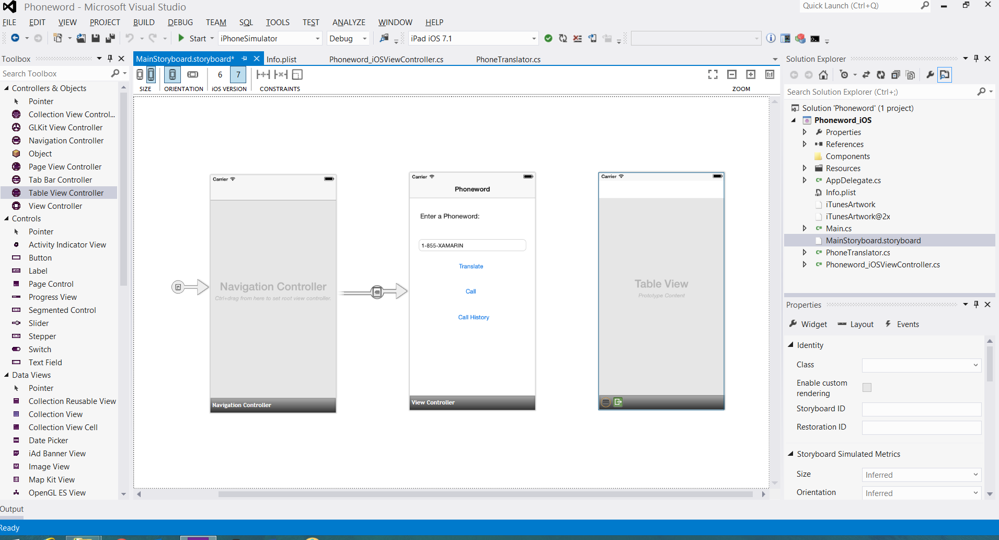</a>

</li>

<li>
Next, select the Table View Controller by clicking on the black bar at the bottom of the Scene. In the Properties Explorer,
change the Table View Controller’s class to <code>CallHistoryController</code> and press <code>Enter</code>:

<a href="Images/vs13.png" class=" fancybox">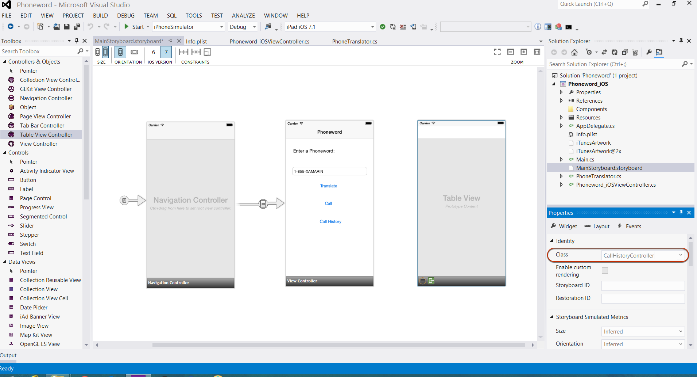</a>

The iOS Designer will generate a custom backing class called <code>CallHistoryController</code> to manage this screen’s Content View Hierarchy.
The CallHistoryController.cs file will appear in the Solution Explorer:

</li>

<li>
Let’s double-click on the CallHistoryController.cs file to open it and replace the contents with the following code:

<pre><code class=" syntax brush-C#">using System;
using MonoTouch.Foundation;
using MonoTouch.UIKit;
using System.Collections.Generic;

namespace Phoneword_iOS
{
    public partial class CallHistoryController : UITableViewController
    {
        public List&lt;String&gt; PhoneNumbers { get; set; }

        static NSString callHistoryCellId = new NSString ("CallHistoryCell");

        public CallHistoryController (IntPtr handle) : base (handle)
        {
            TableView.RegisterClassForCellReuse (typeof(UITableViewCell), callHistoryCellId);
            TableView.Source = new CallHistoryDataSource (this);
            PhoneNumbers = new List&lt;string&gt; ();
        }

        class CallHistoryDataSource : UITableViewSource
        {
            CallHistoryController controller;

            public CallHistoryDataSource (CallHistoryController controller)
            {
                this.controller = controller;
            }

            // Returns the number of rows in each section of the table
            public override nint RowsInSection (UITableView tableView, nint section)
            {
                return controller.PhoneNumbers.Count;
            }
            //
            // Returns a table cell for the row indicated by row property of the NSIndexPath
            // This method is called multiple times to populate each row of the table.
            // The method automatically uses cells that have scrolled off the screen or creates new ones as necessary.
            //
            public override UITableViewCell GetCell (UITableView tableView, NSIndexPath indexPath)
            {
                var cell = tableView.DequeueReusableCell (CallHistoryController.callHistoryCellId);

                int row = indexPath.Row;
                cell.TextLabel.Text = controller.PhoneNumbers [row];
                return cell;
            }
        }
    }
}</code></pre>

Save the application and build it to ensure there are no errors.

</li>

<li>
Let’s create a <code>Segue</code> (transition) between the Phoneword Scene and the Call History Scene.
In the Phoneword Scene, select the Call History Button and <code>Ctrl-drag</code> from the
Button to the Call History Scene:

<a href="Images/vs15.png" class=" fancybox">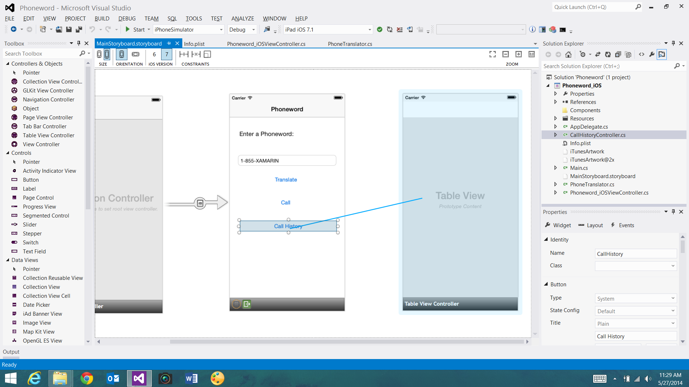</a>

From the Action Segue popover, select Push:

<a href="Images/vs16.png" class=" fancybox">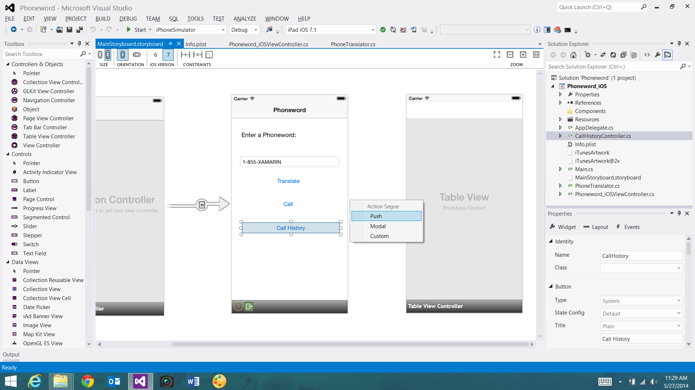</a>

The iOS Designer will add a Segue between the two Scenes:

<a href="Images/vs17.png" class=" fancybox">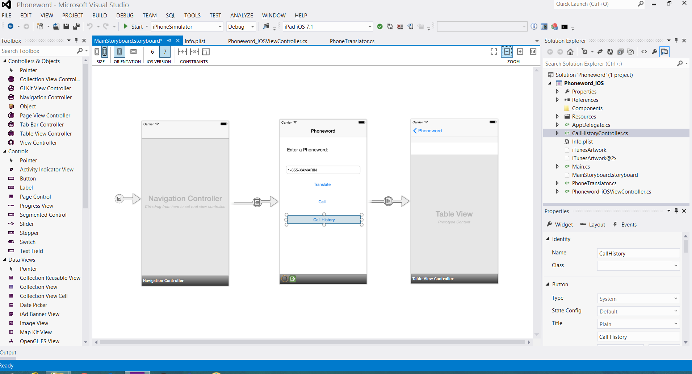</a>

</li>

<li>
Let’s add a Title to the Table View Controller by selecting the black bar at the bottom of the Scene
and changing the View Controller Title to "<code>Call History</code>"" in the Properties Explorer:

</li>

<li>
If we run the application now, the Call History Button will open the Call History screen,
but the <code>Table View</code> will be empty because we have no code to keep track of phone numbers. Let’s add that functionality.

First, we need a way to store dialed phone numbers. We’re going to store it as a list of strings called <code>PhoneNumbers</code>.

To support lists, let’s add <code>System.Collections.Generic</code> to our <code>using directives</code> at the top of the file:

<pre><code class=" syntax brush-C#">using System.Collections.Generic;</code></pre>
</li>

<li>Next, modify the <code>ViewController</code> class with the following code:

<pre><code class=" syntax brush-C#">namespace Phoneword_iOS
{
    public partial class ViewController : UIViewController
    {
        // translatedNumber was moved here from ViewDidLoad ()
        string translatedNumber = "";

        public List&lt;String&gt; PhoneNumbers { get; set; }

        public ViewController (IntPtr handle) : base (handle)
        {
            //initialize list of phone numbers called for Call History screen
            PhoneNumbers = new List&lt;String&gt; ();

        }
        // ViewDidLoad, etc...
	}
}</code></pre>

Note that we’ve also moved <code>translatedNumber</code> from inside the <code>ViewDidLoad</code> method to a <code>class-level variable</code>.

</li>

<li>
Next, let’s modify our <code>CallButton</code> code to add dialed numbers to the list of phone numbers by calling
<code>PhoneNumbers.Add(translatedNumber)</code>. The full code will look like this:

<pre><code class=" syntax brush-C#">// On "Call" button-up, try to dial a phone number
CallButton.TouchUpInside += (object sender, EventArgs e) =&gt; {

    //Store the phone number that we're dialing in PhoneNumbers
    PhoneNumbers.Add (translatedNumber);

    var url = new NSUrl ("tel:" + translatedNumber);

    if (!UIApplication.SharedApplication.OpenUrl (url)) {
        var av = new UIAlertView ("Not supported",
                 "Scheme 'tel:' is not supported on this device",
                  null,
                  "OK",
                  null);
        av.Show ();
    }
 };</code></pre>
</li>

<li>
Finally, let’s add the following method to the <code>ViewController</code> class. This will go somewhere below <code>ViewDidLoad</code>:

<pre><code class=" syntax brush-C#">public override void PrepareForSegue (UIStoryboardSegue segue, NSObject sender)
  {
     base.PrepareForSegue (segue, sender);

     // set the View Controller that’s powering the screen we’re
     // transitioning to

     var callHistoryContoller = segue.DestinationViewController as CallHistoryController;

     //set the Table View Controller’s list of phone numbers to the
     // list of dialed phone numbers

     if (callHistoryContoller != null) {
        callHistoryContoller.PhoneNumbers = PhoneNumbers;
     }
   }</code></pre>

Save and build the application to make sure there are no errors.

</li>

<li>
Press the Start button to launch our application inside the iOS Simulator:

</li>

</ol>

Congratulations on completing your first multi-screen Xamarin.iOS application!

<h1>Walkthrough - Code-Only Navigation</h1>

In the walkthrough above, we created navigation between the Phoneword and Call History
screens using a Storyboard Segue. Segues are great at handling simple navigation that requires moving from one screen to the next. Segues are not
good at handling more complex navigation – for example, conditional navigation when the second screen may be different depending on the user’s
behavior on the first screen. In this walkthrough, we’ll learn to handle navigation between screens programmatically.

<ol>

<li>
Let’s the MainStoryboard.storyboard file and remove the Segue between the Phoneword
Scene and the Call History Scene by selecting the Segue and pressing Delete:

This will remove the Title Bar and Back Button from the Call History screen.

</li>

<li>
Select the <code>CallHistoryController</code> by clicking on the black bar at the bottom of the Scene. In the Properties Explorer,
let’s set this View Controller’s Storyboard ID to <code>CallHistoryController</code>:

</li>

<li>
Next, in the <code>ViewController</code> class, let’s remove the <code>PrepareForSegue</code> method we added in the previous walkthrough.
We can comment out the entire method it by selecting the code, clicking the Edit Menu and choosing Advanced > Comment Selection:

</li>

<li>
Add the following code inside the <code>ViewDidLoad</code> method. This wires up the <code>CallHistoryButton</code> to perform the navigation to the next screen:

<pre><code class=" syntax brush-C#">CallHistoryButton.TouchUpInside += (object sender, EventArgs e) =&gt;{
   // Launches a new instance of CallHistoryController
   CallHistoryController callHistory = this.Storyboard.InstantiateViewController ("CallHistoryController") as CallHistoryController;
   if (callHistory != null) {
      callHistory.PhoneNumbers = PhoneNumbers;
   this.NavigationController.PushViewController (callHistory, true);
   }
};</code></pre>

Save and build the application to make sure there are no errors.

</li>

<li>
Press the Start button to launch our application inside the iOS Simulator. It should look
and behave exactly the same as the previous version:

</li>

</ol>
</ide>

Our app can now handle navigation using both Storyboard Segues and in code. Now it’s time to dissect the tools and skills we just
learned in the [Hello, iOS Multiscreen Deep Dive](http://developer.xamarin.com/guides/ios/getting_started/hello,_iOS_multiscreen/hello,_iOS_multiscreen_deepdive/).