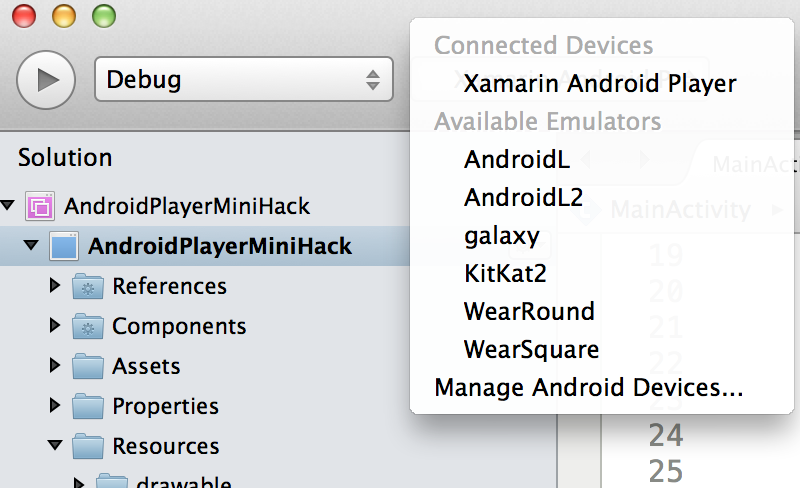
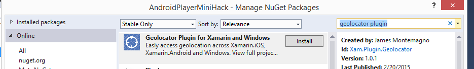

# Lab: Xamarin Android Player

### Challenge

Test out the brand new high performance Xamarin Android Player for Mac or PC.

### Walkthrough 

* Download Xamarin Android Player for Mac or PC from [xamarin.com/android-player](http://xamarin.com/android-player)

* Launch Xamarin Android Player

* Open AndroidPlayerMiniHack.sln in Visual Studio or Xamarin Studio

* Select Xamarin Android Player as Target

* Ensure NuGet Packages are installed (Right Click on Solution and Restore Packages in Xamarin Studio or Select Manage NuGet Packages in Visual Studio)

* Debug application

* Click Xamarin Android Player Logo

* Click Battery Tab

* Change Battery Level

* Select Refresh Battery

# Bonus: Get GPS Location

1. Add NuGet Package:  “Geolocator Plugin for Xamarin and Windows” 

2. Add Geolocator Permissions: You must request `ACCESS_COARSE_LOCATION` & `ACCESS_FINE_LOCATION` permission. These can be added under the project settings.

3. Add new TextView and Button in Resources/layout/main.xml

4. Find Views and add click handler to button

5. Get location and update view with Geolocator Plugin at the end of OnCreate() in MainActivity.cs
