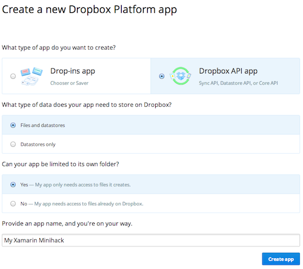
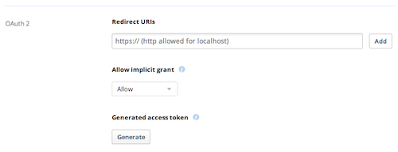
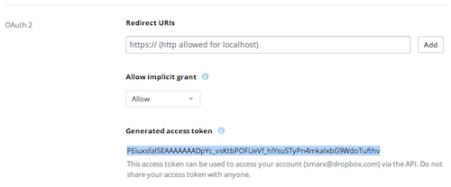
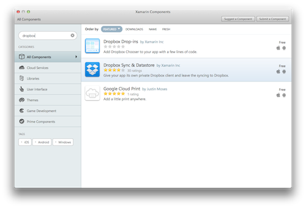
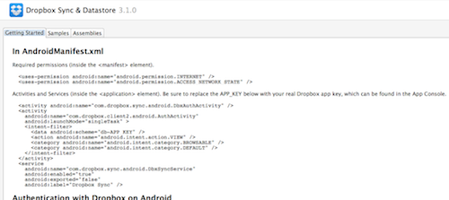

# Dropbox

## Challenge

The [Dropbox Core API](https://www.dropbox.com/developers/core/docs) is a simple HTTP-based API that's easy to call from any language. In this challenge, you'll make a simple HTTP request using `HttpClient` to add a file to your Dropbox.

### Walkthrough

1. Sign up for a free [Dropbox](https://www.dropbox.com) account if you haven't already, and create a new app via the [Dropbox App Console](https://www.dropbox.com/developers/apps/create). Make sure your app is a "Dropbox API" app and has access to files (not just datastores), as in the image below:

    

2. Generate an OAuth access token for your Dropbox account by clicking the "Generate" button in the App Console.

    
    
    After clicking the button, you'll see an access token for your account. Copy that token to the clipboard, since you'll need it in your code.
    
    

2. In Xamarin Studio, create a new Android or iOS project.

3. Add a reference to `System.Net.Http` to your project. This will let you use `HttpClient`.

4. Create a button and add the following code as a handler for the button's `Click` (Android) or `TouchUpInside` (iOS) event. Be sure to use your access token from step #2 in the code, and note that the last line of the delegate varies depending on whether you're developing for Android or iOS.

    ```C#
    using System.Net.Http;
    using System.Net.Http.Headers;
    ```

    ```C#
    button.Click += async delegate {
        const string ACCESS_TOKEN = "<YOUR ACCESS TOKEN>";
        var request = new HttpRequestMessage {
            // See documentation here: https://www.dropbox.com/developers/core/docs#files_put
            RequestUri = new Uri ("https://api-content.dropbox.com/1/files_put/auto/hello.txt"),
            Content = new StringContent ("Hello, World!"),
            Method = HttpMethod.Put
        };
        request.Headers.Authorization = new AuthenticationHeaderValue ("Bearer", ACCESS_TOKEN);
        var result = await new HttpClient().SendAsync(request);
        var message = result.IsSuccessStatusCode ? "Success!" : "Failure: " + result.StatusCode;

        // Android version:
        button.Text = message;
        
        // iOS version:
        // button.SetTitle(message, UIControlState.Normal);
    };
    ```

5. Run your app, press the button, and notice that a new file called `hello.txt` appears in your Dropbox!

Note that, because you hardcoded your access token, this application always writes files into your Dropbox. When you ship an app using the Dropbox API, you should always authenticate the user of your app and use their account. In the additional challenges below, you'll learn how to authenticate a user and interact with that user's Dropbox.

## Additional challenge: Sync API

The [Dropbox Sync API](https://www.dropbox.com/developers/sync) provides a familiar filesystem-like interface on top of the Core API. Add the "Dropbox Sync & Datastore" component from the Xamarin Component Store and follow the "Getting started" instructions through the "Working with files" section. This will lead you through the authentication/authorization process and show you the basics of the filesystem interface.





## Additional challenge: Datastore API

The [Dropbox Datastore API](https://www.dropbox.com/developers/datastore) provides apps with a way to store structured data (tables and records) in Dropbox with offline access and automatic conflict resolution. The "MonkeyBox" sample that comes with the Dropbox Sync & Datastore component will show you how to work with datastores. Give it a try!