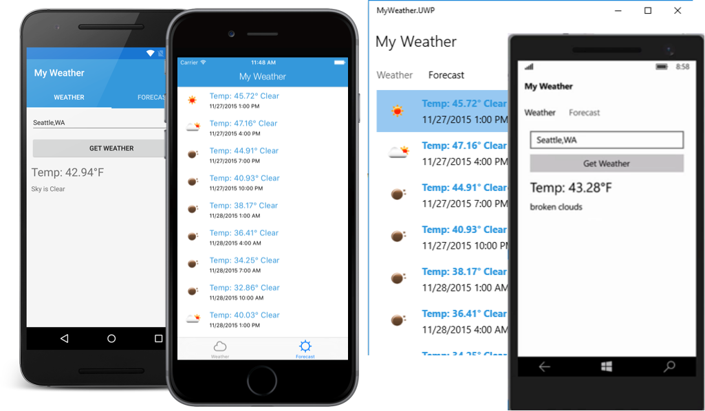

MyWeather.Forms
===================

This is a small sample application showing how to query OpenWeatherMap.org to gather weather for a current location.

Built with C# 6 features, you must be running VS 2015 or Xamarin Studio to compile. 

Built with Xamarin.Forms with support for:
* iOS
* Android
* UWP

Grabs current weather and 5 day forecast.

