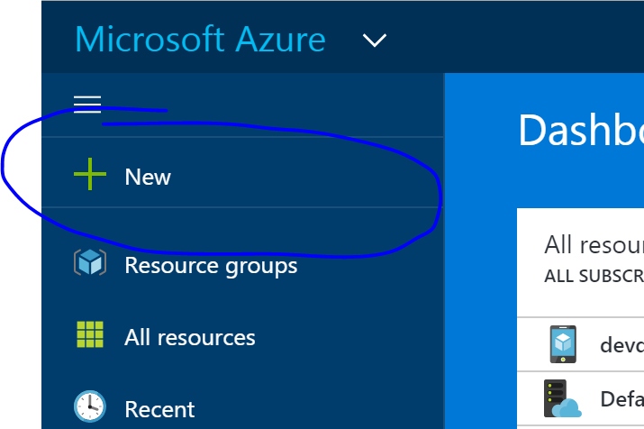
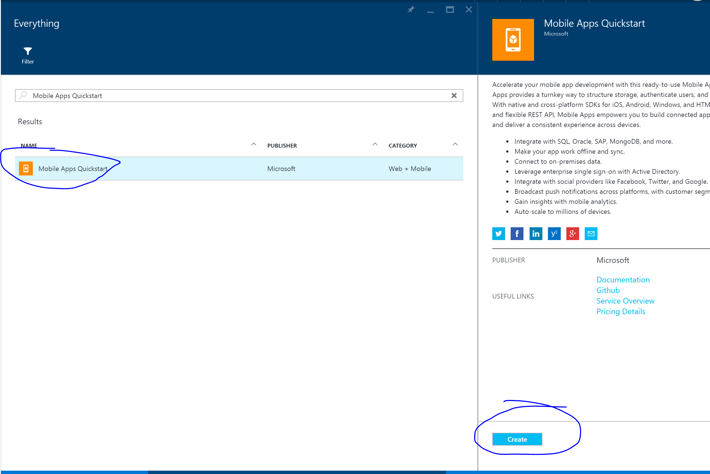
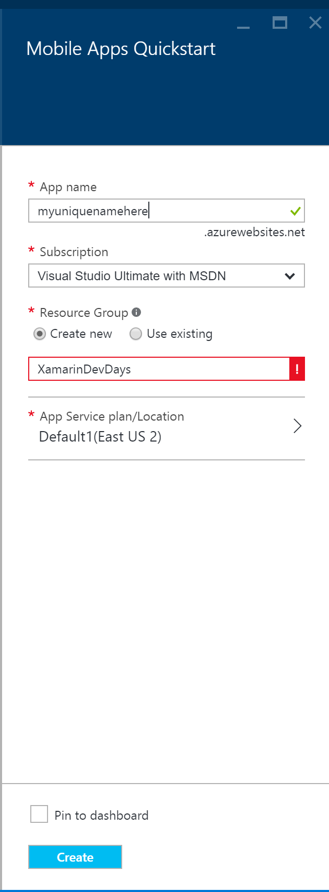

Azure Tasks
===================

This is a small sample application showing how easily add backend using Azure Mobile Apps to a Xamarin Application.

Built with C# 6 features, you must be running VS 2015 or Xamarin Studio to compile. 

Built with Xamarin.Forms with support for:
* iOS
* Android
* UWP

## Setup

There are a few steps to setup this application.

### Azure Account
Please signup or sign into your azure account at http://www.azure.com

### Access Azure Portal
Head to http://portal.azure.com

### Create new Azure Mobile App Quick Start
Click on the **New** button

Search for **Mobile Apps Quickstart**

Tap on it and then tap on it again in the results:

Tap on **Create**

* Name your app (must be unique name, remember this for later)
* Select subscription.
* Create new resource group called **XamarinDevDays**
* Add to existing plan or create new plan
* Check **Pin to Dashboard**
* Tap **Create**

Now give it about 3-5 minutes and you will be completely setup.

## Update code & run
* Open DevDaysTasks.sln.
* You will find DevDaysTasks/Helpers/Constants.cs
* Update with your app name and run!
