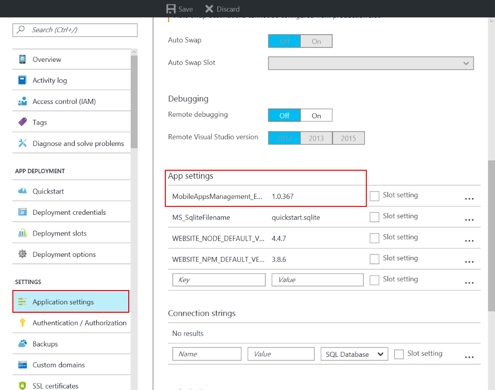

# Xamarin Dev Days Hands On Lab

Today we will build a cloud connected [Xamarin.Forms](https://xamarin.com/forms) application that will display a list of Xamarin Dev Days speaker. We will start by building the business logic backend that pulls down json-ecoded data from a RESTful endpoint. Then we will connect it to an Azure Mobile App backend in just a few lines of code.


## Walkthrough

### 1. Open Solution in Visual Studio

1. Open **Start/DevDaysSpeakers.sln**

This solution contains 4 projects

* DevDaysSpeakers  - Shared Project that will have all shared code (model, views, and view models)
* DevDaysSpeakers.Droid - Xamarin.Android application
* DevDaysSpeakers.iOS - Xamarin.iOS application (requires a macOS build host)
* DevDaysSpeakers.UWP - Windows 10 UWP application (requires Visual Studio 2015/2017 on Windows 10)


The **DevDaysSpeakers** project also has blank code files and XAML pages that we will use during the Hands on Lab.

### 2. NuGet Restore

All projects have the required NuGet packages already installed, so there will be no need to install additional packages during the Hands on Lab. The first thing that we must do is restore all of the NuGet packages from the internet.

1. **Right-click** on the **Solution** and selecting **Restore NuGet packages...**


### 3. Model

We will download details about the speakers.

1. Open the **DevDaysSpeakers/Model/Speaker.cs** file
2. Copy/paste the following properties to the **Speaker** class:

```csharp
public string Id { get; set; }
public string Name { get; set; }
public string Description { get; set; }
public string Website { get; set; }
public string Title { get; set; }
public string Avatar { get; set; }
```

### 4. Implementing INotifyPropertyChanged

*INotifyPropertyChanged* is important for data binding in MVVM Frameworks. This is an interface that, when implemented, lets our view know about changes to the model.

1. In Visual Studio, open `SpeakersViewModel.cs`
2. In `SpeakersViewModel.cs`, implement INotifyPropertyChanged by changing this

```csharp
public class SpeakersViewModel
{

}
```

to this

```csharp
public class SpeakersViewModel : INotifyPropertyChanged
{

}
```

3. In `SpeakersViewModel.cs`, right click on `INotifyPropertyChanged`
4. Implement the `INotifyPropertyChanged` Interface
   - (Visual Studio Mac) In the right-click menu, select Quick Fix -> Implement Interface
   - (Visual Studio PC) In the right-click menu, select Quick Actions and Refactorings -> Implement Interface
5. In `SpeakersViewModel.cs`, ensure this line of code now appears:

```csharp
public event PropertyChangedEventHandler PropertyChanged;
```

6. In `SpeakersViewModel.cs`, create a new method called `OnPropertyChanged`
    - Note: We will call `OnPropertyChanged` whenever a property updates

```csharp
private void OnPropertyChanged([CallerMemberName] string name = null)
{

}
```

7. Add code to `OnPropertyChanged`:
    - Visual Studio Mac and Visual Studio PC 2017 or newer

```csharp
private void OnPropertyChanged([CallerMemberName] string name = null) =>
    PropertyChanged?.Invoke(this, new PropertyChangedEventArgs(name));
```

<ul>
    <ul>
        <li>Visual Studio PC 2015 or earlier</li>
    </ul>
</ul>

```csharp
private void OnPropertyChanged([CallerMemberName] string name = null)
{
    var changed = PropertyChanged;

    if (changed == null)
       return;

    changed.Invoke(this, new PropertyChangedEventArgs(name));
}
```

### 5. Implementing IsBusy

We will create a backing field and accessors for a boolean property. This property will let our view know that our view model is busy so we don't perform duplicate operations (like allowing the user to refresh the data multiple times).

1. In Create the backing field:

```csharp
private bool isBusy;
```

2. Create the property:

```csharp
public bool IsBusy
{
    get { return isBusy; }
    set
    {
        isBusy = value;
        OnPropertyChanged();
    }
}
```

Notice that we call `OnPropertyChanged` when the value changes. The Xamarin.Forms binding infrastructure will subscribe to our **PropertyChanged** event so the UI will be notified of the change.

### 6. Create ObservableCollection of Speaker

We will use an `ObservableCollection<Speaker>` that will be cleared and then loaded with **Speaker** objects. We use an `ObservableCollection` because it has built-in support to raise `CollectionChanged` events when we Add or Remove items from the collection. This means we don't call `OnPropertyChanged` when updating the collection.

1. In `SpeakersViewModel.cs`, above the constructor, declare an auto-property:

```csharp
public ObservableCollection<Speaker> Speakers { get; set; }
```

2. Inside of the constructor, create a new instance of the `ObservableCollection`:

```csharp
public SpeakersViewModel()
{
    Speakers = new ObservableCollection<Speaker>();
}
```

### 7. Create GetSpeakers Method

We are ready to create a method named `GetSpeakers` which will retrieve the speaker data from the internet. We will first implement this with a simple HTTP request, and later update it to grab and sync the data from Azure!

1. In `SpeakersViewModel.cs`, create a method named `GetSpeakers` with that returns `async Task`:

```csharp
private async Task GetSpeakers()
{

}
```

2. In `GetSpeakers`, first ensure `IsBusy` is false. If it is true, `return`

```csharp
private async Task GetSpeakers()
{
    if (IsBusy)
        return;
}
```

3. In `GetSpeakers`, add some scaffolding for try/catch/finally blocks
    - Notice, that we toggle *IsBusy* to true and then false when we start to call to the server and when we finish.

```csharp
private async Task GetSpeakers()
{
    if (IsBusy)
        return;

    try
    {
        IsBusy = true;

    }
    catch (Exception ex)
    {
        error = ex;
    }
    finally
    {
       IsBusy = false;
    }

}
```

4. In the `try` block of `GetSpeakers`, create a new instance of `HttpClient`.     - We will use `HttpClient` to get the json-ecoded data from the server

```csharp
private async Task GetSpeakers()
{
    ...
    try
    {
        using(var client = new HttpClient())
        {
            var json = await client.GetStringAsync("https://demo4404797.mockable.io/speakers");
        }
    }
    ... 
}
```

5. Inside of the `using` we just created, deserialize the json data and turn it into a list of Speakers using Json.NET:

```csharp
private async Task GetSpeakers()
{
    ...
    try
    {
        using(var client = new HttpClient())
        {
            var json = await client.GetStringAsync("https://demo4404797.mockable.io/speakers");

            var items = JsonConvert.DeserializeObject<List<Speaker>>(json);
        }
    }
    ... 
}
```

6. Inside of the `using`, clear the `Speakers` property and then add the new speaker data:

```csharp
private async Task GetSpeakers()
{
    //...
    try
    {
        using(var client = new HttpClient())
        {
            var json = await client.GetStringAsync("https://demo4404797.mockable.io/speakers");

            var items = JsonConvert.DeserializeObject<List<Speaker>>(json);

            Speakers.Clear();

            foreach (var item in items)
                Speakers.Add(item);
        }
    }
    //...
}
```

7. In `GetSpeakers`, add this code to the `catch` block to display a popup if the data retrieval fails:

```csharp
private async Task GetSpeakers()
{
    //...
    catch(Exception e)
    {
        await Application.Current.MainPage.DisplayAlert("Error!", e.Message, "OK");
    }
    //...
}
```

8. Ensure the completed code looks like this:

```csharp
private async Task GetSpeakers()
{
    if (IsBusy)
        return;

    try
    {
        IsBusy = true;

        using(var client = new HttpClient())
        {
            //grab json from server
            var json = await client.GetStringAsync("https://demo4404797.mockable.io/speakers");

            //Deserialize json
            var items = JsonConvert.DeserializeObject<List<Speaker>>(json);

            //Load speakers into list
            Speakers.Clear();
            foreach (var item in items)
                Speakers.Add(item);
        }
    }
    catch (Exception e)
    {
        await Application.Current.MainPage.DisplayAlert("Error!", e.Message, "OK");
        error = ex;
    }
    finally
    {
        IsBusy = false;
    }
}
```

Our main method for getting data is now complete!

#### 8. Create GetSpeakers Command

Instead of invoking this method directly, we will expose it with a `Command`. A `Command` has an interface that knows what method to invoke and has an optional way of describing if the Command is enabled.

1. In `SpeakersViewModel.cs`, create a new Command called `GetSpeakersCommand`:

```csharp
public Command GetSpeakersCommand { get; set; }
```

2. Inside of the `SpeakersViewModel` constructor, create the `GetSpeakersCommand` and pass it two methods
    - One to invoke when the command is executed
    - Another that determines if the command is enabled. Both methods can be implemented as lambda expressions as shown below:

```csharp
public SpeakersViewModel()
{
    GetSpeakersCommand = new Command(async () => await GetSpeakers(),() => !IsBusy);
}
```

## 9. Build The SpeakersPage User Interface
It is now time to build the Xamarin.Forms user interface in `View/SpeakersPage.xaml`.

1. In `SpeakersPage.xaml`, add a `StackLayout` between the `ContentPage` tags
    - By setting `Spacing="0"`, we're requesting that no space is added between the contents of the `StackLayout`

```xml
<ContentPage xmlns="http://xamarin.com/schemas/2014/forms"
             xmlns:x="http://schemas.microsoft.com/winfx/2009/xaml"
             x:Class="DevDaysSpeakers.View.SpeakersPage"
             Title="Speakers">

    <StackLayout Spacing="0">

    </StackLayout>

</ContentPage>
```

2. In `SpeakersPage.xaml`, add a `Button` that has a binding to `GetSpeakersCommand`
    - The command will be executed whenever the user taps the button.

```xml
<ContentPage xmlns="http://xamarin.com/schemas/2014/forms"
             xmlns:x="http://schemas.microsoft.com/winfx/2009/xaml"
             x:Class="DevDaysSpeakers.View.SpeakersPage"
             Title="Speakers">

    <StackLayout Spacing="0">

        <Button Text="Sync Speakers" Command="{Binding GetSpeakersCommand}"/>

    </StackLayout>

</ContentPage>
```

3. In `SpeakersPage.xaml`, under the button, add an `ActivityIndicator`
    - The `ActivityIndicator` is a spinning indicator we'll use to let the user know we are retrieving the files in the background
    - The `ActivityIndicator` will be bound to `IsBusy`

```xml
<ContentPage xmlns="http://xamarin.com/schemas/2014/forms"
             xmlns:x="http://schemas.microsoft.com/winfx/2009/xaml"
             x:Class="DevDaysSpeakers.View.SpeakersPage"
             Title="Speakers">

    <StackLayout Spacing="0">

        <Button Text="Sync Speakers" Command="{Binding GetSpeakersCommand}"/>

        <ActivityIndicator IsRunning="{Binding IsBusy}" IsVisible="{Binding IsBusy}"/>

    </StackLayout>

</ContentPage>
```

4. In `SpeakersPage.xaml`, add a ListView that binds to the `Speakers` collection to display all of the items. 
    - We will use `x:Name="ListViewSpeakers"` so that we can access this XAML control from the C# code-behind

```xml
<ContentPage xmlns="http://xamarin.com/schemas/2014/forms"
             xmlns:x="http://schemas.microsoft.com/winfx/2009/xaml"
             x:Class="DevDaysSpeakers.View.SpeakersPage"
             Title="Speakers">

    <StackLayout Spacing="0">

        <Button Text="Sync Speakers" Command="{Binding GetSpeakersCommand}"/>

        <ActivityIndicator IsRunning="{Binding IsBusy}" IsVisible="{Binding IsBusy}"/>

        <ListView
            x:Name="ListViewSpeakers"
            ItemsSource="{Binding Speakers}">
        <!--Add ItemTemplate Here-->
        </ListView>

    </StackLayout>

</ContentPage>
```

5. In `SpeakersPage.xaml`, add a `ItemTemplate` to describe what each item looks like
    - Xamarin.Forms contains a few default Templates that we can use, and we will use the `ImageCell` that displays an image and two rows of text

```xml
<ContentPage xmlns="http://xamarin.com/schemas/2014/forms"
             xmlns:x="http://schemas.microsoft.com/winfx/2009/xaml"
             x:Class="DevDaysSpeakers.View.SpeakersPage"
             Title="Speakers">

    <StackLayout Spacing="0">

        <Button Text="Sync Speakers" Command="{Binding GetSpeakersCommand}"/>

        <ActivityIndicator IsRunning="{Binding IsBusy}" IsVisible="{Binding IsBusy}"/>

        <ListView
            x:Name="ListViewSpeakers"
            ItemsSource="{Binding Speakers}">
            <ListView.ItemTemplate>
                <DataTemplate>
                    <ImageCell
                        Text="{Binding Name}"
                        Detail="{Binding Title}"
                        ImageSource="{Binding Avatar}"/>
                </DataTemplate>
            </ListView.ItemTemplate>
        </ListView>

    </StackLayout>

</ContentPage>
```

### 10. Connect SpeakersPage with SpeakersViewModel

Because we have bound some elements of the View to ViewModel properties, we have to tell the View with which ViewModel to bind. For this, we have to set the `BindingContext` to the `SpeakersViewModel`.

1. In `SpeakersPage.xaml.cs`, in the constructor, create a field `SpeakersViewModel vm`, initialize `vm` and assign it to the `BindingContext`

```csharp
readonly SpeakersViewModel vm;

public SpeakersPage()
{
    InitializeComponent();

    // Create the view model and set as binding context
    vm = new SpeakersViewModel();
    BindingContext = vm;
}
```

### 11. Run the App

1. In Visual Studio, set the iOS, Android, or UWP project as the startup project 


2. In Visual Studio, click "Start Debugging"
    - If you are having any trouble, see the Setup guides below for your runtime platform

#### iOS Setup
If you are on a Windows PC then you will need to be connected to a macOS build host with the Xamarin tools installed to run and debug the app.

If connected, you will see a Green connection status. Select `iPhoneSimulator` as your target, and then select a Simulator to debug on.


#### Android Setup

Set the DevDaysSpeakers.Droid as the startup project and select a simulator. The first compile may take some additional time as Support Packages may need to be downloaded.

If you run into an issue building the project with an error such as:

**aapt.exe exited with code** or **Unsupported major.minor version 52** then your Java JDK may not be setup correctly, or you have newer build tools installed then what is supported. See this technical bulletin for support: https://releases.xamarin.com/technical-bulletin-android-sdk-build-tools-24/

Additionally, see James' blog for visual reference: https://motzcod.es/post/149717060272/fix-for-unsupported-majorminor-version-520

If you are running into issues with Android support packages that can't be unzipped because of corruption please check: https://xamarinhelp.com/debugging-xamarin-android-build-and-deployment-failures/

#### Windows 10 Setup

Set the DevDaysSpeakers.UWP as the startup project and select debug to **Local Machine**.

### 12. Add Navigation

Now, let's add navigation to a second page that displays speaker details!

1. In `SpeakersPage.xaml.cs`, under `BindingContext = vm;`, add an event to the `ListViewSpeakers` to get notified when an item is selected:

```csharp
readonly SpeakersViewModel vm;

public SpeakersPage()
{
    InitializeComponent();

    // Create the view model and set as binding context
    vm = new SpeakersViewModel();
    BindingContext = vm;

    ListViewSpeakers.ItemSelected += ListViewSpeakers_ItemSelected;
}
```

2. In `ListViewSpeakers_ItemSelected`, create a method called `ListViewSpeakers_ItemSelected`:
    - This code checks to see if the selected item is non-null and then use the built in `Navigation` API to push a new page and deselect the item.

```csharp
private async void ListViewSpeakers_ItemSelected(object sender, SelectedItemChangedEventArgs e)
{
    var speaker = e.SelectedItem as Speaker;
    if (speaker == null)
        return;

    await Navigation.PushAsync(new DetailsPage(speaker));

    ListViewSpeakers.SelectedItem = null;
}
```

### 13. Create DetailsPage.xaml UI

Let's add UI to the DetailsPage. Similar to the SpeakersPage, we will use a StackLayout, but we will wrap it in a ScrollView. This allows the user to scroll if the page content is longer than the avaliable screen space.

1. In `DetailsPage.xaml`, add a `ScrollView` and a `StackLayout`

```xml
<ScrollView Padding="10">
    <StackLayout Spacing="10">
        <!-- Detail controls here -->
    </StackLayout>
</ScrollView>
```

2.  In `DetailsPage.xaml`, add controls and bindings for the properties in the Speaker class:

```xml
<ScrollView Padding="10">
    <StackLayout Spacing="10">
        <Image Source="{Binding Avatar}" HeightRequest="200" WidthRequest="200"/>
            
        <Label Text="{Binding Name}" FontSize="24"/>
        <Label Text="{Binding Title}" TextColor="Purple"/>
        <Label Text="{Binding Description}"/>
    </StackLayout>
</ScrollView>
```

3. In `DetailsPage.xaml`, add two buttons and give them names so we can access them in the code-behind.
     - We'll be adding click handlers to each button.

```xml
<ScrollView Padding="10">
    <StackLayout Spacing="10">
        <Image Source="{Binding Avatar}" HeightRequest="200" WidthRequest="200"/>

        <Label Text="{Binding Name}" FontSize="24"/>
        <Label Text="{Binding Title}" TextColor="Purple"/>
        <Label Text="{Binding Description}"/>

        <Button Text="Speak" x:Name="ButtonSpeak"/>
        <Button Text="Go to Website" x:Name="ButtonWebsite"/>
    </StackLayout>
</ScrollView>
```

### 14. Add Text to Speech

If we open up `DetailsPage.xaml.cs` we can now add a few more click handlers. Let's start with ButtonSpeak, where we will use the [Text To Speech Plugin](https://github.com/jamesmontemagno/TextToSpeechPlugin) to read back the speaker's description.

1. In `DetailsPage.xaml.cs`, in the constructor, add a clicked handler below the BindingContext

```csharp
public DetailsPage(Speaker speaker)
{
    InitializeComponent();

    //Set local instance of speaker and set BindingContext
    this.speaker = speaker;
    BindingContext = this.speaker;

    ButtonSpeak.Clicked += ButtonSpeak_Clicked;
}
```

2. In `DetailsPage.xaml.cs`, create the `ButtonSpeak_Clicked` method which will call the cross-platform API for text to speech

```csharp
private async void ButtonSpeak_Clicked(object sender, EventArgs e)
{
    await CrossTextToSpeech.Current.Speak(speaker.Description);
}
```

### 15. Add Open Website Functionality
Xamarin.Forms includes many APIs for performing common tasks such as opening a URL in the default browser.

1. In `DetailsPage.xaml.cs`, add a clicked handler for `ButtonWebsite.Clicked`:

```csharp
public DetailsPage(Speaker speaker)
{
    InitializeComponent();

    //Set local instance of speaker and set BindingContext
    this.speaker = speaker;
    BindingContext = this.speaker;

    ButtonSpeak.Clicked += ButtonSpeak_Clicked;
    ButtonWebsite.Clicked += ButtonWebsite_Clicked;
}
```

Then, we can use the static Device class to call the OpenUri method:

```csharp
private void ButtonWebsite_Clicked(object sender, EventArgs e)
{
    if (speaker.Website.StartsWith("http"))
        Device.OpenUri(new Uri(speaker.Website));
}
```

### Compile & Run
Now, we should be all set to compile and run our application!

## Connect to Azure Mobile Apps

Being able to grab data from a RESTful end point is great, but what about creating the back-end service? This is where Azure Mobile Apps comes in. Let's update our application to use an Azure Mobile Apps back-end.

If you don't already have an Azure account, go to [https://portal.azure.com](https://portal.azure.com) and register.

Once you're registered, open the Azure portal, select the **+ New** button and search for **mobile apps**. You will see the results as shown below. Select **Mobile Apps Quickstart**


The Quickstart blade will open, select **Create**


This will open a settings blade with 4 settings:

**App name**

This is a unique name for the app that you will need when connecting your Xamarin.Forms client app to the hosted Azure Mobile App. You will need to choose a globally-unique name; for example, you could try something like *yourlastnamespeakers*.

**Subscription**
Select a subscription or create a pay-as-you-go account (this service will not cost you anything).

**Resource Group**
Select *Create new* and call it **DevDaysSpeakers**.

A resource group is logical container the can hold multiple Azure services. Using a resource group allows you to delete a collection of related services in one step.

**App Service plan/Location**
Click this field and select **Create New**, give it a unique name, select a location (typically you would choose a location close to your customers), and then select the F1 Free tier:


Finally check **Pin to dashboard** and click create:


This will take about 3-5 minutes to setup, so let's head back to the code!


### Update AzureService.cs
We will use the [Azure Mobile Apps SDK](https://azure.microsoft.com/en-us/documentation/articles/app-service-mobile-xamarin-forms-get-started/) to connect our mobile app to our Azure back-end with just a few lines of code.

Open the DevDaysSpeakers/Services/AzureService.cs and add our url to the Initialize method:

```csharp
var appUrl = "https://OUR-APP-NAME-HERE.azurewebsites.net";
```

Be sure to update YOUR-APP-NAME-HERE with the app name you specified when creating your Azure Mobile App.

The logic in the Initialize method will setup our database and create our `IMobileServiceSyncTable<Speaker>` table that we can use to retieve speaker data from the Azure Mobile App. There are two methods that we need to fill in to get and sync data from the server.


#### GetSpeakers
In this method, we will need to initialize, sync, and query the table for items. We can use complex LINQ queries to order the results:

```csharp
await Initialize();
await SyncSpeakers();
return await table.OrderBy(s => s.Name).ToEnumerableAsync();   
```

#### SyncSpeakers
Our Azure backend can push any local changes and then pull all of the latest data from the server using the following code that can be added to the try inside of the SyncSpeakers method:

```csharp
await Client.SyncContext.PushAsync();
await table.PullAsync("allSpeakers", table.CreateQuery());
```
That is it for our Azure code! Just a few lines, and we are ready to pull the data from Azure.

### Update SpeakersViewModel.cs

Update async Task GetSpeakers():

Now, instead of using the HttpClient to get a string, let's query the Table:

Change the *try* block of code to:

```csharp
try
{
    IsBusy = true;

    var service = DependencyService.Get<AzureService>();
    var items = await service.GetSpeakers();

    Speakers.Clear();
    foreach (var item in items)
        Speakers.Add(item);
}
```

Now, we have implemented the code we need in our app! Amazing isn't it? The AzureService object will automatically handle all communication with your Azure back-end for you, do online/offline synchronization so your app works even when it's not connected.

Let's head back to the Azure Portal and populate the database.

When the Quickstart finishes you should see the following screen, or can go to it by tapping the pin on the dashboard:


Under **Features** select **Easy Tables**.

It will have created a `TodoItem`, which you should see, but we can create a new table and upload a default set of data by selecting **Add from CSV** from the menu.

Ensure that you have downloaded this repo and have the **Speaker.csv** file that is in this folder.

Select the file and it will add a new table name and find the fields that we have listed. Then hit Start Upload.


> Note: If you get an error while uploading the Speaker.CSV file, it may be a bug that has been resolved. To workaround this, go to the "Application settings" under the "Settings" section and scroll to "App Settings". Change the value for MobileAppsManagement_EXTENSION_VERSION to 1.0.367 and save the changes. Now retry the "Add from CSV" process again



Now you can re-run your application and get data from Azure!


## Bonus Take Home Challenges

Take Dev Days further with these additional challenges that you can complete at home after Dev Days ends.

### Challenge 1: Cognitive Services
For fun, you can add the [Cognitive Service Emotion API](https://www.microsoft.com/cognitive-services/en-us/emotion-api) and add another Button to the detail page to analyze the speaker's face for happiness level. 

Go to: https://microsoft.com/cognitive and create a new account and an API key for the Emotion service.

Follow these steps:

1.) Add **Microsoft.ProjectOxford.Emotion** NuGet package to all projects

2.) Add a new class called EmotionService and add the following code (ensure you update the API key in the GetHappinessAsync call):

```csharp
public class EmotionService
{
    private static async Task<Emotion[]> GetHappinessAsync(string url)
    {        
        var emotionClient = new EmotionServiceClient("INSERT_EMOTION_SERVICE_KEY_HERE");

        var emotionResults = await emotionClient.RecognizeAsync(url);

        if (emotionResults == null || emotionResults.Count() == 0)
        {
            throw new Exception("Can't detect face");
        }

        return emotionResults;
    }

    //Average happiness calculation in case of multiple people
    public static async Task<float> GetAverageHappinessScoreAsync(string url)
    {
        Emotion[] emotionResults = await GetHappinessAsync(url);

        float score = 0;
        foreach (var emotionResult in emotionResults)
        {
            score = score + emotionResult.Scores.Happiness;
        }

        return score / emotionResults.Count();
    }

    public static string GetHappinessMessage(float score)
    {
        score = score * 100;
        double result = Math.Round(score, 2);

        if (score >= 50)
            return result + " % :-)";
        else
            return result + "% :-(";
    }
}
```

3.) Now add a new button to the Details Page and expose it with **x:Name="ButtonAnalyze**

4.) Add a new clicked handler and add the async keyword to it.

5.) Call 
```csharp
var level = await EmotionService.GetAverageHappinessScoreAsync(this.speaker.Avatar);
```

6.) Then display a pop-up alert:
```csharp
await DisplayAlert("Happiness Level", EmotionService.GetHappinessMessage(level), "OK");
```

### Challenge 2: Edit Speaker Details

In this challenge we will make the speaker's Title editable.

Open DetailsPage.xaml and change the Label that is displaying the Title from:

```xml
<Label Text="{Binding Title}" TextColor="Purple"/>
```

to an Entry with a OneWay data binding (this means when we enter text it will not change the actual data), and a Name to expose it in the code behind.

```xml
<Entry
    Text="{Binding Title, Mode=OneWay}" 
    TextColor="Purple" 
    x:Name="EntryTitle"/>
```

Let's add a save Button under the Go To Website button.

```xml
<Button Text="Save" x:Name="ButtonSave"/>
```

#### Update SpeakersViewModel

Open AzureService and add a new method called UpdateSpeaker(Speaker speaker), that will update the speaker, sync, and refresh the list:

```csharp
public async Task UpdateSpeaker(Speaker speaker)
{
    await Initialize();
    await table.UpdateAsync(speaker);
    await SyncSpeakers();
}
```

Open the SpeakersViewModel.cs and add a similar method:

```
public async Task UpdateSpeaker(Speaker speaker)
{
    var service = DependencyService.Get<AzureService>();
    service.UpdateSpeaker(speaker);
    await GetSpeakers();         
}
```

#### Update DetailsPage.xaml.cs
Let's update the constructor to pass in the SpeakersViewModel for the DetailsPage:

Before:
```csharp
Speaker speaker;
public DetailsPage(Speaker item)
{
    InitializeComponent();
    this.speaker = item;
    
    // ...
}
```
After:
```csharp
Speaker speaker;
SpeakersViewModel vm;
public DetailsPage(Speaker item, SpeakersViewModel viewModel)
{
    InitializeComponent();
    this.speaker = item;
    this.vm = viewModel;
    
    // ...
}
```

Under the other clicked handlers, we will add another clicked handler for ButtonSave.

```csharp
ButtonSave.Clicked += ButtonSave_Clicked;
```
When the button is clicked, we will update the speaker, and call save and then navigate back:

```csharp
private async void ButtonSave_Clicked(object sender, EventArgs e)
{
    speaker.Title = EntryTitle.Text;
    await vm.UpdateSpeaker(speaker);
    await Navigation.PopAsync();
}
```

Finally, we will need to pass in the ViewModel when we navigate in the SpeakersPage.xaml.cs in the ListViewSpeakers_ItemSelected method:

```csharp
//Pass in view model now.
await Navigation.PushAsync(new DetailsPage(speaker, vm));
```

There you have it!
